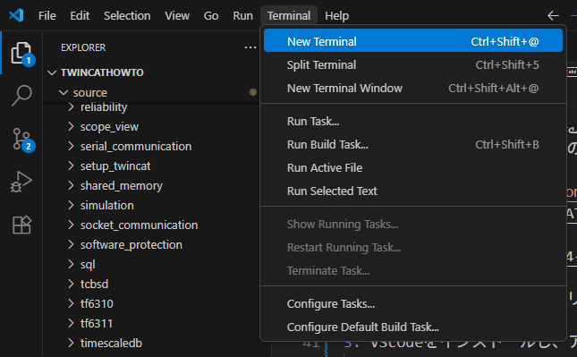
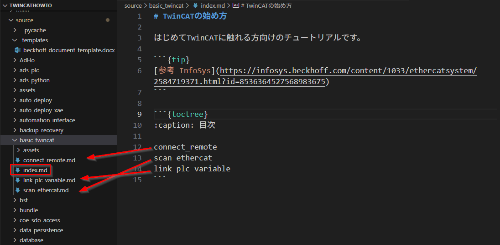
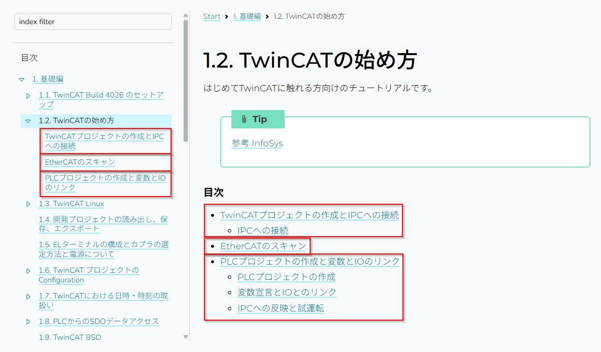
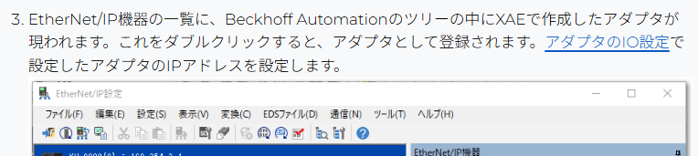
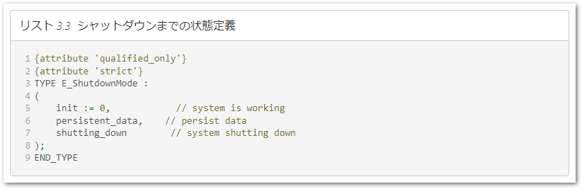

# TwinCAT テクニカルノート

このサイトは、Beckhoff Automation GmbH & Co. KG の日本法人である、ベッコフオートメーション株式会社が運営するTwinCATを中心とした日本語技術情報ページです。

本ページは、文書作成システム [Sphinx](https://www.sphinx-doc.org/ja/master/) 上に [MyST](https://myst-parser.readthedocs.io/en/latest/) エクステンションにて Markdown 形式のソース文書をベースに構築され、以下のURLにてHTML形式で公開しています。

[https://beckhoff-jp.github.io/TwinCATHowTo/](https://beckhoff-jp.github.io/TwinCATHowTo/)

## 環境構築

文書作成システムは、pythonと関連パッケージを構築します。まず、uvをインストールし、その後、githubからリポジトリクローンしてPC上にソースコードを展開します。

1. [UVのインストール](https://docs.astral.sh/uv/getting-started/installation/)

    ターミナルから次のコマンドを発行します。

    Windowsの場合
    ```
    powershell -ExecutionPolicy ByPass -c "irm https://astral.sh/uv/install.ps1 | iex"
    ```

    Linuxの場合

    ```
    curl -LsSf https://astral.sh/uv/install.sh | sh
    ```

2. リポジトリのクローン

    以下の手順を実行してください。

    1. github のアカウントを作成してください。
    2. 次のリポジトリを自分のアカウントへフォークしてください。

        [https://github.com/Beckhoff-JP/TwinCATHowTo](https://github.com/Beckhoff-JP/TwinCATHowTo)

        

    3. フォークしたリポジトリを自分のコンピュータ上にクローンします。

3. VScodeをインストールし、アドオンを入れます

    Windowsターミナル、または、Linux シェル共通
    ```
    code --install-extension ExecutableBookProject.myst-highlight
    code --install-extension mushan.vscode-paste-image
    ```

4. VScodeでクローンしたgitリポジトリのフォルダをオープンします。

5. 文書編集とコンパイル
    
    次節に示す手順に従い、文書を編集します。 編集結果は、htmlファイルとしてプレビューを確認することができます。まず、次のとおりVSCodeのターミナルを開きます。

    

    次のコマンドによって、初回は`.venv`フォルダ内にPythonやsphinxなどの必要なツールが自動的にインストールされます。
    
    また同時に、編集したmarkdown文書をビルドしてhtmlへ変換します。html文書は、sphinx-autobuildによって起動するWEBサーバによって閲覧可能です。

    ```
    uv run sphinx-autobuild source build/html
    ```

    Windows環境の方にはこのコマンドをPowerShellスクリプトにした `autobuild.ps1` を用意しています。

    ```
    powershell ./autobuild.ps1
    ```

    次のとおりコマンドが実行されると最後にWEBサーバが起動し、出力されたhtml文書をプレビューできます。プレビュー先のURLはビルド結果の最終行に表示される `http://127.0.0.1:8000` をクリックしてアクセスしてください。

    ```
    [sphinx-autobuild] Starting initial build
    [sphinx-autobuild] > python -m sphinx build source build/html
        :
    The HTML pages are in build\html.
    [sphinx-autobuild] Serving on http://127.0.0.1:8000
    [sphinx-autobuild] Waiting to detect changes...
    ```

    その後も、継続して文書を編集してmarkdown文書を保存すると、自動的にビルドが行われ、ブラウザ上の文書は自動更新されます。

6. 文書が完成したら、フォークされた自分のリポジトリからプルリクエストを行って、`BECKHOFF-JP` 内のリポジトリへの反映を申請してください。

## 文書編集方法

文書の編集を行うには、WEBブラウザでプレビューを見ながら、vscode上でMarkdown文書の編集、mdファイルの上書き、プレビューソフトによるレイアウト確認、を繰り返します。

### 文書構成

Markdownのソースは、 `source` ディレクトリ内にあります。以下の構成になっていますので、適時新規作成、編集を行ってください。

```
└─source
    │  basic.md      <- 基礎編の章のカテゴリタイトルページ
    │  conf.py       <- 文書の設定ファイルです
    │  develop_***.md  <- 開発編の章のカテゴリタイトルページ
    │  index.md      <- 全文書へのタイトルページ
    │  operation.md  <- 運用編の章のカテゴリタイトルページ
    │  faq.md        <- よくある質問と回答の章のページ
    │
    ├─<<トピック毎のサブフォルダ>>
    │  │  index.md   <- 章のタイトル
    │  │  <<本文>>.md
```

各トピックフォルダ内には、かならず一つの `index.md` ファイルを作成してください。他の md ファイルで副節を作成する場合、`toctree` ブロック命令で各 md ファイルへの目次を作ってツリー構造の章節構造を作成します。

```` markdown
```{toctree}
:caption: 目次

connect_remote
scan_ethercat
link_plc_variable
```
````

VSCode上のフォルダツリーと`toctree`で定義するファイルの関係は次の通りです。



たとえば、`toctree` 内で定義した別の `link_plc_variable.md` ファイルには、次のとおりトップレベルの見出し階層 `#` から始める文書となります。

```` markdown
# PLCプロジェクトの作成と変数とIOのリンク

## PLCプロジェクトの作成

```{list-table}
- * PLCプロジェクトを追加します。
  * 
- * PLCプロジェクトの名称設定を行います。
  * 
```
````

この文書を出力すると、次のようなhtml文書を出力します。




個々の文書はトップレベルの見出し `#` から定義しますが、`toctree` を定義する位置によってその相対的な階層で文書は構成されます。

よって、このあと`link_plc_variable.md`を別の階層の場所へ持っていったとしても、文書内の階層自体は変更することなく、配置された階層に適合した構造となります。

このように全体の文書構造を組み替えた場合においても、個々の文書の修正が必要なく、独立性が保たれますので文書管理が容易になります。

### toctreeの別ディレクトリへの参照

toctreeを定義するmdファイルの位置からの相対パスで定義します。サブフォルダが有る場合は、`サブフォルダ/文書名`となるように、ディレクトリ区切りをスラッシュで定義します。

````markdown
# 章のタイトル

<<章の概要と説明>>

```{toctree}
:caption: 目次

<<節1のサブディレクトリ名>>/index.md
<<節2のサブディレクトリ名>>/index.md
 :
```
````

また、 `:caption: 目次` を定義すると、文書内に `目次` ヘッダに続いて目次が構成されます。

````markdown
# 開発編（開発環境）

TwinCATはVisual Studioの優れた開発環境をベースとしています。また、PLCエディアとしてさまざまな便利な機能がありますので、こられの機能と使い方についてご紹介します。

```{toctree}
:caption: 目次

debug_support/index.md
devops/index.md
```
````


> [!TIP]
> `toctree` ブロック内の先頭に :hidden: を定義すると、メニューツリーには文書が構成されますが、文書内の目次表示は表示されなくなります。
> [https://myst-parser.readthedocs.io/en/latest/syntax/organising_content.html#using-toctree-to-include-other-documents-as-children](https://myst-parser.readthedocs.io/en/latest/syntax/organising_content.html#using-toctree-to-include-other-documents-as-children)


## Markdown 拡張命令

本システムは、Sphinxの myst-parserによってmarkdownをベースとしたさまざまな拡張機能が使えます。詳細は、以下のURLをご覧ください。

[https://myst-parser.readthedocs.io/en/latest/index.html](https://myst-parser.readthedocs.io/en/latest/index.html)

以下のとおりテクニカルノートの記述でよく使う命令についてご紹介します。

### 節や章への相互参照

文書同士でリンクを張る方法は次のサイトで解説されています。

[https://myst-parser.readthedocs.io/en/latest/syntax/cross-referencing.html#creating-explicit-targets](https://myst-parser.readthedocs.io/en/latest/syntax/cross-referencing.html#creating-explicit-targets)

リンク先の定義は章タイトルの前行に次のコマンドで`シンボル`定義します。

``` markdown
(シンボル)=
# 章タイトル
```

次に文書中に、次のとおり参照用のコマンドを記述します。

``` markdown
この手順は、 {ref}`シンボル` に記載したとおりです。
```

例

``` markdown
(section_eip_adapter_connection_setting)=
## アダプタのIO設定

1. ソリューションウィンドウからTwinCATツリーの `I/O` > `Devices` のポップアップメニューを出現させ、EtherNet/IP Adapter (Slave) を選びOKボタンを押します。
 :
```

下記の通り文書内で定義します。

``` markdown
3. EtherNet/IP機器の一覧に、Beckhoff Automationのツリーの中にXAEで作成したアダプタが現われます。これをダブルクリックすると、アダプタとして登録されます。{ref}`section_eip_adapter_connection_setting` で設定したアダプタのIPアドレスを設定します。

```

すると、次のとおり文書中に節のタイトルである「アダプタIO設定」という文字列とそこへのリンクが設定されます。




### 図の挿入

図の挿入と、相互参照は次の通り`figure` ブロックを用います。

````
```{figure} cyclic_data_buffer.png
:align: center
:name: figure_cyclic_data_buffer

サイクリックデータバッファの構造
```
````

`:name:` タグで定義された参照キーに対して、本文中に ``{numref}`参照キー` ``を記述すると、下図の通り相互参照が可能となります。


````markdown
一定のサイズになるまでバッファにデータが蓄積されたら、これを一つのチャンクとしてデータベースに書込みコマンドを発行します。チャンクサイズの決定方法は最小値を設定した上で、データベースの負荷やネットワークの影響により発生した遅延時間に比例して動的に増加させています。（{numref}`figure_cyclic_data_buffer`）
````


### 表の書き方

最も簡単な表の書き方は、`csv-table`を用いることです。


```` markdown

表の外で、表の番号を参照するには、{numref}`シンボル` と記述します。

```{csv-table} 表のキャプションの名称
:header: 列1タイトル, 列2タイトル, 列3タイトル,...
:name: シンボル
:widths: 列1の比率,列2の比率,列3の比率,...

行1列1の内容, 行1列2の内容, 行1列3の内容,...
行2列1の内容, 行2列2の内容, 行2列3の内容,...
 :
 :
```
````

下記の例の表記述を例として挙げます。

```` markdown
influxDBでは、`_time` 列に時刻が、 `_field` 列にフィールドが、 `_value` にその値が格納された縦持ちリストとなっています。（{numref}`table_default_influxdb_query`）

```{csv-table} influxDBの抽出結果
:header: _time, module_name, _field, _value
:name: table_default_influxdb_query
:widths: 3,2,3,2

2023-12-08 10:00:00.000, XTS1, position, 122.99843
2023-12-08 10:00:00.000, XTS1, set_position, 123.0000
:
```
````

次の通り表示されます。


### 警告ラベル

警告ラベルを入れるには、次の記述を行います。

```` markdown
```{admonition} タイトル
:class: <<重要度キーワードの定義>>

<<注釈の内容を記述>>
```
````

例えば下記の通り記述すると、

```` markdown
```{admonition} 危険
:class: danger

本手順は、装置稼働中に絶対に行わないでください。装置が確実に停止している状態(TwinCAT3ランタイム(以下、XAR)がコンフィグレーションモード)で作業を行ってください。稼働中に実施することにより制御対象の装置が安全に停止できなくなる可能性があり、重大な事故につながる可能性があります。

```
````

下記の通り出力されます。


重要度キーワード `:class:` には、下記のURLで示す、Admonition typeを指定してください。このアイコンと枠色で表示されます。

[https://myst-parser.readthedocs.io/en/latest/syntax/admonitions.html#admonition-types](https://myst-parser.readthedocs.io/en/latest/syntax/admonitions.html#admonition-types)

### プログラムコードの挿入

プログラムコードを挿入する場合は、次の通り記述します。

```` markdown
```{code-block} <<プログラム言語キーワード>>
:caption: <<キャプション（タイトル）>>
:name: <<相互参照用のキーワード>>
:linenos:

<<プログラムコード>>
````

`:lineos:` 
    : 行番号が付加されます。不要であれば無くても構いません。

`:name:`
    : 図や表同様、{numref}`<<相互参照用のキーワード>>` で参照先へのリンクが張られます。不要であれば無くても構いません。

`:caption:`
    : プログラム例にキャプションが付けられます。不要であれば無くても構いません。

プログラム言語については、様々な言語に対応していますが、TwinCATのST言語を掲載する場合は、`iecst`を定義してください。

例として次の記述と出力をご紹介します。

```` markdown
```{code-block} iecst
:caption: シャットダウンまでの状態定義
:name: def_shutdown_state
:linenos:

{attribute 'qualified_only'}
{attribute 'strict'}
TYPE E_ShutdownMode :
(
    init := 0,          // system is working
    persistent_data,    // persist data
    shutting_down       // system shutting down
);
END_TYPE
```
````



## vscodeによる編集テクニック

本スクリプトを使うと、vscodeおよび、markdownのプレビューア、図のプラグインなどが自動的にインストールされます。以下にその使い方を説明します。

### プレビュー

前述の通り、ブラウザによるリアルタイムプレビューが可能ですが、vscode内でも簡易的なプレビューが可能です。次図の右上の赤丸アイコンをクリックすると、編集画面の右半分がプレビューウィンドウになります。ただし、実際ビルドして生成されたHTMLとは違いますので、あくまでも簡易的なプレビューであることをご理解ください。


### 図の貼り付け

図の貼り付けは、`figure` ブロックを用いることをご説明しましたが、相互参照が必要ない場合は、

``` markdown
{align=center width=300px}
```

のように、ワンラインで定義できます。このうち、`{align=center width=300px}` の直前までの命令は、VSCodeのプラグインの機能によってクリップボードにコピーされた画像データを`CTRL + ALT + V` のキー操作によって直接ペーストすることができます。

スクリーンショットなどをコピーした際には、クリップボードに画像データが保存されています。この後、vscodeのMarkdownソース文書の任意の行にて`CTRL + ALT + V` のキー操作を行うと、自動的にpngファイルが同ディレクトリ以下に`assset`サブフォルダが作成され、この中に日付時刻が付いたファイル名として保存された上で、このpngファイルへのリンクが張られます。

```markdown

```

図の配置場所を指定する場合は、次の通り `{align=center}` を追加定義してください。

```markdown
{align=center}
```

> [!NOTE]
> width などサイズ指定しますと、PCやスマートフォン等画面解像度に合わせて自動調整することができなくなりますので、なるべく指定しないことをお勧めします。