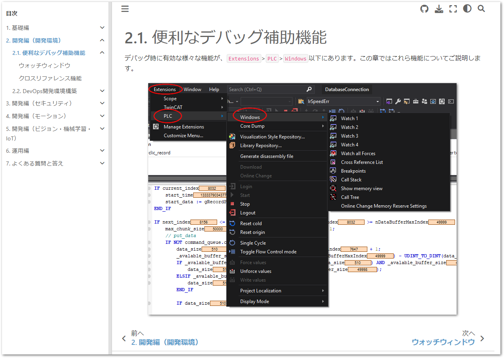

# TwinCAT テクニカルノート

このサイトは、Beckhoff Automation GmbH & Co. KG の日本法人である、ベッコフオートメーション株式会社が運営するTwinCATを中心とした日本語技術情報ページです。

本ページは、文書作成システム [Sphinx](https://www.sphinx-doc.org/ja/master/) 上に [MyST](https://myst-parser.readthedocs.io/en/latest/) エクステンションにて Markdown 形式のソース文書をベースに構築され、以下のURLにてHTML形式で公開しています。

[https://beckhoff-jp.github.io/TwinCATHowTo/](https://beckhoff-jp.github.io/TwinCATHowTo/)

## 環境構築

powershellにより、 `setup_environment.ps1` を実行してください。途中でユーザ名とメールアドレスを聞かれます。今後gitのコミッタ（変更を加える人）の属性を示すものです。半角英数で入力してください。これにより以下のソフトウェアがインストールされます。

* [scoopパッケージマネージャ](https://scoop.sh/)
* [git](https://git-scm.com/)
* [7zip アーカイバ](https://sevenzip.osdn.jp/)
* [Visual Studio Code （以後 vscode）](https://code.visualstudio.com/)
* [Python](https://www.python.org/)

これらのソフトウェアは、Windowsインストーラを用いず、全て、ユーザディレクトリの以下の場所に配置されています。アンインストールする場合は、このフォルダごと削除してください。

```
C:\Users\<<ログオンユーザ名>>\scoop
```

## リポジトリのクローン

以下の手順を実行してください。

1. github のアカウントを作成してください。
2. 次のリポジトリを自分のアカウントへフォークしてください。

    [https://github.com/Beckhoff-JP/TwinCATHowTo](https://github.com/Beckhoff-JP/TwinCATHowTo)

    

3. フォークしたリポジトリを自分のコンピュータ上にクローンします。

クローンし終わったら、リポジトリの中にある `setup.ps1` を実行します。文書作成に必要なPython sphinx関連のモジュールが自動的にインストールされます。

## 文書編集方法

文書の編集を行うには、WEBブラウザでプレビューを見ながら、vscode上でMarkdown文書の編集、mdファイルの上書き、プレビューソフトによるレイアウト確認、を繰り返します。

まずは以下の手順でプレビューソフトを起動します。

### プレビューソフトの起動

vscodeを起動して、`Terminal` メニューの `New Terminal` を選択してください。下部の `TERMINAL` ウィンドウにPowerShellのプロンプトが現われます。下記の通り入力してください。

```powershell
> sphinx-autobuild.exe -b html source build/html
```
これにより以下の通りWEBサーバが起動します。最後に現われるURLの部分にマウスポインタを移動し、 `CTRL + click` してください。

```powershell
[sphinx-autobuild] > sphinx-build -b html....
Running Sphinx v4.4.0
loading translations [ja]... done
 :
[I 230413 09:57:11 server:335] Serving on http://127.0.0.1:8000
[I 230413 09:57:11 handlers:62] Start watching changes
[I 230413 09:57:11 handlers:64] Start detecting changes
```

## 文書構成

Markdownのソースは、 `source` ディレクトリ内にあります。以下の構成になっていますので、適時新規作成、編集を行ってください。

```
└─source
    │  basic.md      <- 基礎編の章のカテゴリタイトルページ
    │  conf.py       <- 文書の設定ファイルです
    │  develop_***.md  <- 開発編の章のカテゴリタイトルページ
    │  index.md      <- 全文書へのタイトルページ
    │  operation.md  <- 運用編の章のカテゴリタイトルページ
    │  faq.md        <- よくある質問と回答の章のページ
    │
    ├─<<トピック毎のサブフォルダ>>
    │  │  index.md   <- 章のタイトル
    │  │  <<本文>>.md
```

### 章の作り方

まず、source以下に任意の章名が分かるmarkdownファイルを作成します。このファイル名を、`source/index.md`上に登録します。

````markdown
   :
   :
* Beckhoff 製品カタログ

    [https://download.beckhoff.com/download/document/Catalog/Beckhoff_Products_2023_jp.pdf](https://download.beckhoff.com/download/document/Catalog/Beckhoff_Products_2023_jp.pdf)

```{toctree}
:maxdepth: 2
:numbered: 2
:caption: 目次

basic.md
develop_environment.md
develop_security.md
develop_motion.md
develop_information.md
operation.md
faq.md
<<任意の行にmarkdownファイル名を追加>>
 :
 :
```

````

次に、作成した章のmarkdownファイルを編集し、以下の通り記述します。

````markdown
# 章のタイトル

<<章の概要と説明>>

```{toctree}
:caption: 目次

<<節1のサブディレクトリ名>>/index.md
<<節2のサブディレクトリ名>>/index.md
 :
```
````

カテゴリタイトルからは、章以下に節を示すサブフォルダを作成し、サブフォルダ毎にタイトルページ `index.md` を作成します。

そこへ`{toctree}`のリンクを張ってください。章レベルでは、`:caption:`に「目次」を指定します。

章のタイトルページ `index.md` では、タイトルと節へのリンクだけではなく、なるべく概要まで記載してください。下記に例を示します。

````markdown
# 開発編（開発環境）

TwinCATはVisual Studioの優れた開発環境をベースとしています。また、PLCエディアとしてさまざまな便利な機能がありますので、こられの機能と使い方についてご紹介します。

```{toctree}
:caption: 目次

debug_support/index.md
devops/index.md
```
````

上記の通りの構成によって次図のような出力が得られます。


#### 節のタイトル

各節のサブディレクトリ内には、それぞれ`index.md`を作成し、章の書式と同様、タイトル、概要を記載してから`{toctree}`にて小節に対するリンクを記載します。`{toctree}`は単なる小節への順次リンクとして機能させ、目次などは作成しません。よって、`:hidden:`を付加します。

````markdown
# 節のタイトル

<<節の説明など>>

```{toctree}
:hidden:

<<小節（ページ）毎のmarkdownファイル名>>
 :
 :
```
````

例えば、前項の章の例で紹介した、`debug_support` の節の`index.md`では以下のとおりとなります。

````markdown
# 便利なデバッグ補助機能

デバッグ時に有効な様々な機能が、`Extensions` > `PLC` > `Windows` 以下にあります。この章ではこれら機能についてご説明します。

{align=center}

```{toctree}
:hidden:

watch_window
cross_reference
```
````

この出力は次の通りとなります。




## vscodeによる編集テクニック

本スクリプトを使うと、vscodeおよび、markdownのプレビューア、図のプラグインなどが自動的にインストールされます。以下にその使い方を説明します。

### プレビュー

前述の通り、ブラウザによるリアルタイムプレビューが可能ですが、vscode内でも簡易的なプレビューが可能です。次図の右上の赤丸アイコンをクリックすると、編集画面の右半分がプレビューウィンドウになります。ただし、実際ビルドして生成されたHTMLとは違いますので、あくまでも簡易的なプレビューであることをご理解ください。


### 図の貼り付け

スクリーンショットなどをクリップボードにコピーした後、vscodeのMarkdownソース文書の任意の行にて、`CTRL + ALT + V` のキー操作を行う事で、自動的にファイルが`assset`フォルダ上に配置され、そこへのリンクが張られます。

```markdown

```

図の配置場所を指定する場合は、次の通り別途追加定義してください。

```markdown
{align=center}
```

相互参照を使いたい場合は、次の通りブロック方式の図の定義が必要となります。

````markdown
一定のサイズになるまでバッファにデータが蓄積されたら、これを一つのチャンクとしてデータベースに書込みコマンドを発行します。チャンクサイズの決定方法は最小値を設定した上で、データベースの負荷やネットワークの影響により発生した遅延時間に比例して動的に増加させています。（{numref}`figure_cyclic_data_buffer`）

```{figure} cyclic_data_buffer.png
:align: center
:name: figure_cyclic_data_buffer

サイクリックデータバッファの構造
```
````

`:name:` タグで定義された参照キーに対して、本文中に ``{numref}`参照キー` ``を記述すると、下図の通り相互参照が可能となります。


### 表の書き方

最も簡単な表の書き方は、`csv-table`を用いることです。

```` markdown

表の外で、表の番号を参照するには、{numref}`<<相互参照のキー文字列>>` と記述します。

```{csv-table} 表のキャプションの名称
:header: 列1タイトル, 列2タイトル, 列3タイトル,...
:name: <<相互参照のキー文字列>>
:widths: 列1の比率,列2の比率,列3の比率,...

行1列1の内容, 行1列2の内容, 行1列3の内容,...
行2列1の内容, 行2列2の内容, 行2列3の内容,...
 :
 :
```
````

下記の例の表記述を例として挙げます。

```` markdown
influxDBでは、`_time` 列に時刻が、 `_field` 列にフィールドが、 `_value` にその値が格納された縦持ちリストとなっています。（{numref}`table_default_influxdb_query`）

```{csv-table} influxDBの抽出結果
:header: _time, module_name, _field, _value
:name: table_default_influxdb_query
:widths: 3,2,3,2

2023-12-08 10:00:00.000, XTS1, position, 122.99843
2023-12-08 10:00:00.000, XTS1, set_position, 123.0000
:
```
````

次の通り表示されます。

