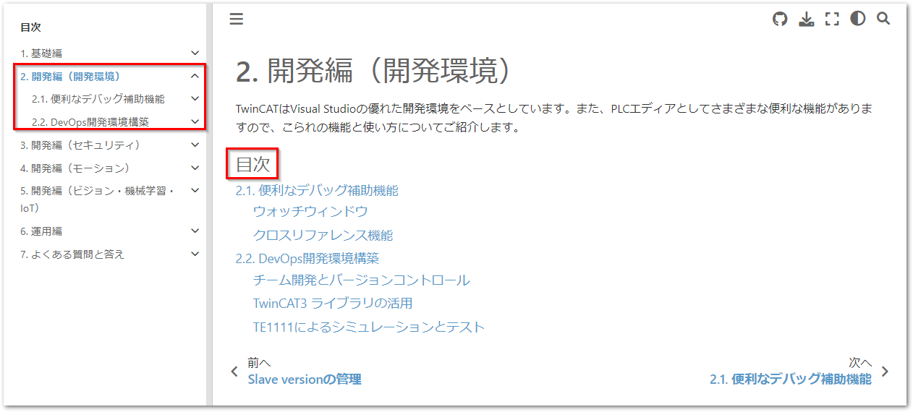

# TwinCAT テクニカルノート

このサイトは、Beckhoff Automation GmbH & Co. KG の日本法人である、ベッコフオートメーション株式会社が運営するTwinCATを中心とした日本語技術情報ページです。

本ページは、文書作成システム [Sphinx](https://www.sphinx-doc.org/ja/master/) 上に [MyST](https://myst-parser.readthedocs.io/en/latest/) エクステンションにて Markdown 形式のソース文書をベースに構築され、以下のURLにてHTML形式で公開しています。

[https://beckhoff-jp.github.io/TwinCATHowTo/](https://beckhoff-jp.github.io/TwinCATHowTo/)

## 環境構築

powershellにより、 `setup_environment.ps1` を実行してください。途中でユーザ名とメールアドレスを聞かれます。今後gitのコミッタ（変更を加える人）の属性を示すものです。半角英数で入力してください。これにより以下のソフトウェアがインストールされます。

* [scoopパッケージマネージャ](https://scoop.sh/)
* [git](https://git-scm.com/)
* [7zip アーカイバ](https://sevenzip.osdn.jp/)
* [Visual Studio Code （以後 vscode）](https://code.visualstudio.com/)
* [Python](https://www.python.org/)

これらのソフトウェアは、Windowsインストーラを用いず、全て、ユーザディレクトリの以下の場所に配置されています。アンインストールする場合は、このフォルダごと削除してください。

```
C:\Users\<<ログオンユーザ名>>\scoop
```

## リポジトリのクローン

以下の手順を実行してください。

1. github のアカウントを作成してください。
2. 次のリポジトリを自分のアカウントへフォークしてください。

    [https://github.com/Beckhoff-JP/TwinCATHowTo](https://github.com/Beckhoff-JP/TwinCATHowTo)

    

3. フォークしたリポジトリを自分のコンピュータ上にクローンします。

クローンし終わったら、リポジトリの中にある `setup.ps1` を実行します。文書作成に必要なPython sphinx関連のモジュールが自動的にインストールされます。

## 文書編集方法

文書の編集を行うには、WEBブラウザでプレビューを見ながら、vscode上でMarkdown文書の編集、mdファイルの上書き、プレビューソフトによるレイアウト確認、を繰り返します。

まずは以下の手順でプレビューソフトを起動します。

### プレビューソフトの起動

vscodeを起動して、`Terminal` メニューの `New Terminal` を選択してください。下部の `TERMINAL` ウィンドウにPowerShellのプロンプトが現われます。下記の通り入力してください。

```powershell
> sphinx-autobuild.exe -b html source build/html
```
これにより以下の通りWEBサーバが起動します。最後に現われるURLの部分にマウスポインタを移動し、 `CTRL + click` してください。

```powershell
[sphinx-autobuild] > sphinx-build -b html....
Running Sphinx v4.4.0
loading translations [ja]... done
 :
[I 230413 09:57:11 server:335] Serving on http://127.0.0.1:8000
[I 230413 09:57:11 handlers:62] Start watching changes
[I 230413 09:57:11 handlers:64] Start detecting changes
```
### 文書の編集

Markdownのソースは、 `source` ディレクトリ内にあります。以下の構成になっていますので、適時新規作成、編集を行ってください。

```
└─source
    │  basic.md      <- 基礎編のカテゴリタイトルページ
    │  conf.py       <- 文書の設定ファイルです
    │  develop.md    <- 開発編のカテゴリタイトルページ
    │  index.md      <- 全文書へのタイトルページ
    │  operation.md  <- 運用編のカテゴリタイトルページ
    │
    ├─<<トピック毎のサブフォルダ>>
    │  │  index.md   <- 章のタイトル
    │  │  <<本文>>.md
```

#### 目次系（タイトルページ）のMarkdownの書き方

次の通りの例の通りです。まず `#` に続いてタイトルを記載します。複数行空けてから、`{toctree}` ブロックを定義します。最初の2行（`:maxdepth: 2`, `:caption: 目次`）はお約束なのでそのままとしてください。続いて1行空けてから、本文となるMarkdownのページへのパスを記載します。複数の章がある場合は続けて複数行パスを記載してください。

以下に「基礎編」のカテゴリタイトルである `basic.md` の例を挙げます。

````markdown
# 基礎編

```{toctree}
:maxdepth: 2
:caption: 目次

TwinCATConfiguration/index.md
 :
```
````

カテゴリタイトルからは、章毎にサブフォルダを作成し、サブフォルダ毎にタイトルページ `index.md` を作成してそこへ`{toctree}`のリンクを張ってください。同様に `index.md` 内においても、実際の本文が記載されたMarkdownファイルへのリンクを `toctree` で定義します。

章のタイトルページ `index.md` では、タイトルとリンクだけではなく、なるべく概要まで記載してください。

````markdown
# TwinCAT プロジェクトのConfiguration

この章ではTwinCATの制御対象となるハードウェアの構成設定や診断方法について説明します。

```{toctree}
:maxdepth: 2
:caption: 目次

scan.md
slave_version.md
```
````

上記の通りの構成によって次図のような出力が得られます。



## vscodeによる編集テクニック

### プレビュー

前述の通り、ブラウザによるリアルタイムプレビューが可能ですが、vscode内でも簡易的なプレビューが可能です。次図の右上の赤丸アイコンをクリックすると、編集画面の右半分がプレビューウィンドウになります。ただし、実際ビルドして生成されたHTMLとは違いますので、あくまでも簡易的なプレビューであることをご理解ください。


### 図の貼り付け

スクリーンショットなどをクリップボードにコピーした後、vscodeのMarkdownソース文書の任意の行にて、`CTRL + ALT + V` のキー操作を行う事で、自動的にファイルが`assset`フォルダ上に配置され、そこへのリンクが張られます。

```markdown

```

図の幅、配置場所などを指定する場合は、次の通り別途追加定義してください。

```markdown
{align=center w=300px}
```

あるいは高さを指定する場合は、

```markdown
{align=center h=500px}
```

相互参照を使いたい場合は、次の通りブロック方式の図の定義が必要となります。

````markdown
一定のサイズになるまでバッファにデータが蓄積されたら、これを一つのチャンクとしてデータベースに書込みコマンドを発行します。チャンクサイズの決定方法は最小値を設定した上で、データベースの負荷やネットワークの影響により発生した遅延時間に比例して動的に増加させています。（{numref}`figure_cyclic_data_buffer`）

```{figure} cyclic_data_buffer.png
:width: 400px
:align: center
:name: figure_cyclic_data_buffer

サイクリックデータバッファの構造
```
````
`:name:` タグで定義された参照キーに対して、本文中に ``{numref}`参照キー` ``を記述すると、下図の通り相互参照が可能となります。


