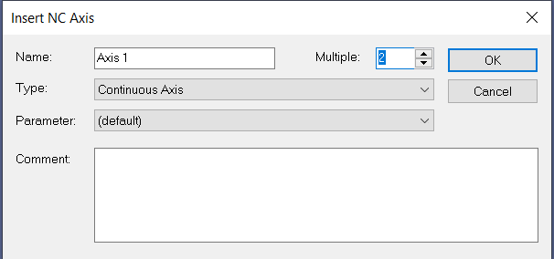
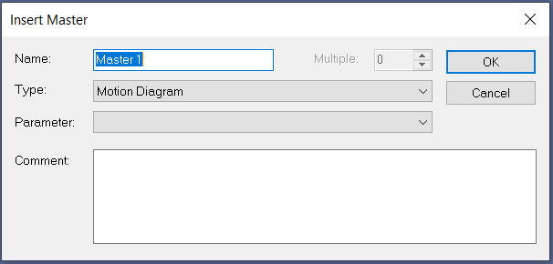
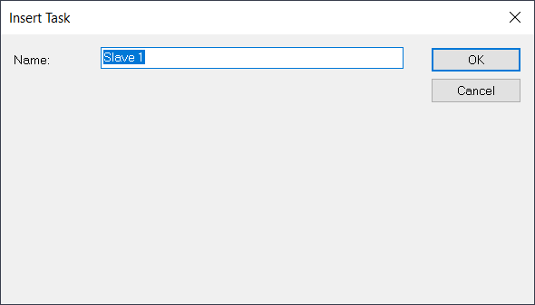
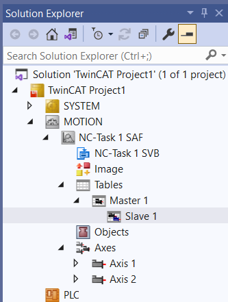

# Cam 設定手順

## 前提

TE1510 : Cam Design Tool
Cam のデータを保存する場合に使用する。

## Cam の導入

### NC Task を追加する

1. `MOTION > Add New Item...` を選択する。

    {w=400px align=center} 

2. 目的の `NCTask` を作成する。

    {w=400px align=center} 

### Axis を追加する

1. `Axes > Add New Item...` を選択する。

    {w=400px align=center} 

2. `Master` と `Slave` 用に 2 軸 Continuous Axis を追加する。

    {w=400px align=center} 

### Master を追加する

1. `Tables > Add New Item...` を選択する。

    {w=400px align=center} 

2. `Motion Diagram` で `Master` を追加する。

    {w=400px align=center} 

### Slave を追加する


1. `Master > Add New Item...` を選択する。

    {w=400px align=center} 

2. `Slave` を追加する。

    {w=400px align=center} 

## Cam の作成

### Motion の作成

1. `Slave` を選択します。

    {w=200px align=center} 


    ```{figure} assets/window_cam_create.png
    :width: 400px
    :align: center
        
    ポイントの情報画面(上部)
    ```

    ```{figure} assets/window_cam_create2.png
    :width: 400px
    :align: center
        
    プロファイル画面(下部)
    ```


2. Insert Point を選択します。

    {align=center} 

3. 下部にポイントを作る。

    {align=center} 

4. ポイントができると上部にポイントのデータが自動生成されます。

    {align=center} 

5. ポイントを 2 つ追加する。

    {align=center} 

6. 上部のデータも自動追加されます。

    {align=center} 

### グラフの形状を変える

1. 上部の Fuction でグラフの形状を変更できます。

    {align=center} 

2. Function に合わせてグラフが変化します。

    {align=center} 
