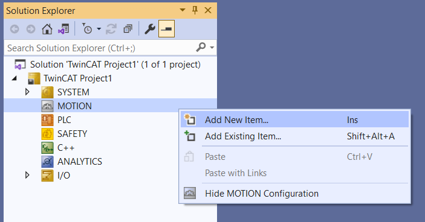
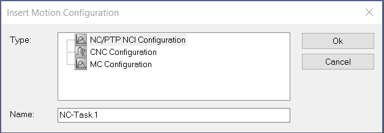
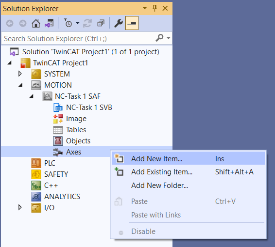
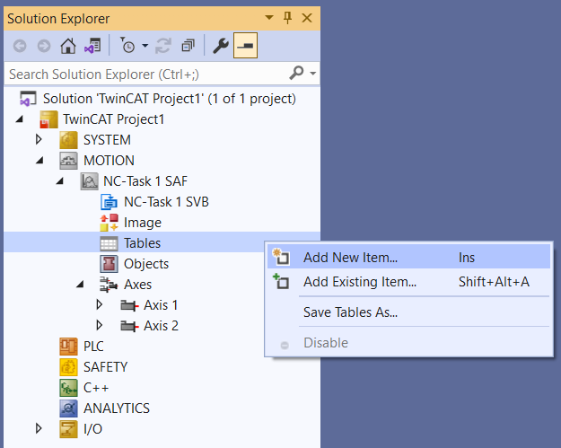
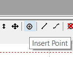
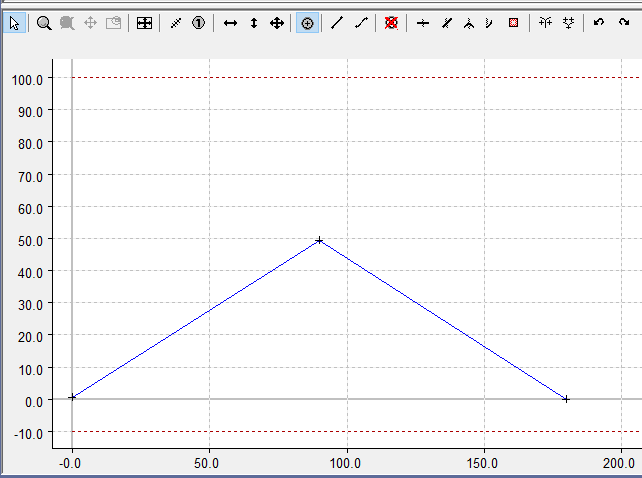

## Camを作成する

TwinCAT XAEのCam Design Toolを使用してCamを作成することができる。

TE1510 : Cam Design Tool

Cam のデータを再編集する際に必要となる。
ライセンスがない場合は新規作成は可能だが、編集することが出来ないので注意する。

### NC Task を追加する

MOTION > Add New Item...を選択する。

目的の NCTask を作成する。

### Axis を追加する

Axes > Add New Item...を選択する。

Master と Slave 用に 2 軸 Continuous Axis を追加する。

### Master を追加する

Tables > Add New Item...を選択する。

 

Motion Diagram で Master を追加する。

### Slave を追加する

Master > Add New Item...を選択する。

Slave を追加する。

## Cam の作成

### Motion の作成

Slave を選択します。

  

上がポイントの情報画面(上部)
下がプロファイル画面(下部)

Insert Point を選択します。

下部にポイントを作る。

ポイントができると上部にポイントのデータが自動生成されます。

ポイントを 2 つ追加する。

上部のデータも自動追加されます。

### グラフの形状を変える

上部の Fuction でグラフの形状を変更できます。

Function に合わせてグラフが変化します。
