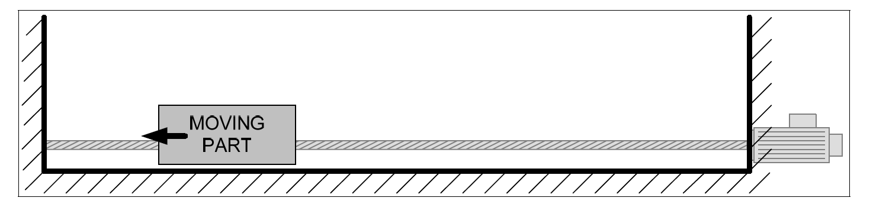

#MC_StepBlock

このファンクションブロックは、物理的なオブジェクトに対して原点復帰手順 を実行し、移動を機械的にブロックする。このモードでは、リミットスイッチや基準パルスがない。原点復帰プロセス中に機械的な損傷を与えないためには、適切なトルク制限が必要。
- StepBlock」条件は２つあり：
  - トルクリミットに達す
  - 実際の速度が、少なくとも 'DetectionVelocityTime' の間、 'DetectionVelocityLimit' 入力の値を下回ったこと
###FBの入力

###FBの出力
