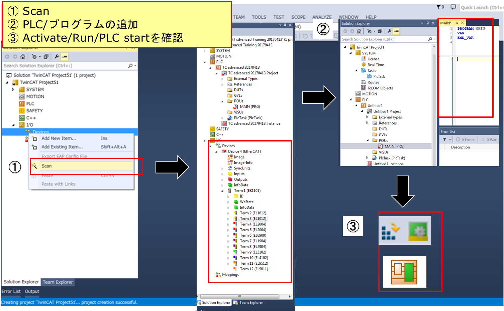

## EtherCAT Slave の Scan

TwinCATからEtherCATデバイスに対して “Scan”をかけて状況を見ることでデバイスのエラー・動作異常の原因を確認できる場合がある。

【対象事例】下記の状況でエラー・動作異常がある場合

1. 装置の新規立上げ時
2. 故障対応でデバイス交換を行った場合
3. 作成したプログラムに対して正常に動作が行われない場合

### 新規Scan

“New project”で新規のTwinCAT projectを作成し“Scan”することでEtherCATで接続されるデバイスを構成を取込むことができる。

次図の通りの操作で、Slaveをスキャンし、PLCをRUNモードへ遷移させることができます。

{align=center idth=300px}

