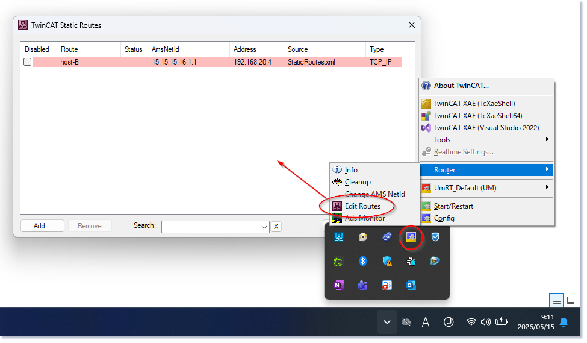

(section_ads_routing)=
# ADSルータ

ADSルータは、TwinCAT上のTcCOMモジュール同士を通信するための役割を果たします。


TwinCATランタイムが非リアルタイム層と通信を行う際には、ソケットを通じた接続を行います。このソケット接続を行うソフトウェアをADSルータと呼びます。

場合、双方にADSルータソフトウェアが稼働している必要があり、このルータがホストアドレス（IPアドレスやホスト名）とAMS Net IDとの対応表を参照してルータ同士データの交換を行います。

よって、ADS通信でソケットを通してルータ間のコネクションを確立するためには、事前に相互のホスト同士のIPアドレスを基にルーティング設定をしておく必要があります。例えば次表のようにhost-Aとhost-BがADSで通信するには、相互にADSルータの機能を擁した上で、AMS NET IDを割り振っておく必要があります。

```{csv-table}
:header: ホスト名, IPアドレス, AMS NET ID

localhost, 127.0.0.1, 127.0.0.1.1.1
host-A, 192.168.20.3, 15.15.15.15.1.1
host-B, 192.168.20.4, 15.15.16.15.1.1
```

この上で、ルータ間の通信先を参照する定義ファイル  `StaticRoutes.xml` または、このディレクトリ以下に作成する `Routes` サブディレクトリ以下に配置した同じフォーマットのXMLファイルにてお互いのAMS NET IDとIPアドレスとの対応表を登録しておく必要があります。

```{code-block} XML
:caption: host-A（Windows）のルート設定 `C:\Program Files (x86)\Beckhoff\TwinCAT\3.1\Target\StaticRoutes.xml`

<?xml version="1.0"?>
<TcConfig xmlns:xsi="http://www.w3.org/2001/XMLSchema-instance" xsi:noNamespaceSchemaLocation="http://www.beckhoff.com/schemas/2009/05/TcConfig">
    <RemoteConnections>
        <Route>
            <Name>host-B</Name>
            <Address>192.168.20.4</Address>
            <NetId>15.15.16.15.1.1</NetId>
            <Type>TCP_IP</Type>
            <Flags>32</Flags>
        </Route>
    </RemoteConnections>
</TcConfig>
```

```{code-block} XML
:caption: host-B（Linux）のルート設定 `/etc/TwinCAT/3.1/Target/StaticRoutes.xml`

<?xml version="1.0"?>
<TcConfig xmlns:xsi="http://www.w3.org/2001/XMLSchema-instance" xsi:noNamespaceSchemaLocation="http://www.beckhoff.com/schemas/2009/05/TcConfig">
    <RemoteConnections>
        <Route>
            <Name>host-A</Name>
            <Address>192.168.20.3</Address>
            <NetId>15.15.15.15.1.1</NetId>
            <Type>TCP_IP</Type>
            <Flags>32</Flags>
        </Route>
    </RemoteConnections>
</TcConfig>
```

なお、この登録作業はXMLで手動で定義する方法の代わりに、次のとおりTwinCATの機能を用いて設定することができます。{bdg-link-primary-line}`参考：InfoSys <https://infosys.beckhoff.com/content/1033/beckhoff_rt_linux/20793631499.html?id=6625251865097960107>`

{align=center}

なお、この場合どちらもADS通信に使用されるTCP/UDPのポートを通した外部通信ができるように、相互にネットワークフィルタ（ファイアウォール）で開放設定する必要があります。

```{csv-table}
:header: ソケット種別, ポート, 用途

TCP, 48898, セキュアではないADS通信
UDP, 48899, ADSルートのの検出やデバイスの検出に用いる
TCP, 8016, セキュアADS通信
```

## ADS over MQTT による接続

これまでの手順にて、host-Aとhost-Bが相互にルーティングテーブルを保持し合うことでADSルータ同士のソケット通信によるコネクションが作成できることをご説明しました。また、このために相互に通信相手側のAMS NET IDとルータのIPアドレスの対応表のXMLファイルを登録しておく必要がありました。加えて、ホスト間でのADSルータ同士の通信には、ポート48898またはポート8016のTCPポートを使用するため、ファイアウォールについて気にしておく必要がありました。

これが、新しい技術であるTwinCAT コンテナ上でのランタイム運用ちょっとした障壁となります。

これまでのADS通信の多くはハードウェアに紐づいたソフトウェアと接続することが一般的でした。たとえばXAE開発環境であったり、HMIとなるGUIアプリケーションです。このユースケースでは一度設定したルーティング設定を頻繁に変更することはありません。

しかし、TwinCATコンテナで動作させるユースケースではコンピュータハードウェアは固定にはなりません。あるときはIPCであり、あるときはクラウド上のコンピューティングリソースとなる可能性があります。また、ランタイムの通信相手も複数のTwinCATコンポーネント同士を通信させたり、必要な時に立ち上げるIoTアプリケーションコンテナとなるなど、コンピュータ上のホストアドレスが頻繁に変わったり新しく生成することが考えられます。そのために相互のルーティング設定を都度変更しなければならないのは極めて管理が煩雑となります。

代替案として提唱されているのがMQTTブローカーを介してADSプロトコルをトンネリングする、 **ADS-over-MQTT** です。この場合、各TwinCATコンテナがADS接続を行うには相手側のルータへ直接ソケット接続を行うのではなく、MQTTブローカを介して接続します。よって各コンテナが保持しておくべき接続設定はMQTTブローカのホストアドレスとトピック名のみです。このトピックを各TwinCATコンテナは相互にパブリッシュ・サブスクライブすることで、AMS Net IDのみで通信相手を特定し、ADSのメッセージ交換を行うことが可能となります。

{align=center}

設定例を {numref}`ADS_routing_definition_for_mqtt` に示します。この例ではMQTTブローカのホストアドレスが `192.168.20.2` で、トピック名が `AdsOverMqtt` となります。

```{code-block} python
:caption: ADS over MQTT で接続する場合のルーティング設定
:section: ADS_routing_definition_for_mqtt

<?xml version="1.0" encoding="utf-8"?>
<TcConfig xmlns:xsi="http://www.w3.org/2001/XMLSchema-instance"
xsi:noNamespaceSchemaLocation="http://www.beckhoff.com/schemas/2015/12/TcConfig">
<RemoteConnections>
    <Mqtt Unidirectional="true">
        <Address Port="1883">192.168.20.2</Address>
        <Topic>AdsOverMqtt</Topic>
    </Mqtt>
</RemoteConnections>
</TcConfig>
```
