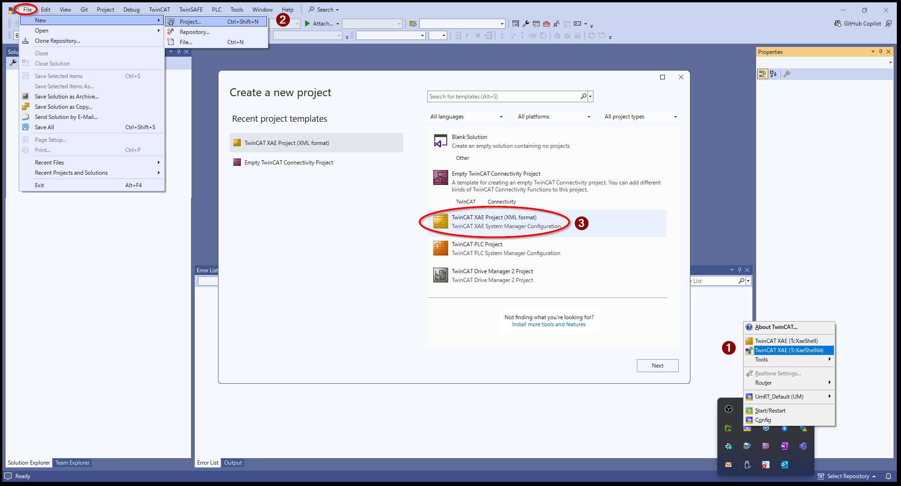
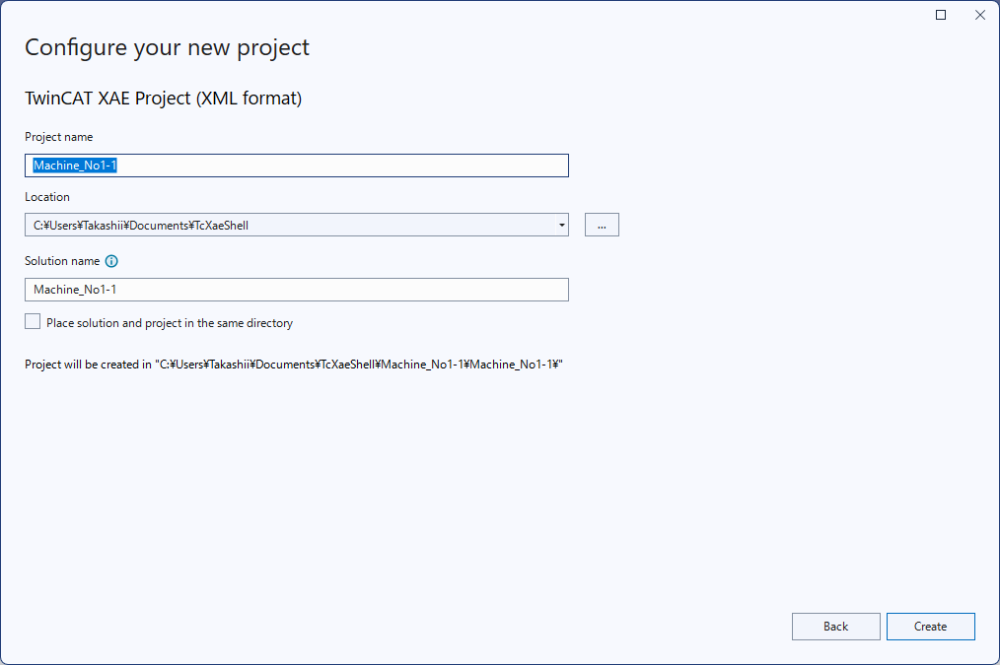

# TwinCATプロジェクトの作成とIPCへの接続

## TwinCATプロジェクトの新規作成

``````{grid} 1
`````{grid-item-card} TwinCATプロジェクトの新規作成
:columns: auto

{align=center}

ソリューションプロジェクト名と保存先を設定するウィンドウが現れますので、適切な名前で保存してください。

{align=center}
`````
`````{grid-item-card} ソリューションツリー
  ````{grid} 2
  ```{grid-item}
  :columns: 4
  {align=center}
  ```
  ```{grid-item}
  :columns: 8
  TwinCATプロジェクトが生成され、ソリューションツリーにTwinCATプロジェクトのデフォルトツリーが現れます。

  SYSTEM
    : TwinCAT全般に関する設定（タスク、ライセンス、ADSルータ等）

  MOTION, PLC, SAFETY, C++
    : 各リアルタイムコンポーネントのプロジェクトを格納します

  IO
    : EtherCAT, EtherNet/IP, ProfiNet...など様々なリアルタイムIOリソースが一覧されます。
  ```
  ````
`````
``````

## IPCへの接続

TwinCATプロジェクトの初期状態では、ランタイム（XAR）への接続先が自分のPCである `<Local>` となっています。この節ではEthernetケーブルで接続した先のIPCに切り替える方法をご説明します。

```{attention}
IPCのWindows領域に開発環境をインストールされていてこのXAEをお使いの方はこの節は読み飛ばしてください。
```

```{admonition} 事前条件
:class: tip

* 開発用PCのIPCに接続しているEthernetポート、およびそのIPC側のEthernetポートは、どちらもIPアドレス自動取得設定になっているものとします。
* XAEと接続するIPC側のEthernetポートにリアルタイムドライバを適用必要はありません。
```

````{admonition} 使用するEthernetポートの選択にご注意ください
:class: attention

多くのIPCには複数のEthernetポートを備えていますが、EtherCATとしてお使いいただく場合、ポートによってサイクルタイムの制限があります。たとえば、C6025は3つのEthernetポートがありますが、次の参考リンクの説明にあるとおり、Intel® i210を搭載したX103, LAN2; X104, LAN3は1ms以下のサイクルタイムに使用できますが、Intel® i219を搭載したX102, LAN1は1msより大きなサイクルタイムのみでお使いいただけます。

{bdg-link-primary-line}`参考：InfoSys <https://infosys.beckhoff.com/content/1033/c6025/8212982923.html?id=3163034562408065601>`

よって、XAEとIPCのXARと接続する際にはリアルタイムネットワークではありませんので、 **遅いサイクルタイムにしか利用できないX102, LAN1を優先的に利用する** ことが望ましいといえます。

事前に各機種のマニュアルをご覧いただき、最適なEthernetポートを選んでください。また、リアルタイムネットワークとして利用いただくことを前提としたフィールドバスは、EtherCATの他にEtherNet/IPやProfinet、またTF6311によるソケット通信などがございます。より高速なサイクル通信が可能なポートはできる限り空けておくことをお勧めします。
````

`````{grid} 1

````{grid-item-card} ターゲットの切り替え
`Choose Target System` タブ選択から、`Choose Target System...`を選択します。

  ::::{grid} 2
  :::{grid-item} 
  :columns: 8
  {align=center}
  :::
  :::{grid-item} 
  :columns: 4
  {align=center}
  :::
  ::::
  ````

````{grid-item-card} ターゲットの検索
`Search (Ethernet)...` ボタンを押します。

{align=center}

相手先のIPアドレスが分かっている場合
    : 赤枠欄にIPアドレスを設定して `Enter Host Name / IP:` ボタンを押してください。

    : {align=center}

相手先のIPアドレスが分からない場合
    : `Broadcast Search` ボタンを押してください。ネットワークカードが一覧されるウィンドウが現れます。OKボタンを押すとチェックを入れたカードからブロードキャストでIPCを検索します。

    : {align=center}
````
````{grid-item-card} 見つかったターゲットへのルート追加
ターゲットIPCのホスト名、IPアドレスなどの情報が一覧されます。目的のIPCを選択し、`Addres Info:` 欄のラジオボタンを `IP Address` を選択してから `AddRoute` ボタンを押します。

{align=center}

```{attention}
`IP Address` を選択しておかないとこの後Routeに接続に失敗します。
```
````
````{grid-item-card} ターゲットへの接続設定
1. `Secure ADS` および、`Self Signed Certificate` が選択します。
2. `Check Fingerprint: `の文字列をダブルクリックして`CTRL + C`キーでクリップボードにコピーします。
3. `Compare with:` 欄にカーソル移動して `CTRL+V` にてクリップボードの内容をペーストします。
4. Remote User Credetials の `Password:` にIPCの `Administrator` ユーザのパスワードを入力して、最後に `OK` ボタンを押します。 

{align=center}

````
````{grid-item-card} 接続成功
接続に成功すると、Connected欄に鍵アイコンが表示されます。確認できたら `Close` ボタンを押してください。

{align=center}
````
````{grid-item-card} 作成した接続先へのターゲット選択
Target System一覧に、追加したターゲットのIPCが一覧されています。選択された状態で`OK`ボタンを押します。

{align=center}
````

````{grid-item-card} 変更後のターゲットのアーキテクチャ変更確認
ターゲット先のIO情報やアーキテクチャ設定に更新するウィンドウが現れますので、いずれも`OK`ボタンをおしてください。
  ::::{grid} 2
  :::{grid-item} 
  {align=center}
  :::
  :::{grid-item} 
  {align=center}
  :::
  ::::
````
`````

以上の手順で、次の通りターゲットが `<Local>` IPCに切り替わっていることがわかります。

{align=center}

* 基本的にXAE上での設定変更、操作は、接続先のIPCに対して行っているものとして認識してください。
* 設定変更した内容をIPCへ反映するには、  のアイコンを押して  `Active Configuration` を行います。