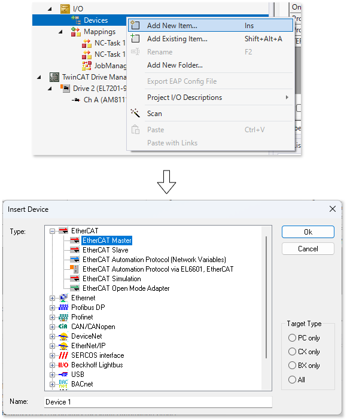
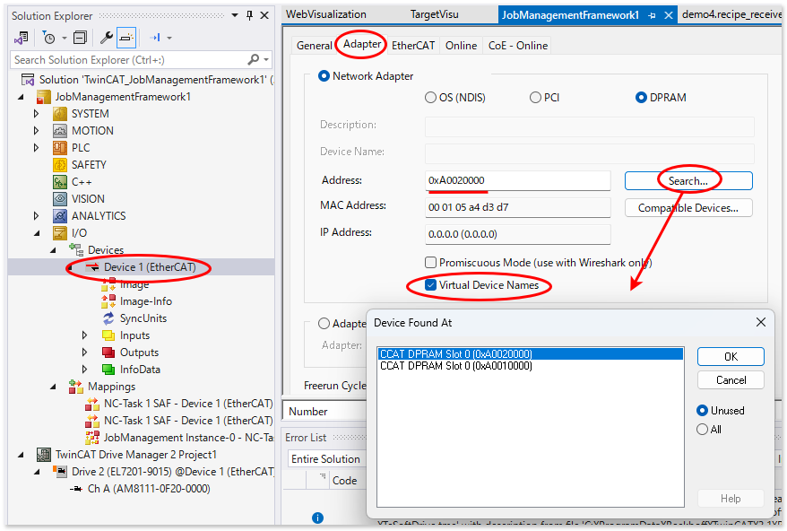
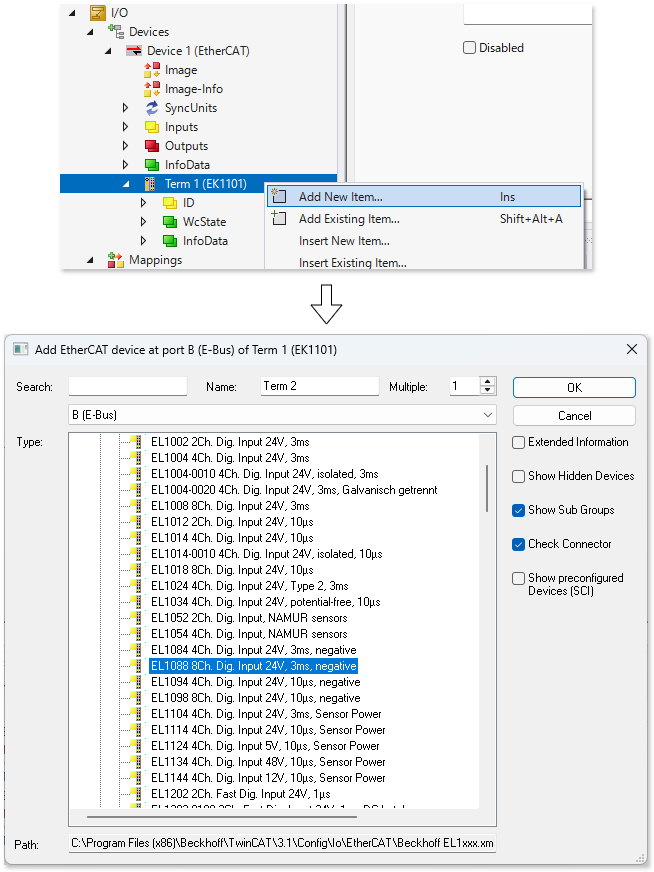

# EtherCATのスキャン

すでにEtherCATの通信経路が構成されている場合は、次のメニューからEtherCATの通信経路のSCANを行い、その結果を一覧させることができます。

{align=center}

## ESIファイルの配置

EtherCAT対応サブデバイスを認識するには、ESI（EtherCAT Sub-device Information）を、次のTwinCAT XAE（開発環境）のインストールされたPCの所定のフォルダへ配置する必要があります。

ファイルをサブデバイスメーカからダウンロードしましたら、こちらへ展開してください。ファイルは再帰的に検索されますので、サブフォルダを作成いただいても構いません。

Build 4024まで
    : ```{code} powershell
      C:\TwinCAT\3.1\Config\Io\EtherCAT
      ```

Build 4026以後
    : ```{code} powershell
      C:\Program Files (x86)\Beckhoff\TwinCAT\3.1\Config\Io\EtherCAT
      ```

ここに格納するファイルで、Beckhoff製のIOターミナルについてはTwinCAT XAEをインストールした時点で同梱されています。ただ、下記のサイトには別途最新がダウンロードできるようになっていますので、ダウンロードした zip ファイルを解凍して、上記フォルダパスへ展開して上書きしていただく事で最新の状態となります。

[Beckhoff製 EtherCAT サブデバイスのESIファイルのダウンロード](https://www.beckhoff.com/ja-jp/support/download-finder/search-result/?c-1=27833244)


## ネットワークのスキャン

すでにIPCへEtherCATネットワークが組みあがっている環境において、接続されたサブデバイスをスキャンしてソフトウェア上の定義（ENI）として自動的に構成するために、デバイスのスキャン機能を用います。

手順はこちらのドキュメントをご覧ください。

```{tip}
* [ネットワークのスキャン](https://sites.google.com/site/twincathowto/io-she-ding/ethercatnettowakunosukyan)
```

## 手動で構成する

まだ実物が無い状態で、設計上のEtherCATネットワークを構成するには次の手順に従ってください。

```{list-table}
:widths: 3,7

- * EtherCATメインデバイスの新規作成
        : `I/O` - `Devices` ツリーからコンテキストメニューで `Add New Item...` を選択し、`EtherCAT Master` を選んでOKボタンを押します。
  * {align=center}
- * ネットワークインターフェースカード指定
        : EtherCATメインデバイスとするネットワークインターフェースカードを指定します。
  * {align=center}
- * 1. EtherCAT メインデバイスの、Adapterタブにある `Search` ボタンを押して現れるネットワークインターフェースを選択してください。
  * 2. Virtual Device Namesにチェックを入れます。これによりネットワークカードのMACアドレスではなく、ネットワークインターフェース名を基にインターフェースの割り当てが行われます。同じタイプのIPCであればネットワークアダプタ名称が同じですのでターゲットIPC毎にネットワークカードを指定しなおす必要がなくなります。
- * カプラーの追加
        : 最初に接続されるターミナルがカプラーの場合、`System Couplers` のツリーから型番を選びます。
  * {align=center}
- * カプラーへの追加
        : カプラーを選択して ebus に接続されたELターミナルの追加を行います。
  * {align=center}
- * ターミナルの追加・挿入
        : Insertを選ぶと選択したターミナルの前段に、Addを選ぶと後段に指定したターミナルが追加されます。
  * {align=center}
```