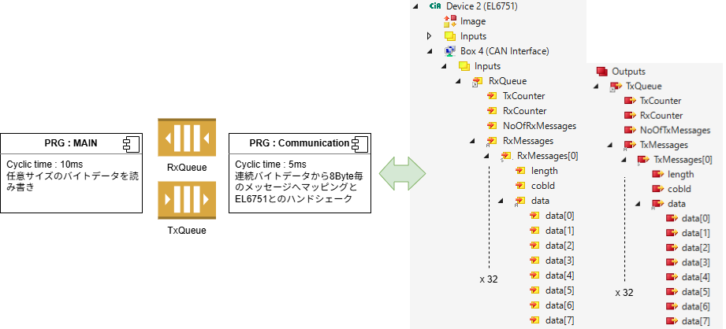
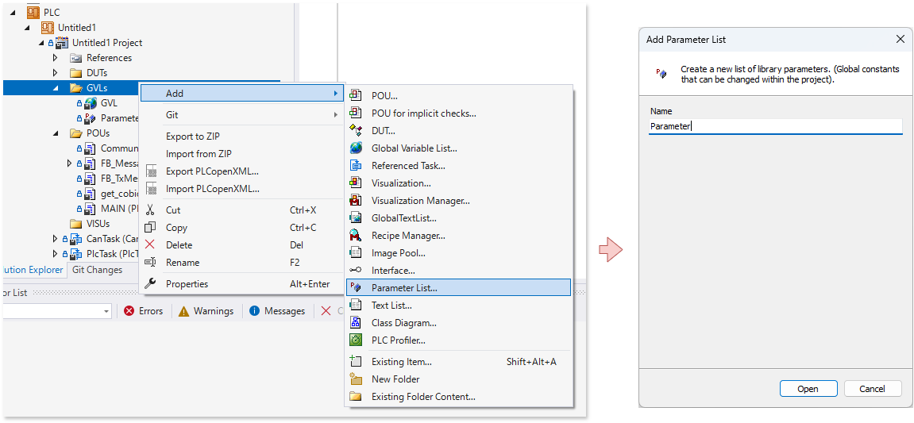

# サンプルプログラム

前節で作成したCAN InterfaceのBOX IOは、CANフレーム構造に応じたデータ長、COB-ID、最大8byteのデータエリアが32個作成されました。これらを通してデータを交換するため、次図のとおり送信、受信それぞれにキューを設け、MAINプログラムと独立したCommunicationプログラムにて通信を行うサンプルコードをご紹介します。

```{admonition} ダウンロード
[https://github.com/Beckhoff-JP/CANCommunication](https://github.com/Beckhoff-JP/CANCommunication)
```

{align=center}


EL6751では1メッセージ辺り最大8byteのデータ領域を持つCANフレームに対応したデータ構造があり、前節で設定した数のバッファを持っています。（本例では32個）

MAINプログラムからキューを通じてデータの書き込み、読み出しを行います。キューに対しては任意のバイト列のデータを読み書きすることができ、CANメッセージの上限8Byteやヘッダなどを意識する必要はありません。

キューを通じてCommunicationプログラムがMAINからのデータを受け取ると、EL6751のIOのデータ構造にマッピングしてEtherCATを通じたハンドシェークを行う事で送受信を行います。

具体的には、送信側では`GVL.TxQueue`から取り出したデータを、8Byteづつ分割してEL6751のTxバッファへデータを書き込んでハンドシェークを開始します。

受信側ではEL6751のRxバッファから取り出した8Byteづつのデータを`GVL.RxQueue`へ送り、MAINプログラムではデータがキュー溜まったことを検出するとバイト配列としてまとめて取り出すことができます。

以後、具体的な実装手順を説明します。

## パラメータの定義

プログラムで制御するパラメータを追加します。前節で設定したEL6751のCAN interfaceで設定したバッファ数（32）を定義します。

{align=center}

```{code-block} iecst
:caption: GVLs > Parameter
:name: parameter_el6751_buffer_size

{attribute 'qualified_only'}
VAR_GLOBAL CONSTANT
    EL6751_BUFFER_SIZE :UDINT := 32;
END_VAR
```

## キューモデルの定義

キュー内部には連続した`BYTE`型の配列のバッファを持ち、リングバッファとして機能します。`read(p_data: PVOID, cbLen: UDINT)`, `write(p_data: PVOID, cbLen: UDINT)`メソッドでは、指定した連続バイト数のデータを読み書きできます。引数には読み書きを行う変数ポインタと、バイトサイズを指定します。`write()`では指定した変数のポインタとそのポインタを先頭とした書き込みたいサイズを指定してデータをキューインし、`read()`では指定した変数のポインタに対して、指定したサイズをキューから取り出して書き込みます。

キューの最大容量は`max_q_size`プロパティで取り出せ、現在溜まっているキューサイズは`length`プロパティで取り出すことができます。

```{code-block} iecst
:caption: POUs > FB_MessageQueue本体
:name: pou_FB_MessageQueue_body

FUNCTION_BLOCK FB_MessageQueue
VAR CONSTANT
    QSIZE : UDINT := 1024; // キューサイズを指定
END_VAR
VAR_INPUT
END_VAR
VAR_OUTPUT
END_VAR
VAR
    buffer : ARRAY [1..QSIZE] OF BYTE;
    read_index : UDINT := 1;
    write_index : UDINT := 1;
    _length : UDINT;
END_VAR
```

```{code-block} iecst
:caption: POUs > FB_MessageQueue > read() メソッド
:name: pou_FB_MessageQueue_read

(*キューのデータから指定したサイズ読み取つて指定したポインタに書き込む*)
METHOD read : BOOL;
VAR_INPUT
    p_data : PVOID; // 読み込んだデータを書き込む先のポインタアドレス
    cbLen : UDINT; // 読み込むデータサイズ（byte）
END_VAR
VAR
    modulo : UDINT;
END_VAR

IF cbLen > _length THEN
    cbLen := _length;
END_IF

IF (read_index + cbLen) > QSIZE THEN
    modulo := cbLen - (QSIZE - read_index);
ELSE
    modulo := 0;
END_IF

// リンクバッファ方式のキューなのでバッファの末端に達した場合、読み込むデータの折り返した後のサイズをmoduloに格納
IF modulo > 0 THEN
    MEMCPY(p_data, ADR(buffer[read_index]), cbLen - modulo);
    read_index := 1;
    MEMCPY(p_data + (cbLen - modulo), ADR(buffer[read_index]), modulo);
    read_index := read_index + modulo;
ELSE
    MEMCPY(p_data, ADR(buffer[read_index]), cbLen);
    read_index := read_index + cbLen;
    IF read_index >= QSIZE THEN
        read_index := 1;
    END_IF
END_IF

_length := _length - cbLen;
```


```{code-block} iecst
:caption: POUs > FB_MessageQueue > write() メソッド
:name: pou_FB_MessageQueue_write

(*指定したサイズとポインタのデータをキューへ書き込む*)
METHOD write : BOOL
VAR_INPUT
    p_data : PVOID; // 書き込むデータのポインタアドレス
    cbLen : UDINT; // 書き込むデータサイズ（byte）
END_VAR
VAR
    modulo : UDINT;
END_VAR

IF (QSIZE - _length) < cbLen THEN
    write := TRUE;
    RETURN;
END_IF

// リンクバッファ方式のキューなのでバッファの末端に達した場合、書き込むデータの折り返した後のサイズをmoduloに格納
IF (write_index + cbLen) > QSIZE THEN
    modulo := cbLen - (QSIZE - write_index);
ELSE
    modulo := 0;
END_IF

IF modulo > 0 THEN
    MEMCPY(ADR(buffer[write_index]), p_data, cbLen - modulo);
    write_index := 1;
    MEMCPY(ADR(buffer[write_index]), p_data + (cbLen - modulo), modulo);
    write_index := write_index + modulo;
ELSE
    MEMCPY(ADR(buffer[write_index]), p_data, cbLen);
    write_index := write_index + cbLen;
    IF write_index >= QSIZE THEN
        write_index := 1;
    END_IF
END_IF


_length := _length + cbLen;
```

```{code-block} iecst
:caption: POUs > FB_MessageQueue > length プロパティ
:name: pou_FB_MessageQueue_length

PROPERTY length : UDINT

Get:
    length := _length;
```

```{code-block} iecst
:caption: POUs > FB_MessageQueue > max_q_size プロパティ
:name: pou_FB_MessageQueue_max_q_size

PROPERTY max_q_size : UDINT

Get:
    max_q_size := QSIZE;
```

## タスク設定とPLCプログラム

TwinCATのタスクとして次のとおり設定します。`CanTask` タスクサイクル時間は、CAN通信のボーレートやデータスループット要求に応じて適切に設定してください。

```{csv-table}
:header: Object, BaseTime($ms$), CycleTime($ms$),登録するPOU名

CanTask,1$ms$,5$ms$, Communication
PlcTask,1$ms$,10$ms$, MAIN
```

## 送受信キューインスタンス定義

グローバルラベルにキューのインスタンス変数を宣言します。

```{code-block} iecst
:caption: GVLs > GVL
:name: gvl_gvl

{attribute 'qualified_only'}
VAR_GLOBAL
    rx_queue : FB_MessageQueue;
    tx_queue : FB_MessageQueue;
END_VAR
```
## Communication プログラムの実装

通信プログラムを実装します。[こちらのサイトに記載されている参考プログラム](https://infosys.beckhoff.com/content/1033/can-interface/5013025547.html?id=117400649333443125)を基に実装します。まず、このサイトの **Message structure when using the 29-bit identifier** に記載されている `COB ID` の8Byteデータを生成するファンクションを実装します。

```{code-block} iecst
:caption: POUs > get_cobid_ext ファンクション
:name: pou_function_get_cobid_ext

(*Generate COBID byte data for CAN 2.0b 29bit extended CAN ID support*)
FUNCTION get_cobid_ext : UDINT
VAR_INPUT
	extended : BOOL;
	rtr : BOOL := FALSE;
	id : UDINT;
END_VAR
VAR
END_VAR

IF extended THEN
    get_cobid_ext := 16#80000000;
    IF rtr THEN
        get_cobid_ext := get_cobid_ext OR 16#40000000;
    END_IF
    get_cobid_ext := get_cobid_ext OR (id AND 16#3FFFFFFF);
ELSE
    get_cobid_ext := 16#00000000;
    IF rtr THEN
        get_cobid_ext := get_cobid_ext OR 16#40000000;
    END_IF
    get_cobid_ext := get_cobid_ext OR (id AND 16#0003FFFF);
END_IF
```

次にEL6751とのハンドシェークを行う通信プログラムを実装します。先ほどのタスク設定にあるとおり、このプログラムは `CanTask` のサイクルで実行します。実装後、PLC プロジェクト内に Reference Taskを作成して、Communicationプログラムを登録してください。

また、`PlcTask`で実行されているMAINプログラムとの間でのデータ交換は、グローバルラベルで宣言したキューを通じて非同期通信します。

キューを通じて受け取ったデータで送信する際には、先ほど作成したCOB-IDを生成するファンクションが起動後最初のサイクルで実行され、`my_cobid`に格納されます。これを使ってCANフレームを生成します。

```{tip}
COB-IDには、CAN IDが含まれます。CANは半二重の通信経路でデータが転送され、多対多の通信を実現しており、同時送信が行われるケースがあります。この場合、CANの仕様によりアービトレーション（調停）の仕様によりCAN ID部の値が小さい値の方が優先され、大きい値のノードが待たされる処理が行われます。この仕様を考慮した上で適切なCAN IDを `can_id` にセットしてください。
```

```{code-block} iecst
:caption: POUs > Communication プログラム
:name: pou_program_communication

PROGRAM Communication
VAR
    Outputs AT%Q* : IO.CANTXQUEUESTRUCT_E_32;
    Inputs AT%I* : IO.CANRXQUEUESTRUCT_E_32;
    tx_message_count : UDINT;
    tx_message_modulo : UINT;
    extended_id : BOOL := TRUE; // TRUE if CAN2.0b 29 bit extended ID
    rtr : BOOL := FALSE; // TRUE if RTR message
    can_id : UDINT := 1; // set CAN ID
    init : BOOL; // Initialization flag
    my_cobid : UDINT;
    i : UDINT;
END_VAR

IF NOT init THEN
    my_cobid := get_cobid_ext(extended_id,rtr,can_id);
    init := TRUE;
END_IF


// データ送信 キューバッファからデータを取り出してEL6751メッセージバッファへ書込み
// 基本的に入力と出力のTxCounterを使ってEL6751とハンドシェークしてEtherCAT通じてデータを交換する
IF (Outputs.TxCounter = Inputs.TxCounter)            // check if the interface is ready
AND GVL.tx_queue.length > 0 THEN                   // and messages are to send

    // CAN interfaceのメッセージは8Byte毎に区切って作成する
    // このため、キューにたまったデータサイズを8Byte毎に区切ったメッセージ数と余りのバイト数を計算
    tx_message_count := GVL.tx_queue.length / 8;
    tx_message_modulo := TO_UINT(GVL.tx_queue.length MOD 8);
    // ただし、EL6751のメッセージバッファ数を越えるならそこで頭打ち
    IF tx_message_count > Parameter.EL6751_BUFFER_SIZE THEN
        tx_message_count := Parameter.EL6751_BUFFER_SIZE;
        tx_message_modulo := 0;
    END_IF
    
    //メッセージ数の回数に分けてバイト列をキューから順に取り出してEL6751のキューバッファへセット
    FOR i := 1 TO  tx_message_count DO        // LOOP for copying the CAN message to the
        IF tx_message_count > i OR tx_message_modulo = 0 THEN
            Outputs.TxMessages[i].length := 8;
            GVL.tx_queue.read(ADR(Outputs.TxMessages[i].data), 8);
        ELSE
            Outputs.TxMessages[i].length := tx_message_modulo;
            GVL.tx_queue.read(ADR(Outputs.TxMessages[i].data), tx_message_modulo);
        END_IF
        Outputs.TxMessages[i].cobid := my_cobid;
    END_FOR
    Outputs.NoOfTxMessages := TO_UINT(tx_message_count); // number of CAN messages you are going to send
    Outputs.TxCounter := Outputs.TxCounter + 1;        // inc. shows the CAN interface that new data
                                                    // is available and to send this data
END_IF


// データ受信 EL6751メッセージバッファからデータを取り出してキューへ書込み
// 基本的に入力と出力のRxCounterを使ってEL6751とハンドシェークしてEtherCAT通じてデータを交換する
IF Outputs.RxCounter <> Inputs.RxCounter THEN        // check if new data is in the buffer
FOR i := 1 TO Inputs.NoOfRxMessages DO        // start the LOOP and check how much data
                                                    // is in the buffer
        GVL.rx_queue.write(ADR(Inputs.RxMessages[i].data),Inputs.RxMessages[i].length);   // copy the CAN message
END_FOR
Outputs.RxCounter := Inputs.RxCounter;            // set equal: the CAN interface then knows,                                                     // that you have copied the CAN data
END_IF
```

## MAIN プログラムの実装


```{code-block} iecst
:caption: POUs > MAIN プログラム
:name: pou_program_main

PROGRAM MAIN
VAR
    i : UDINT;
    tx_index : UDINT;
    test_message :STRING := '9876543210abcdefghijklmnopqrstuvwxyz0123456789ABCDEFGHIJKLMNOPQRSTUVWXYZ';

    received_data : STRING(1024);
    received_length : UDINT;
    receive_buffer_index : UDINT;
END_VAR


// 送信。とにかくキューが空いてたら文字列を書く
IF GVL.tx_queue.length < GVL.tx_queue.max_q_size THEN
    GVL.tx_queue.write(ADR(test_message), TO_UDINT(LEN(test_message)));
END_IF

// 受信　1024Byteの受信データ文字列バッファ上にリング状に読み出していく
WHILE GVL.rx_queue.length > 0 DO
    IF (SIZEOF(received_data) - receive_buffer_index) > GVL.rx_queue.length THEN
        received_length := GVL.rx_queue.length;
        GVL.rx_queue.read(ADR(received_data) + receive_buffer_index, received_length);
        receive_buffer_index := receive_buffer_index + received_length;
    ELSE
        GVL.rx_queue.read(ADR(received_data) + receive_buffer_index, (SIZEOF(received_data) - receive_buffer_index));
        receive_buffer_index := 0;
    END_IF
END_WHILE
// STRING型の最終BYTEはNULLでなければ文字型としてエンコードできない
MEMSET(ADR(received_data) + SIZEOF(received_data) - 1,0,1);
```

## EL6751のCAN Interfaceとのリンクとアクティベート

ビルドを行うとPLCインスタンスの `CanTask Inputs` および、`CanTask Outputs` 以下の`Communication.Inputs`, `Communication.Outputs` が生成されます。それぞれ、IOのBox * (CAN Interface) ツリー以下に作成された `Inputs.RxQueue`, `Outputs.TxQueue` にリンクし、Active Configurationを行ってください。

## さらなる改造

今回は、キューの仕様として連続BYTE配列データを指定サイズ読み書きできる仕様でサンプルコードとしました。とくに受信データについてはキューに溜まったデータがどのようなデータかチェックせずただ、取り出すだけの仕様です。

受信したデータを内容によって振り分けたり、フレーム開始、終了コードの判別や、さまざまなバリエーションのメッセージデータ構造に対応できるようにするには、Interfaceの抽象オブジェクトを用いてキュー内のデータ検査を行い、フロー制御やデータ振り分けなどを実装いただくと、より汎用的な通信フレームワークになります。
