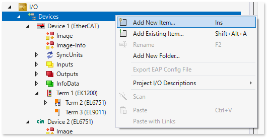
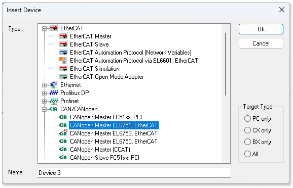
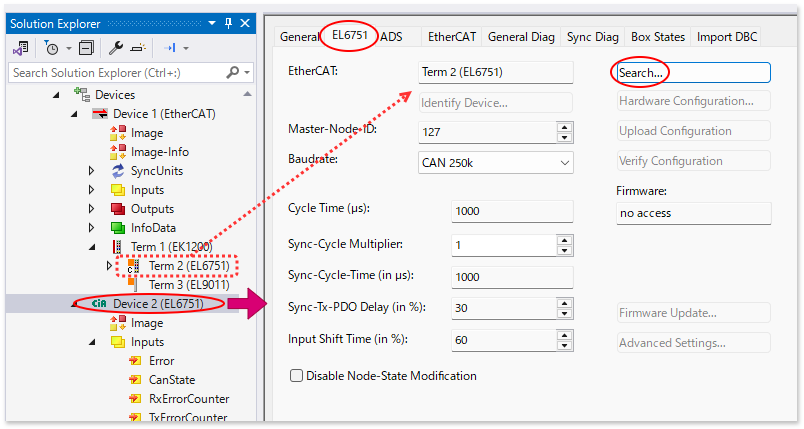
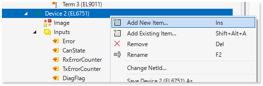
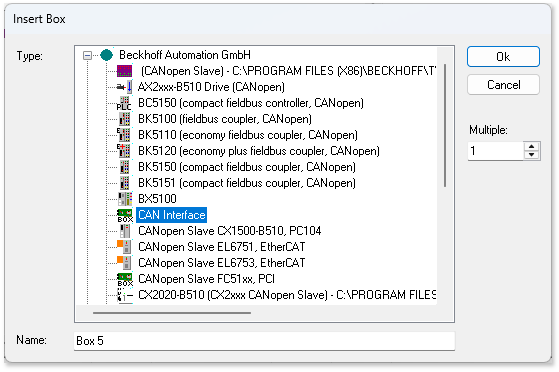
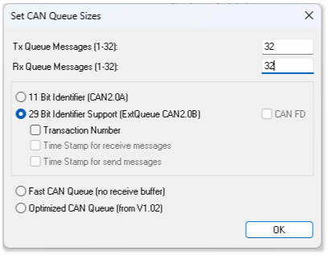

# CAN通信設定手順

CAN通信には、1フレーム辺りのデータサイズを8Byteで最大ボーレートを1MbpsとするCAN 2.0 規格と、64Byteまで拡張し、5Mbps以上通信可能な CAN FD 規格があります。さらに、CAN2.0規格には、CAN ID部を11bitとするCAN2.0aと、29bitとするCAN2.0bの2つの規格が存在します。

EtherCATのCAN通信ターミナルには、EL6751とEL6753の2種類がありますが、この二つの違いは、CAN FDに対応しているか否かの違いとなります。EL6753のみCAN FDに対応しています。

また、CAN2.0aとCAN2.0bの違いとして、EL6751/EL6753にはターミナル内のバッファを使って送受信データをFIFOキュー処理する機能が備えられていますが、このキュー機能を使うことができるのはCAN2.0aのみです。

ここでは、CAN2.0bを使ってPLC側でFIFOキューを作って順次データアクセスする手法をご説明します。

``````{grid} 1
`````{grid-item-card} 1. IO > Devices を右クリックして現れるコンテキストメニューから Add New Item... を選びます。
{align=center}
`````
`````{grid-item-card} 2. CAN/CANopenメニューから CANopen Master EL6751, EtherCAT を選択します。
{align=center}
`````
`````{grid-item-card} 3. 作成されたDevice * (EL6751) をダブルクリックし、EL6751タブの設定を行います。
{align=center}

EtherCAT
    : Search ボタンを押して、該当するEtherCATサブデバイス（EL6751）を選択します。

Master-Node-ID 
    : CANOpenとして用いる際の CAN ID の11bitヘッダ部のうち、[7bit部で定義するNode IDの設定](https://infosys.beckhoff.com/content/1033/el6751/2519213579.html?id=4228679782958907566)です。CAN通信としてのみ使用する場合は無視して構いません。

Baudrate
    : ボーレート（通信速度）を設定してください。

Cycle Time
    : タスクサイクルの値が自動設定されます。送受信間隔を司る基本サイクルタイムです。TxQueue/RxQueueなどの通信メッセージをコンテキスト（Task）の持つ変数とリンクしたあとビルドを行うと反映されます。

Sync-Cycle Multiplier
    : 上記で表示されたサイクルタイム何回分をCANメッセージの送受信の送受信周期とするかを設定します。

Sync-Cycle-Time (in $\ \mu s$)
    : `Cycle Time` $\times$ `Sync-Cycle Multiplier` の値が反映されます。ビルドを行うまで反映されません。

Sync-Tx-PDO Delay(in %)
    : EL6751で同期信号が発行されてから Sync-Cycle-Time (in $\ \mu s$) で設定されたサイクルタイムの何%遅延時間を置いてから送信制御を行うかを設定。複数のCANのポートが存在する場合、送信タイミングが重ならないようにずらす設定を行う事により通信バーストを防ぐことができます。

    : なお、同期信号とは、EtherCATサブデバイス設定 `Term * (EL6751)` の `DC` タブ設定によって仕様が変わります。SM-Syncron 設定の場合はタスク周期により発せられるEtherCATフレームがEL6751に到着する周期、DC-Syncron の場合は Distribution Crock による同期周期に従います。複数のEL6751を同一 Sync unit 内にて完全同期した周期で送信タイミングを正確に調整したい場合は、EtherCATフレーム伝送遅延まで考慮して同期を実現するDC-Syncronを選んでください。受信のみにしか用いない場合はこの設定は不要です。

Input Shift Time (in %)
    : EL6751で同期信号が発行されてから Sync-Cycle-Time (in $\ \mu s$) で設定されたサイクルタイムの何%遅延時間を置いた時点の受信データを EtherCAT 入力バッファに反映するかを設定します。通信相手からの送受信に対するレスポンス時間の応答性能によって適切な値を設定してください。

```{note}

[参考 InfoSys サイト](https://infosys.beckhoff.com/content/1033/el6751/2519217419.html?id=6259439910808643118)
```

```{tip}
タスクのサイクルサイクルタイムは、EtherCATメインデバイスとEL6751との間における通信制御を行うための制御サイクル時間として十分に短い時間を設定してください。対してCAN通信相手側に対しては、送信からの受信までの応答時間やボーレート設定などに準じた適切な通信サイクルタイムを計算し、この結果を `Sync-Cycle Multiplier` に反映してください。

さらにPLCの制御サイクルと、EL6751とのEtherCAT通信サイクルは別のタスクとして分けて設定し、この間をFIFOキュー等で非同期通信していただくことをお勧めします。このための方法をサンプルコードをもとに後述します。

さらに同一のCAN通信ネットワークに複数のEL6751がある場合、送信タイミングが同一の場合、フレーム競合が起こり、CANの調停機能によって特定のノードに集中した遅延が発生します。Sync-Tx-PDO Delay(in %) パラメータにより送信タイミングをずらすことで、フレーム競合を回避してください。
```

`````
`````{grid-item-card} 4. 作成されたDevice * (EL6751) ツリー上で右クリックして現れるコンテキストメニューから Add New Item... を選びます。
{align=center}
`````

`````{grid} 2
```{grid-item-card} 5. CAN interface を選択します。
{align=center}
```
```{grid-item-card} 6. バッファ、および、通信フォーマットを設定します。
{align=center}

Tx Queue, Rx Queue
    : バッファの数を指定します。CANメッセージフレームは最大8Byteのデータを送ることができ、このフレーム数のバッファを保持できます。

11 Bit Identifier / 29 Bit Idefntifier Support
    : CAN 2.0a もしくは CAN 2.0b どちらのメッセージ仕様とするか指定します。

Fast CAN, Optimized CAN Queue
    : 11 Bit Identifier の場合のみ選択可能です。EL6751側のバッファを使ってQUEUEを使用する方式ですが、EtherCAT側が十分に高速なため、使用は推奨しません。
```
`````
``````