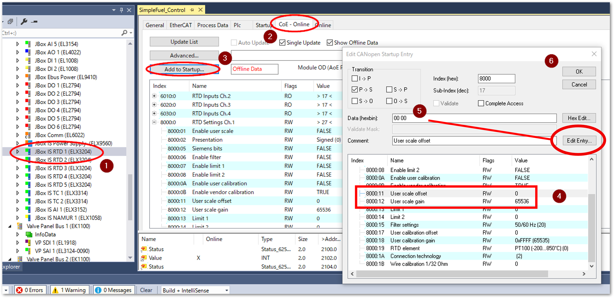
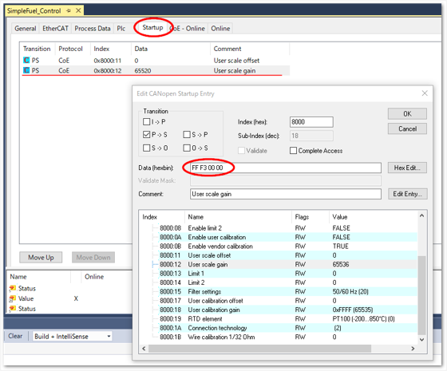

# CoEスタートアップパラメータ

EtherCATサブデバイスにはその動作仕様を決定するさまざまなパラメータを持っています。CANOpenのアプリケーション仕様をEtherCATに適用したCoE(CAN Application Protocol over EtherCAT)にて規定されているIndex, Subindexを通したパラメータアクセスが可能です。

TwinCAT上に構成されたEtherCATネットワークには、個々のサブデバイスがツリー形式でぶら下がっています。CoEパラメータを持つデバイスについては、`CoEオンライン`というタブにて設定と一覧が可能です。`Flags` 列が `RW` となっているものは、書き込みも可能です。PREOP, SAFEOP, OP のいずれかであればダブルクリックして書き込んだ値がサブデバイスに書き込まれます。

```{figure} assets/coe_parameter.png
:align: center
:name: figure_edit_coe_parameter

RW属性のCoEパラメータの書き込み編集
```

ただし、ここで書いた値は次回システムを再起動すると元に（デフォルト値に）戻ってしまいます。変更した値を次回も再現したい場合（永続化といいます）は、 **Startup登録** する必要があります。次の手順を実施してください。

{align=center}

1. 任意のサブデバイス選択
2. `CoE-Online`タブを開く
3. `Add to Startup...` ボタンを押す
4. ポップアップ画面の次の設定を行う
   
   Transition
      : EtherCATネットワーク初期化時のどのタイミングで書き込むかの設定を行います。
      : I -> P
        : INIT -> PREOP に移行した際に書き込まれる
      : P -> S
        : PREOP -> SAFEOP に移行した際に書き込まれる
      : S -> O
        : SAFEOP -> OP に移行した際に書き込まれる
      : O -> S
        : OP -> SAFEOP に移行した際に書き込まれる 

   Edit Entity... ボタン
      : 設定値を入力します。CoEパラメータはESIファイルに定義された個々のパラメータに定められたサイズのリトルエンディアンのバイト列で `Data [hexbin]` にその設定フィールドが現れます。リトルエンディアンで左からバイト毎に目的のデータを直接編集するのは困難です。代わりに、`Edit Entity...` ボタンを押すと、{numref}`figure_edit_coe_parameter` のように直接編集するウィンドウが開き、10進数、または16進数の値で入力することができます。最後にOKボタンを押すと `Data [hexbin]` そのデータが反映されます。

上記の操作で`Add to Startup...` ボタンを通じて登録したCoEパラメータは、 `Startup` タブに一覧されます。また、目的のパラメータを選択してダブルクリックすると再度編集することが可能です。

{align=center}

```{admonition} 設定変更例：EL3204（温度計）のゲイン調整
:class: tip

上図の設定例はAD変換のデジタル最大値の設定（ゲイン）の設定例です。この値は下記のとおりリトルエンディアンのバイト列で表現されたものを表しています。

デフォルト値
    : 65536（10進数） 0x00010000（16進数）
    : 00 00 00 01 （バイト列）

設定変更値
    : 65523（10進数） 0x0000FFF3（16進数）
    : FF F3 00 00 （バイト列）
```

ここへ登録することで、次回システム再起動後にEtherCATのネットワークが `INIT` > `PREOP` > `SAFEOP` > `OP` 状態遷移のうち、個々に設定したいずれかの時点でSDOコマンドが発行されてStartupに登録したパラメータがサブデバイスに書き込まれます。

このようにメインデバイス側でパラメータを保持しておくことで、サブデバイスが故障した場合、同型機への差し替えを行ってもすぐに再現できることがメリットとなります。

ただし、あくまでもシステム起動時の初期値設定ですから、運転中に動的にパラメータを変更することはできません。この必要がある場合、次節に示すPLCのファンクションブロックによるCoEパラメータ読み書き方法をご参照ください。