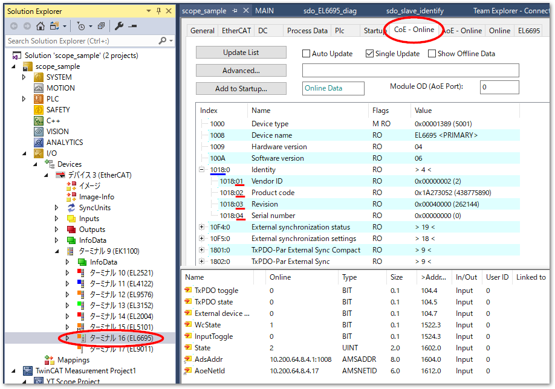

(section_coe_sdo_access)=
# PLCからのSDOデータアクセス

EtherCATサブデバイスとメインデバイスの間で行われる通信データには、周期パケットによりデータ交換が行われるプロセスデータオブジェクト（PDO）と、メインデバイスからのハンドシェーク方式であるMaibox通信によるデータ交換が行われるサービスデータオブジェクト（SDO）の2種類があります。

いずれもCANopen over EtherCAT（CoE）と呼ばれるCANopenの規格に従ったデータフォーマット規約のオブジェクトディクショナリ（OD）に準じてPDO・SDOデータが構成され、EtherCAT上でデータ交換できます。

TwinCAT上では、任意のサブターミナルを選択したあと、`CoE - Online`タブからODを一覧することができます。

CoEのODは、青下線で示した`Index`と、赤下線で示した`Subindex`という階層構造で一覧構成されます。

{align=center}

サブデバイスの仕様により異なりますが、PDOデータは、このODの任意の`Index`を選択してマッピングして構成することができます。構成設定を行った後、サブデバイスが`OP`状態になるとマッピングされた`Index`のODのデータグラムによる周期通信が行われます。

対してSDOはMailbox通信により次の二つの方式でODを指定してデータを取得することができます。

標準アクセス

    : 任意の`Index`, `Subindex`まで指定して、単一のオブジェクトをSDOとして構成する。CANOpenに準拠したアクセス方法です。

コンプリートアクセス

    : 任意の`Index`のみを指定し、ここにぶらさがる全ての`Subindex`のオブジェクトを連続したバイトデータとしてSDOを構成します。EtherCAT向けに拡張されたアクセス方法です。

どのサブデバイスも標準アクセスは可能です。コンプリートアクセスが可能かどうかはサブデバイスの仕様によります。SDOをやりとりするMaibox通信が可能なタイミングは`PREOP`, `SAFEOP`, `OP`いずれの状態でも実施することが可能です。

本節では、TwinCAT PLCのファンクションブロックを使ってSDOデータを取得し、コンプリートアクセスで一度に得たバイト配列を、TwinCAT上の構造体データにパースするまでの手順を説明します。

```{toctree}
:caption: 目次

analyze_data_model
plc_sdo_access
```