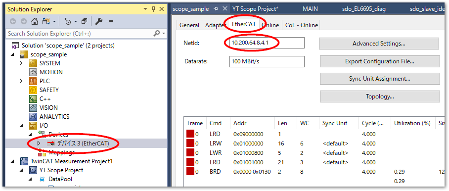
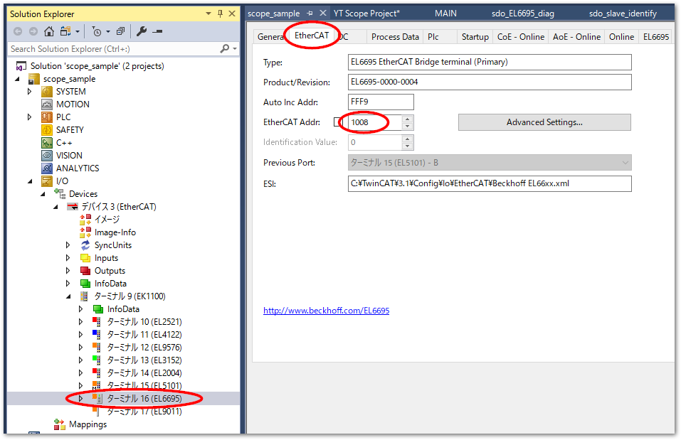
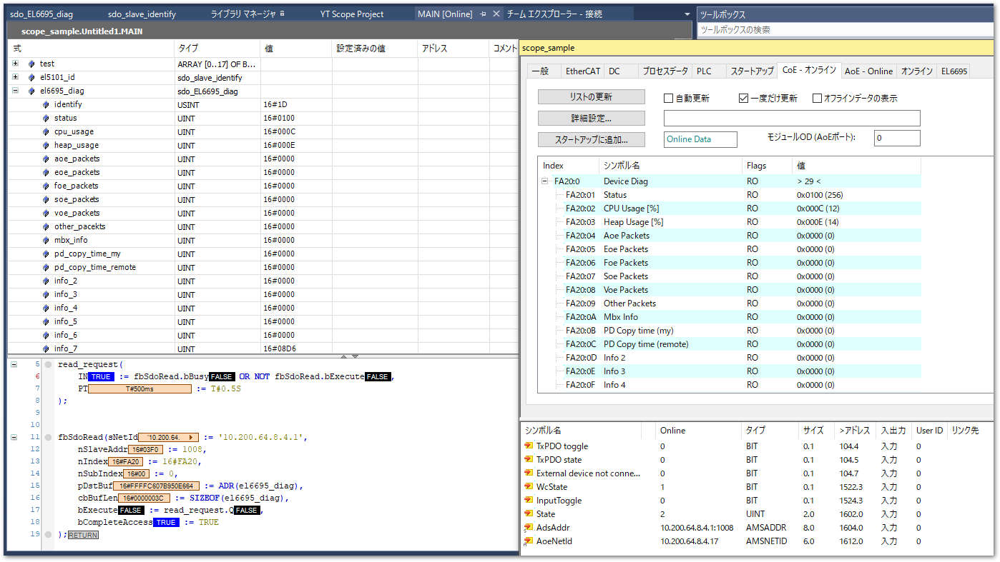

# ファンクションブロックを用いたデータアクセス

コンプリートアクセスでSDOデータを読み書きする場合、次のページで紹介されているファンクションブロックを用います。

{bdg-link-primary-line}`FB_EcCoeSdo***のつかいかた<https://infosys.beckhoff.com/content/1033/tcplclib_tc2_ethercat/56994827.html?id=1722338225767758862>`


ここでは、`FB_ECCoeSdoReadEx`ファンクションブロックを使いてターミナルの診断情報などを読み出す例をご紹介します。

## ライブラリの有効化

PLCプロジェクトのReferencesメニューからライブラリマネージャを出現させ、`IO/Tc2_EtherCAT`のライブラリを追加してください。TwinCAT XAEに含まれているライブラリですので、別途リポジトリからのインストールは不要です。

## EtherCATマスタのAmsNetID、読み出したいサブデバイスのEtherCATアドレスの調査

EtherCATマスタのAMS NetIdを確認してください。

{align=center}

また、読み出したい対象のサブデバイスのEtherCATアドレスを、EtherCATタブを開いて調べます。

{align=center}

## プログラム

2byteアライメントで定義した`sdo_EL6695_diag`構造体変数を使って、`FB_ECCoeSdoReadEx`ファンクションブロックを通じて0.5秒ごとに周期的にSDOを読み出すプログラム例を紹介します。

事前に調べたEtherCATマスタのNetId、サブデバイスのEtherCATアドレス、読み出したい対象のCoE Index、定義した構造体変数へのポインタおよびそのサイズを指定します。

bExecuteは、bErrorが立ち上がることなくbBusyがFalseとなるまで保持します。

```{code-block} iecst
PROGRAM MAIN
VAR
    fbSdoRead: FB_ECCoeSdoReadEx;
    el6695_diag : sdo_EL6695_diag;
    read_request : TON;
END_VAR

read_request(
    IN := fbSdoRead.bBusy OR NOT fbSdoRead.bExecute, 
    PT := T#0.5S
);


fbSdoRead(sNetId := '10.200.64.8.4.1',
    nSlaveAddr := 1008,
    nIndex := 16#FA20,
    nSubIndex := 0,
    pDstBuf := ADR(el6695_diag),
    cbBufLen := SIZEOF(el6695_diag),
    bExecute := read_request.Q,
    bCompleteAccess := TRUE
);
```

これにより、0.5秒毎にMaibox通信でSDOを読み出し、構造体変数へマップすることができます。PDOなどでは読み取れない診断データ等を定期的に監視し、故障予知などにご活用ください。

{align=center}