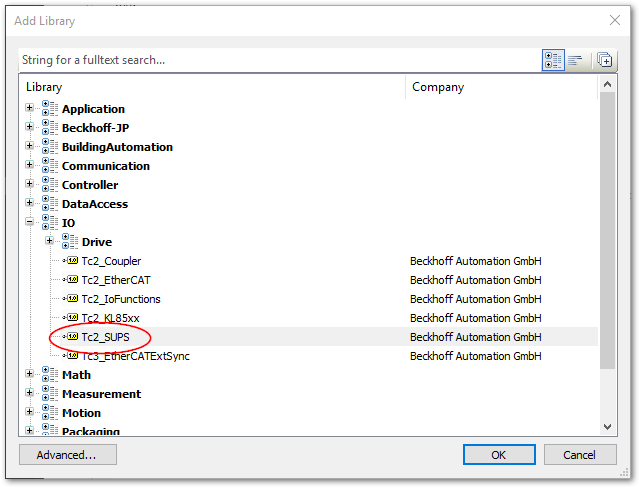
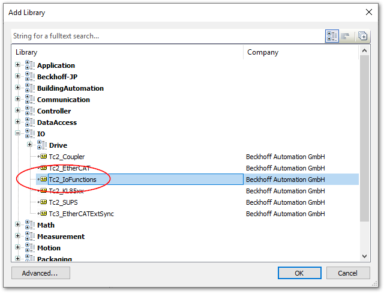

(figure_persistent_value_with_ups)=
# 無停電電源装置（UPS）によるPERSISTENTデータの永続化

Persistent属性の変数値は、IPCの正常シャットダウン操作時にファイルへ書き出され、次の起動時にはファイルから値が再度ロードされる、いわゆる永続化されます。
しかし、不意な電源ダウン時にはファイルへ保存することができず、RUN中の活動により変動したPersistent変数の値の永続化ができません。

これを防ぐためには、UPS（無停電電源装置）を取り付け、電源供給が失われた事を検出して明示的な命令でPersistentデータをファイルへ保存する必要があります。

IPCに搭載可能なUPSには次の2タイプがあり、それぞれ実装方法が異なります。（{numref}`UPS_persistent_flow`）

[1 second UPS](https://infosys.beckhoff.com/content/1033/tcplclib_tc2_sups/index.html?id=2087920595982685749)

    : 大容量キャパシタによる組み込み電源保持機構です。専用のファンクションブロック`FB_S_UPS_****`が用意され、RUN中は常時実行し続けることで、選択したモードにより不意の停電発生時には自動的にPERSISTENT変数の値をファイルへ永続化することができます。またPERSISTENTデータへの保存が完了したあと、`FB_NT_QuickShutdown` によりWindowsのシャットダウン処理を行う事ができます。

[UPS Software Components（汎用UPS）](https://infosys.beckhoff.com/content/1033/tcupsshellext/html/overview.htm?id=1892807518135003723)

    : IPCのWindows側に接続したUPSをマネジメントするソフトウェアです。UPSの残量やバッテリのみの駆動時間により自動的にWindowsシャットダウンを実施するところまでマネジメントしてくれるソフトウェアとなっています。PLCでは`FB_GetUPSStatus`によりUPSの稼働状態がモニタリングできますので、これにより `WritePersistentData` ファンクションブロックを実行し、PERSISTENT変数を永続化します。その後は、マネジメントソフトが自動的にシャットダウン処理まで行いますので、PLCからのシャットダウン処理は必要ありません。

```{note}
参考サイト一覧

* [YouTube](https://infosys.beckhoff.com/content/1033/tcupsshellext/html/overview.htm?id=1892807518135003723)

* [1 second UPS](https://infosys.beckhoff.com/content/1033/tcplclib_tc2_sups/index.html?id=2087920595982685749)

* [UPS Software Components](https://infosys.beckhoff.com/content/1033/tcupsshellext/html/overview.htm?id=1892807518135003723)

* [WritePersistentData](https://infosys.beckhoff.com/content/1033/tcplclibutilities/11850907403.html?id=1644098846396023990)

```

```{figure-md} UPS_persistent_flow
{align=center}

UPSのタイプ別PERSISTENT変数データの永続化フロー
```

## PLCプログラム実装

以上に示したパターンのUPSに対応するため、{numref}`UPS_persistent_class` の制御モジュールによりUPSの制御とPERSISTENT変数の永続化を管理します。1 second UPSは、多様なドライバが個々に存在し、インターフェース化されていませんので、`FB_SUPS_BASE` という基底クラスである程度共通制御プログラムを実装し、ドライバに応じたサブクラスを作成します。UPS Software componentsで制御しているシステムについては、`FB_GenericUPS` を実装して制御を行います。

また、実際のUPSが無い場合に挙動を確認するための、`FB_UPS_STUB` を用意しています。

```{figure-md} UPS_persistent_class
{align=center}

UPSによるデータ永続化制御プログラムクラス図
```

またこのモジュールを実装する方法は、{numref}`main_inplementation_program` の通りシンプルになります。

それぞれに応じたUPS実装ファンクションブロックを`fbUPS`入力変数にセットした`FB_ShutDown`を毎サイクル実行することで、UPSを常時監視し、一次電源ダウンを検出すると{numref}`UPS_persistent_flow`に示すフローによりPERSISTENTデータを永続化しながらシャットダウンを行うプログラムを実現します。

```{code-block} pascal
:caption: 本モジュールのうち`FB_UPS_STUB`を用いた実装例
:name: main_inplementation_program
:linenos:

PROGRAM MAIN
VAR
	fbShutdown	:FB_ShutDown; // Safely shutdown feature
	fbUPS		:FB_UPS_STUB; // UPS type for test use
    //fbUPS       :FB_GenericUPS; //UPS type based on Windows driver
    //fbUPS       :FB_SUPS; // UPS type for 1sec UPS on CX50x0
    //fbUPS       :FB_SUPS_CB3011; // UPS type for 1sec UPS on CB3011 board
    //fbUPS       :FB_SUPS_CX51x0; // UPS type for 1sec UPS on CX51x0
    //fbUPS       :FB_SUPS_CX9020_U900; // UPS type for 1sec UPS on CX9020_U900
    //fbUPS       :FB_SUPS_BAPI; // UPS type for 1sec UPS using BIOS-API

END_VAR

fbShutdown(fbUPS := fbUPS);
```

### 必要ライブラリ

* 1 second UPS向けライブラリ

    各種`FB_S_UPS****`はTc2_SUPSに含まれます。
    Libraryから`Tc2_SUPS`を追加します。
    {align=center width=500px}

* UPS Software Components向けライブラリ

    `FB_GetUpsStatus` はTc2_IoFunctions に含まれます。
    {align=center width=500px}


### 列挙体の定義

DUTsに、UPSの状態（{numref}`def_ups_state` ）、および、シャットダウンまでの状態定義（{numref}`def_shutdown_state` ）を定義します。

```{code-block} pascal
:caption: UPS状態定義
:name: def_ups_state
:linenos:

{attribute 'qualified_only'}
{attribute 'strict'}
TYPE E_UPSState :
(
    init := 0,		// UPS not working
    on_power,		// power supplied normally
    on_battery,		// continue working on battery
    critical_error,	// system shutdown
    facility_error	// UPC failure
);
END_TYPE
```

```{code-block} pascal
:caption: シャットダウンまでの状態定義
:name: def_shutdown_state
:linenos:

{attribute 'qualified_only'}
{attribute 'strict'}
TYPE E_ShutdownMode :
(
    init := 0,			// system is working
    persistent_data,	// persist data
    shutting_down		// system shutting down
);
END_TYPE
```

### インターフェース定義

Interface `iUPS` を追加します。

```{csv-table}
:header: 種別, 名称, 説明, 引数, 戻り値

プロパティ, UPSState, UPSの状態を取得する, なし ,E_UPSState
メソッド, watch_status, UPSの状態を更新する, なし ,BOOL
メソッド, persist_data, 永続化変数を保存します, なし ,BOOL
メソッド, shutdown, IPCのシャットダウン処理を行います, なし ,BOOL
```

### シャットダウン制御ファンクションブロックの実装

シャットダウンシーケンスは、インターフェースを実装したUPSの状態に応じてファンクションブロックのメソッドを実行します。

```{code-block} pascal
:caption: シャットダウンシーケンス制御FB
:name: fb_shutdown
:linenos:

FUNCTION_BLOCK FB_ShutDown
VAR_INPUT
	fbUPS			:iUPS;				// UPS interface	
END_VAR
VAR_OUTPUT
END_VAR
VAR
	eShutdownMode	:E_ShutdownMode;	// State machine when shutting down
END_VAR

// watch power fail
fbUPS.watch_status();

CASE fbUPS.UPSState OF 
	E_UPSState.on_battery:
		eShutdownMode := E_ShutdownMode.persistent_data;
	E_UPSState.critical_error:
		eShutdownMode := E_ShutdownMode.shutting_down;
	ELSE
		eShutdownMode := E_ShutdownMode.init;
END_CASE

CASE eShutdownMode OF 
	E_ShutdownMode.persistent_data:
		fbUPS.persist_data();
		IF fbUPS.UPSState = E_UPSState.facility_error THEN
			eShutdownMode := E_ShutdownMode.shutting_down;
		END_IF
	E_ShutdownMode.shutting_down:
		fbUPS.shutdown();
END_CASE
```

### UPS制御ファンクションブロックの実装

様々なUPSタイプに応じてファンクションブロックを実装します。

#### FB_UPS_STUBの実装例

変数定義部

```{code-block} pascal
:caption: 変数定義部
:name: fb_ups_declearation
:linenos:

FUNCTION_BLOCK FB_UPS_STUB IMPLEMENTS iUPS
VAR_INPUT
END_VAR
VAR_OUTPUT
END_VAR
VAR
    eUPSState :E_UPSState;
    test_timer :Tc2_Standard.TON;
    shutdown_timer : Tc2_Standard.TON;
END_VAR
```


```{code-block} pascal
:caption: UPSStateプロパティの実装
:name: fb_ups_state_property
:linenos:

{warning 'add property implementation'}
PROPERTY UPSState : E_UPSState

GET:
    eUPSState := UPSState;
SET:

```

```{code-block} pascal
:caption: watch_statusメソッドの実装
:name: fb_ups_watch_status
:linenos:

{warning 'add method implementation '}
METHOD watch_status : BOOL

// 15秒経つごとにUPS電源ONを確認、一次電源断、バッテリ低下からのシャットダウンへの状態遷移を行う。
test_timer(IN := NOT test_timer.Q, PT := T#15S);
IF test_timer.Q THEN
    CASE eUPSState OF
        E_UPSState.init:
            eUPSState := E_UPSState.on_power;
        E_UPSState.on_power:
            eUPSState := E_UPSState.on_battery;
        E_UPSState.critical_error:
            eUPSState := E_UPSState.init;
    END_CASE
END_IF
```
```{code-block} pascal
:caption: persist_dataメソッドの実装
:name: fb_ups_persist_data
:linenos:

{warning 'add method implementation '}
METHOD persist_data : BOOL

// 一次電源断から5秒後にUPS容量低下またはタイムアップによるシャットダウン状態に移行するだけ。実際は、GenericUPSの場合は、WritePersistentDataを数秒おきに実施するとよい。
shutdown_timer(IN:=TRUE, PT:=T#5S);

IF shutdown_timer.Q THEN
	eUPSState := E_UPSState.critical_error;
	shutdown_timer(IN:=FALSE);
END_IF
```

```{code-block} pascal
:caption: shutdownメソッドの実装
:name: fb_ups_shutdown
:linenos:

{warning 'add method implementation '}
METHOD shutdown : BOOL

// stubやGenericUPSとしては処理未定義。1 second UPSの場合のみ、WritePersistentDataが完了したら、FB_NT_QuickShutdownを行う。
```

```{note}
実際のBekchoff製UPSや1second UPSについては、実機にて動作確認を行った上での実装サンプルコードを掲載予定です。現時点ではSTUBまででご了承ください。
```