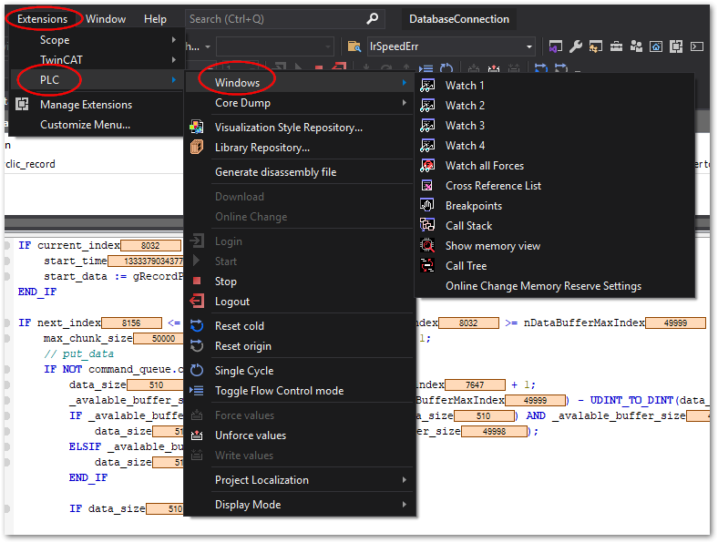

# クロスリファレンス機能

クロスリファレンスは、プログラム画面で選択された変数がプロジェクト内で使われている全ての行番号にジャンプできる機能です。

`Extension` > `PLC` > `Windows` > `Cross Reference List`
{align=center}

選択すると下部にクロスリファレンスウィンドウが現われます。
この状態で、コードエディタで任意の変数上にカーソルを合わせると、同変数を使用している全ての個所に対するリンク付きの行が現れます。

{align=center}

クロスリファレンスウィンドウに現われた任意の行を選択すると、該当ソースの行にジャンプします。