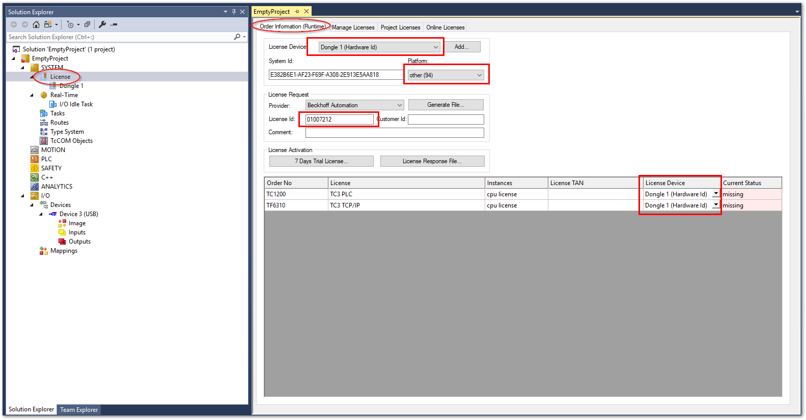

## ライセンスドングルのセットアップ

* [InfoSys リンク](https://infosys.beckhoff.com/content/1033/c9900-l100/index.html?id=7250900528365093236)

IPCにインストールされたXARにはシステムIDが割り振られ、これに対して様々なソフトウェアライセンスを付加することでTwinCATの機能をご利用いただくことができます。

これではIPCごとにライセンスが紐づくため、IPCが故障したり、新しいものへリプレースする度に新たなライセンスキーを発行しなおすことが求められます。

この移行の手間を省くため、 [``C9900-L100``](https://www.beckhoff.com/ja-jp/products/ipc/panel-pcs/accessories/c9900-l100.html) という製品名の、システムIDが付加されたUSBドングルがあります。ここにライセンスを付加する事で、IPCとライセンスを切り離す事が可能となり、急なIPCの故障やそれに伴う交換を行った場合でも即座にライセンスを引き継ぐ事ができます。


ここではUSBドングルにライセンスを付加する手順について説明   します。

### ドングルをセットアップするためのTwinCATがインストールされたPCを用意する

ドングルをセットアップするには、TwinCAT XAE がインストールされたPCが必要です。IPC上にXAEがインストールされていればIPCにドングルを挿してセットアップを行う事が可能です。

### ラインセンスアクティベート方法

1. はじめに、 ``C9900-L100`` ドングルをターゲットPCのUSBに挿してください。ターゲットPCとは、XAEの接続先PCとなります。リモート接続の場合は、接続先のPCのUSBポートに接続してください。
2. Solution explorer から ``SYSTEM - License`` を開いて、 ``License Device`` から ``Add..`` ボタンを押します。  
　　
3. ``License`` の下に ``Dongle 1`` というメニューが追加されるため、これをクリックして開き、 ``Search...`` ボタンを押して、現れたドングルのデバイス行を選択して ``OK`` ボタンを押します。
    
4. ``Activate stored license(s) on target`` のメッセージに ``OK`` ボタンを押します。
    
5. この操作により次図の通り ``C9900-L100`` メディア情報が表示されます。
    
    
    ```{note}
    ここに表示される ``System id`` は、USBドングルのシステムIDです。このIDにライセンスを紐づける事が重要です。後ほどライセンスリクエストファイルの確認の際に参照しますので覚えておいてください。
    ```

6. 左側サイドメニューのツリーから、 ``Dongle 1`` の上の階層の ``License`` に戻り、 ``Manage Licenses`` タブを開きます。以下の設定を行ってください。

    ``Disable automatic detection of required licenses for project`` 
    : True

    ``Add license`` 
    : あらかじめ購入したLicenseを選択してチェックを入れる

    

    ```{warning}
    有効にできるライセンスは、あらかじめ購入したものに限ります。それ以外のものを指定した場合、このあとの手順でサーバへのアクティベート申請でエラーになります。
    ```
    
7. 次に ``Order information (Runtime)`` のタブに移り、次の通り値を設定します。

    ``License Device``
    : ``Dongle 1 (Hardware Id)`` に切り替える。

    ``Platform``
    : 購入した際に指定したプラットフォーム番号を入力します。

    ``License ID``
    : 発行されたライセンスIDを入力する。

    選択した各ライセンスの ``License Device``
    : 全て ``Dongle 1 (Hardware Id)`` に切り替える。

    

    ```{warning}
    ``Platform`` 設定は、かならず購入時に指定したものと同じものを設定してください。指定したプラットフォーム番号より下位レベルのものを誤って設定してアクティベートリクエストを行った場合、異常とならずその設定でライセンスが発行されてしまいます。これにより目的とするアーキテクチャのPCがこのプラットフォーム要件を満たさずライセンスが有効とならなくなる恐れがあります。さらに、いちど発行したライセンスはドイツ本社へ問合せの上修正する必要が生じます。特に慎重に設定を行ってください。
    ```

8. 必要項目の設定が完了したら、 ``Generate File...`` ボタンを押して ``*.tclrq`` ファイルを保存します。
    

    ```{warning}
    保存するファイル名は、全体で **23文字以内** になるようにしてください。これを越える文字数のファイル名は、アクティベートする際にエラーとなります。
    ```

9. このあと、保存したファイルをアクティベート申請先メールアドレスへ送りますが、その前に保存したファイルが間違えなく設定が反映されているか確認します。このファイルはXMLフォーマットのテキストファイルとなっていますので、XMLエディタ、または、メモ帳などのテキストエディタで開いて、次の通り ``LicenseInfo`` タグ内の、 ``<<プラットフォーム番号2桁の数字>>`` と、``<<ライセンスID>>`` と、``5`` の項目で確認した ``<<Dongle USB のシステムID>>`` の部分の設定が正しく反映されているか確認してください。

    ```{code-block} xml
    <?xml version="1.0"?>
        <TcLicenseInfo xmlns:xsi="http://www.w3.org/2001/XMLSchema-instance" xsi:noNamespaceSchemaLocation="http://www.beckhoff.com/schemas/2011/11/TcLicenseInfo">
            <TargetInfo>
                ...
            </TargetInfo>
            <LicenseInfo>
                <SystemId Level="<<プラットフォーム番号2桁の数字>>">{<<Dongle USB のシステムID>>}</SystemId>
                <PurchaseOrder><![CDATA[<<ライセンスID>>]]></PurchaseOrder>
                <IssueTime>YYYY-MM-DDThh:mm:ss</IssueTime>
                <License ManuallyAdded="true">
                    <LicenseId>{********-****-****-****-************}</LicenseId>
                    <Name>TC3 PLC</Name>
                    <OrderNo>TC1200</OrderNo>
                </License>
                <License ManuallyAdded="true">
                    <LicenseId>{********-****-****-****-************}</LicenseId>
                    <Name>TC3 TCP/IP</Name>
                    <OrderNo>TF6310</OrderNo>
                </License>
            </LicenseInfo>
        </TcLicenseInfo>
    ```
    
10. 次の宛先に保存した ** ``*.tclrq`` ファイルを添付したメール** をおくります。タイトル、本文どちらも空のままでも構いません。何等かの文字があっても無視されます。

    ```{note}
    メールの送付先: [TCLicense@beckhoff.com](mailto:TCLicense@beckhoff.com)
    ```

11. メール送信後、10秒以内にアクティベートされたライセンスファイル ``*.TCLRS`` が返信されてきます。この添付ファイルを保存してください。
12. 再度、 ``Dongle 1`` ツリーをクリックし、 ``Store License on Dongle`` ボタンを押します。確認ダイアログが現れますので、 ``OK`` をおしてください。
    
13. エクスプローラウィンドウが現れますので、メールで返信された ``*.TCLRS`` ファイルを開きます。正常に読み込まれると次の通り確認ダイアログ現れます。 ``OK`` を押して次へ進んでください。
    

    ```{note}
    この段階ではまだライセンスが有効となったUSBドングルがIPC上に展開されていません。必ず次の2ステップを実行してください。
    ```

14. ``Search...`` ボタンを押して、現れたドングルのデバイス行を選択して ``OK`` ボタンを押します。
    
15. ``Activate stored license(s) on target`` のメッセージに ``OK`` ボタンを押します。
    
16. ``Config mode`` ボタンを押してください。確認ダイアログが現れますので、 ``OK`` ボタンを押します。
    
17. Config modeへ移行することで、 ``Current Status`` 欄が更新されます。 ``Valid (dongle)`` となっていれば正しくライセンスがDongleへ書き込まれた事が確認できます。
    
