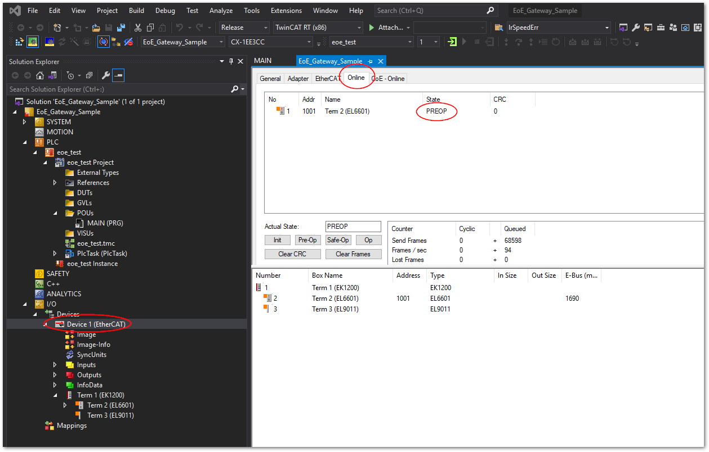
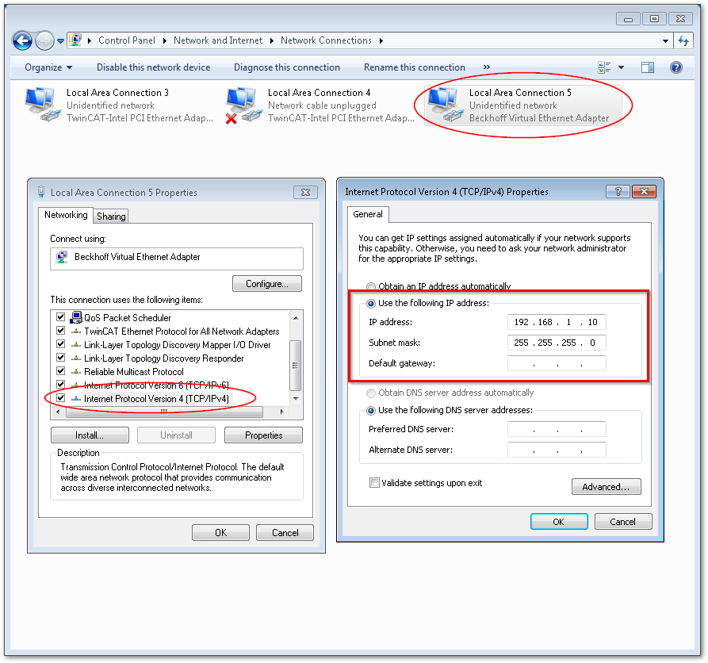
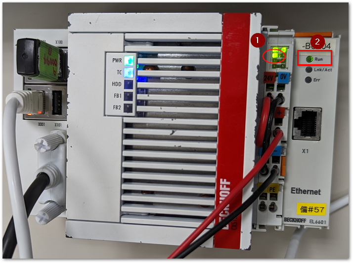

# セットアップと運用

## TwinCATプロジェクトの設定

1. EL6601をEtherCATターミナルとして接続し、TwinCATのIOのDeviceからSCANを行います。

2. ソリューションエクスプローラからEtherCATマスターを選択し、`EtherCATタブ` > `Advanced Settings...` > `EoE Support` を選択して以下の設定を行います。
    {align=center}
    * Virtual Ethernet Switch > Enable
    * Windows Network > Connect to TCP/IP Stack

    ```{note}
    Windowsネットワーク内の、`IP Enable Router` は、IPCのWindowsやTwinCAT内からEL6601に接続したコンピュータの接続を行う場合は無効設定で構いません。この設定を有効にするとIPCの外部コンピュータが、IPCを経由して（ルーティング）通信できるようになります。有効にするには、設定後一度IPCの再起動が必要です。
    IPCに接続された外部のコンピュータのゲートウェイ設定にIPCのEtherCATマスターに設定したIPアドレス（後述の手順4.）を設定することでそのコンピュータはEL6601越しに接続されたコンピュータと接続することができます。
    ```

3. FreeRUNまたはRUNモードに移行して、EL6601を`PREOP`または`OP`状態にする。

    TwinCATでActive configurationを行い、RUNモードに移行すると、次の通り`PREOP`状態になります。
    {align=center}

4. Windowsネットワーク設定において、EtherCATマスターのネットワークカード設定を行います。EtherCATマスターを接続したI/Fカードのアダプタ設定のプロパティを開き、`TCP/IP V4` 設定を開きます。ここでは、EtherCATマスタのホストアドレスを`192.168.1.10/24`と設定する例を示します。

    ```{warning}
    CXなどの組み込み型PCに付属したE-busでは、EtherCATマスタのEthernetカードのアダプタが現われませんが、EL6601を認識した場合に限り、EL6601が`PREOP`以上の状態になることで{numref}`figure_virtual_network_card`のようにVirtual network portが現われます。ネットワークアダプタが現われない場合は、EtherCATのスレーブ状態が`PREOP`, `SAFEOP`, `OP`のいずれかになっていることをご確認ください。
    ```

    ```{figure-md} figure_virtual_network_card
    {align=center}

    CXにおけるWindowsのバーチャルネットワークカード
    ```

5. 起動時にRUNモードへ移行する設定を行う

    起動時に自動的にEL6601が`PREOP`以上の状態に移行するためには、自動ログイン、自動RUNモードへの移行設定を行う必要があります。下記のとおり設定してください。

    {align=center}

6. 接続テスト

    IPCを再起動し、RUNモードになったら、EtherCATのパケットが回っている（高速に点滅する）こと、および、EL6601がRUNのLEDが点滅していることを確認します。

    {align=center}

    EL6601と他のPCをEthernetケーブルで接続し、他のPCのIPアドレス設定を`192.168.1.11/24`に設定してください。IPCのWindows上のPowerShell等から次のとおりpingコマンドを送り応答があるかどうか確認してください。

    ```{code} powershell
    PS> ping 192.168.1.11
    ```

    ```{admonition} pingが通らない場合ファイアウォール設定をご確認ください。

    pingが通らない場合は、Windows10側のファイアウォールの設定によりpingに応答しない設定になっている可能性があります。次図のとおり一時的にファイアウォールを無効化して再度お試しください。

    確認後は必ず有効にしなおしてください。

    {align=center}
    ```