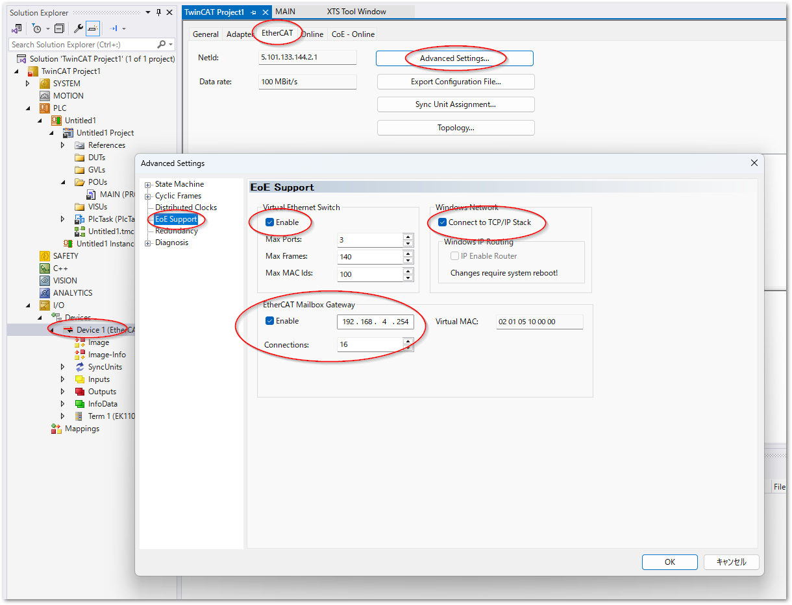

(section_eoe_on_linux)=
# TwinCAT RT Linux上でEoEを使用するための設定

## 仮想デバイスへのIPアドレスの設定

### EtherCATネットワークが接続された仮想Ethernetデバイスの確認

まず、EtherCATとして使用可能なリアルタイムドライバが適用されているポートとそのインターフェース名を一覧します。`sudo TcRteInstall -l` を発行してください。

``` bash
$ sudo TcRteInstall -l
[sudo] password for Administrator:
+-----+----------+-------------------+--------------+----------+----------+----------------------------------+------+
| No  | Name     | MAC               | Location     | Driver   | Override | Model                            | Link |
+-----+----------+-------------------+--------------+----------+----------+----------------------------------+------+
| 0   | enp2s0   | unknown           | 0000:02:00.0 | vfio-pci | [*]      | I210 Gigabit Network Connection  | un.. |
| 1   | eno1     | 00:01:05:**:**:** | 0000:00:1f.6 | e1000e   | [-]      | Ethernet Connection (2) I219-LM  | up   |
| 2   | enp4s0   | unknown           | 0000:04:00.0 | vfio-pci | [*]      | I210 Gigabit Network Connection  | un.. |
+-----+----------+-------------------+--------------+----------+----------+----------------------------------+------+
```

このIPCには3つのEthernetポートを持っていて、リアルタイムドライバである `vfio-pci` が適用されているのは、`enp2s0` および、 `enp4s0` 2つのI210カードであることが分かります。また、`eno1` はリアルタイムドライバが適用されていないLinuxのTCP/IPスタックと通信可能な（つまりEoEを通じて外部と通信することができる）非リアルタイムEthernetカードです。

`enp2s0` および、 `enp4s0` はいずれもLinuxのEthernetデバイス名の命名規則に基づく場合、物理デバイス名であることがわかります。

```{tip}
デバイス命名規則は以下の順で表記されます。

* en: Ethernet（有線LAN）を示します。
* p/o: PCI（またはPCIe）バス(p)または、オンボード(o)に接続されていることを示します。
* 1: バス番号（Bus）
* s0: スロット番号（Slot）
```

すでに`enp2s0` および、 `enp4s0`はEtherCAT等のリアルタイムフィールドバス用にTwinCATのためにドライバが差し替えられていますので、これを使ってEoEネットワークへアクセスすることはできません。そこで、TwinCAT RT Linuxでは、これらのリアルタイムEthernetドライバが適用されたインターフェースカードに対応した仮想Ethernetデバイスが作成されます。これを確認するには、`ip a` コマンドにてEthernetインターフェースカードを一覧します。

``` bash
$ ip a
1: lo: <LOOPBACK,UP,LOWER_UP> mtu 65536 qdisc noqueue state UNKNOWN group default qlen 1000
    link/loopback 00:00:00:00:00:00 brd 00:00:00:00:00:00
    inet 127.0.0.1/8 scope host lo
       valid_lft forever preferred_lft forever
    inet6 ::1/128 scope host noprefixroute
       valid_lft forever preferred_lft forever
2: eno1: <BROADCAST,MULTICAST,UP,LOWER_UP> mtu 1500 qdisc pfifo_fast state UP group default qlen 1000
    link/ether 00:01:05:**:**:** brd ff:ff:ff:ff:ff:ff
    altname enp0s31f6
    altname enx000105658590
    inet 192.168.3.10/24 metric 1024 brd 192.168.3.255 scope global dynamic eno1
       valid_lft 83450sec preferred_lft 83450sec
    inet6 2400:2653:ca21:7800:201:5ff:fe65:8590/64 scope global dynamic mngtmpaddr noprefixroute
       valid_lft 14361sec preferred_lft 12561sec
    inet6 fe80::201:5ff:fe65:8590/64 scope link proto kernel_ll
       valid_lft forever preferred_lft forever
5: tap2s0: <BROADCAST,MULTICAST,UP,LOWER_UP> mtu 1500 qdisc pfifo_fast state UP group default qlen 1000
    link/ether 00:01:05:**:**:** brd ff:ff:ff:ff:ff:ff
    inet 192.168.4.1/24 brd 192.168.4.255 scope global tap2s0
       valid_lft forever preferred_lft forever
    inet6 fe80::201:5ff:fe65:8591/64 scope link proto kernel_ll
       valid_lft forever preferred_lft forever
6: docker0: <NO-CARRIER,BROADCAST,MULTICAST,UP> mtu 1500 qdisc noqueue state DOWN group default
    link/ether ce:90:e3:**:**:** brd ff:ff:ff:ff:ff:ff
    inet 172.17.0.1/16 brd 172.17.255.255 scope global docker0
       valid_lft forever preferred_lft forever
7: tap4s0: <BROADCAST,MULTICAST> mtu 1500 qdisc pfifo_fast state DOWN group default qlen 1000
    link/ether 00:01:05:**:**:** brd ff:ff:ff:ff:ff:ff
```

この結果のとおり、`enp2s0` および、 `enp4s0`の上3文字を `tap` に差し替えたものが仮想ネットワークインターフェースです。ここでは、`state UP` となっている5番の、`tap2s0` がEtherCATネットワークが接続されているインターフェースであることが分かります。

加えてこの一覧からわかるのは、`enp2s0` には `192.168.4.1` というIPアドレスが割り当てられています。これによって次のように、ルーティングテーブルの最終行のように追加され、このIPC内部では `192.168.4.0/24` のIPへの接続が `192.168.4.1` である EtherCAT ネットワークを経由してアクセスできるようになります。

``` bash
$ ip route list
default via 192.168.3.1 dev eno1 proto dhcp src 192.168.3.10 metric 1024
172.17.0.0/16 dev docker0 proto kernel scope link src 172.17.0.1 linkdown
192.168.3.0/24 dev eno1 proto kernel scope link src 192.168.3.10 metric 1024
192.168.3.1 dev eno1 proto dhcp scope link src 192.168.3.10 metric 1024
192.168.4.0/24 dev tap2s0 proto kernel scope link src 192.168.4.1
```

よって、IPCからEoEを通じて接続を行うには、 `enp2s0` に設定するネットワークアドレスがEoEの先に接続するIPアドレスのネットワークアドレスと同一でなければなりません。この例ではネットワークアドレスがクラスCのローカルアドレスですので、頭の24bit `192.168.4` が該当します。EoEの先に接続するコンピュータのIPアドレスもこのネットワークアドレスである必要があります。

### 仮想EthernetインターフェースカードにIPアドレスを設定する

先に示した例のとおり、`tap2s0` に`192.168.4.1`を割り当てて、再起動後も設定が永続化するには、`/etc/systemd/network` 以下に `10-tap2s0-static.network` というファイル名で、次の定義を行います。

```{code-block} toml
:caption: /etc/systemd/network/10-tap2s0-static.network

[Match]
Name=tap2s0

[Network]
Address=192.168.4.1/24
```

この設定を有効にするには次のコマンドを入力してください。

``` bash
sudo networkctl reload
```

これで再起動後も永続的にtap2s0に固定のIPアドレスが設定されます。

{bdg-link-info}`参考Infosys <https://infosys.beckhoff.com/content/1033/beckhoff_rt_linux/18089353227.html?id=7825633042970223141>`


## IP転送設定

ここまでの設定により、TwinCATを含む、IPC内部のLinux上のプログラムがEoEをまたいだ先のコンピュータと通信することができます。これ以後ではIPCの外部のコンピュータからの接続を許可し、EoEネットワークへアクセスするための設定を行います。

### Linux カーネルの IP フォワーディング有効化

OS レベルでインターフェース間のパケット転送を許可します。

1. 設定ファイル（例: `60-routing.conf`）を新規作成します。
   ```bash
   sudo nano /etc/sysctl.d/60-routing.conf
   ```
2. 以下の内容を記述して保存します。
   ```ini
   # IPv4 のパケット転送を有効化
   net.ipv4.ip_forward=1

   # IPv6 のパケット転送を有効化（必要に応じて）
   net.ipv6.conf.all.forwarding=1
   ```
3. 設定をシステムに即座に反映します。
   ```bash
   sudo systemctl restart systemd-sysctl
   ```
   *(確認コマンド: `sysctl net.ipv4.ip_forward` を実行し `1` が返れば成功)*


### nftablesによる転送設定


`eno1` に届いたIPを `tap2s0` にも転送する設定を行います。 

### nftablesの設定

新規に `/etc/nftables.conf.d/60-eoe.conf` を作成して次の通り定義してください。この設定例では特定のポート、サービスのみ通過させる設定としています。接続先のサービス、アプリケーションに合わせて、適切なプロトコル、ポートを許可するようにしてください。

``` nginx
table inet filter {
   chain forward {
       type filter hook forward priority filter; policy drop;
       # 往路のポート（established）は自動割り当てのためすべて許可する
       ct state established,related accept
       # echo-request（pingコマンド）を通過
       meta nfproto ipv4 iifname "eno1" oifname "tap2s*" icmp type echo-request accept
       # UDPポートの5010（SLMP）と443（HTTPS）のみ通過
       meta nfproto ipv4 iifname "eno1" oifname "tap2s*" udp dport { 5010, 443 }\
           ct state new counter accept
   }
}
```

設定が正しいか以下のコマンドでチェック

``` bash
$ sudo nft -c -f /etc/nftables.conf
```

エラーがでなければ、次のコマンドで設定を反映します。

``` bash
$ sudo nft -f /etc/nftables.conf
```

### 外部のコンピュータ（Windows側）のルーティング設定

EoEネットワークはクライアント側で、EoE以下に構成された接続先のノードが `192.168.4.***` ネットワークとなっていますが、必ずしも外部から見たIPCの接続先のIPアドレスは、同一ネットワークとは限りません。接続先のIPCのIPアドレス `192.168.3.10` とした場合、外部から接続するためには、たとえばWindowsの場合、管理者権限によるPowershellターミナルを起動し、次のコマンドを入力します。

``` powershell
route add 192.168.4.0 mask 255.255.255.0 192.168.3.10
```

Windows側ではルーティングテーブルは `netstat -nr` により表示されます。クライアント側のIPアドレスは、`192.168.3.9` で、`192.168.4.0/24` のネットワークへ接続するには、IPCのIPアドレスである `192.168.3.10` を経由する設定が追加されています。

``` Powershell
PS> netstat -nr
    :
IPv4 ルート テーブル
===========================================================================
アクティブ ルート:
ネットワーク宛先        ネットマスク          ゲートウェイ       インターフェイス  メトリック
          0.0.0.0          0.0.0.0      192.168.3.1         192.168.3.9     30
             :                 :                :                   :       :
     192.168.4.0     255.255.255.0      192.168.3.10        192.168.3.9     31
             :                 :                :                   :       :
===========================================================================
```

この設定により、次のとおりping確認を行います。EoEの先に接続されたコンピュータのIPアドレスは `192.168.4.254` とします。

``` Powershell
PS> ping 192.168.4.254

192.168.4.254 に ping を送信しています 32 バイトのデータ:
192.168.4.254 からの応答: バイト数 =32 時間 =1ms TTL=126
192.168.4.254 からの応答: バイト数 =32 時間 =2ms TTL=126
192.168.4.254 からの応答: バイト数 =32 時間 =2ms TTL=126
192.168.4.254 からの応答: バイト数 =32 時間 =2ms TTL=126

192.168.4.254 の ping 統計:
    パケット数: 送信 = 4、受信 = 4、損失 = 0 (0% の損失)、
ラウンド トリップの概算時間 (ミリ秒):
    最小 = 1ms、最大 = 2ms、平均 = 1ms
```

## さらに進んだ転送設定（NAT付きIPフォワーディング）

ここまではIPCの外部コンピュータ側（前述の例ではWindows PC）上にルーティングテーブルを設定しなければ、EoEの先のコンピュータに接続することができませんでした。不特定多数の外部コンピュータすべてにこの設定が必要となるのは運用が難しくなります。

もしEoEをまたいだ特定のコンピュータとサービスが特定できる場合、EoEの先のコンピュータの代わりにIPCがサービスすることが可能です。このためNAT設定を行います。この節では例として、Mailbox gatewayであるUDP port 34980 をホスト側のサービスとして提供するためのNAT設定例を示します。

```{note}
Mailbox gatewayは、EoEの技術を使ってEtherCAT上のCoEコマンドなどを発行することができる中継窓口です。次の設定を行うことで、EoE越しにある `192.168.4.254` のコンピュータへアクセスし、UDP port 34980を使ってEtherCATのCoEコマンドを発行することができます。

{align=center}
```

```{warning}
Mailbox gatewayの場合、EtherCATネットワークに侵入して悪意あるコマンドを発行することが可能になります。nftables の設定によりアクセス可能なプロセス（プログラム）を制限するなど、アクセス権限を十分に限定してください。また、これ以後に示す**NATやIPフォワーディングなどを通じた外部からアクセスを許可する設定は推奨しません**

あくまでも開発環境上などの攻撃された場合にも経済的な損失が発生しない環境上でのみ実施いただくようご注意ください。生産環境においてどうしても外部からアクセスが必要な場合は、併せてTLS通信等で通信経路を秘匿化し、認証を通じたノードだけをアクセス可能とするように万全のセキュリティ対策を行ってください。
```


1. 対象の設定ファイル（例: `/etc/nftables.conf.d/60-ecmbgateway.conf`）を編集します。
   ```bash
   sudo nano /etc/nftables.conf.d/60-ecmbgateway.conf
   ```
2. 以下の設定（全文）を貼り付けて保存します。
   ```nginx
   # -------------------------------------------------------------
   # 1. 宛先NAT（ポートフォワーディング）設定
   # -------------------------------------------------------------
   table ip ecmb_force_nat {
       chain prerouting {
           # 標準の dstnat よりも高い優先度 (dstnat - 10) で最速実行
           type nat hook prerouting priority dstnat - 10; policy accept;

           # eno1 に届いた 34980/udp を 192.168.4.254 へ強制転送（ログ付き）
           iifname "eno1" udp dport 34980 log prefix "[FORCE-DNAT] " dnat to 192.168.4.254
       }
   }

   # -------------------------------------------------------------
   # 2. パケット転送（フォワード）の最優先許可設定
   # -------------------------------------------------------------
   table inet ecmb_force_filter {
       chain forward {
           # 標準の filter よりも高い優先度 (filter - 10) で最速実行
           type filter hook forward priority filter - 10; policy accept;

           # 転送対象パケットを最優先で通過許可（ログ付き）
           iifname "eno1" oifname "tap2s0" ip daddr 192.168.4.254 udp dport 34980 log prefix "[FORCE-FORWARD] " accept
       }
   }

   # -------------------------------------------------------------
   # 3. 送信元NAT（マスカレード）設定
   # -------------------------------------------------------------
   table ip nat {
       chain prerouting {
           type nat hook prerouting priority dstnat; policy accept;
       }

       chain postrouting {
           type nat hook postrouting priority srcnat; policy accept;

           # 内部セグメントから eno1(外部) へ出ていくパケットをマスカレード（IP変換）
           ip saddr 192.168.4.0/24 oifname "eno1" masquerade
       }
   }
   ```

3. nftables サービスを再起動し、設定を適用します。
   ```bash
   sudo systemctl restart nftables.service
   ```

---

### 動作確認・トラブルシューティング手法

設定適用後、通信が正常に行われているか、またはトラブル時にどこでパケットが止まっているかを追跡するコマンド群です。

#### ① nftables 内部ログのリアルタイム監視
設定ファイルに仕込んだ `log prefix` により、パケットが制限を通過した瞬間のログを監視できます。
```bash
sudo journalctl -fu nftables.service | grep FORCE
```
* **正常時の出力例:** `[FORCE-DNAT]...` と `[FORCE-FORWARD]...` の両方が順に出力されれば、Debian 内の処理は正常に完了しています。

#### ② カーネル手前での生パケット受信確認（tcpdump）
物理ネットワークカード（NIC）にパケットがそもそも到達しているかを調べる最も確実な方法です。
```bash
sudo tcpdump -i eno1 udp port 34980 -n
```
* 外部から接続を試みた際、ここにパケットの履歴（`192.168.3.9.xxxxx > 192.168.3.10.34980`）が出力されれば、物理層の疎通は問題ありません。

---

### 注意事項（今後の運用に向けて）
1. **ターゲットサーバーのデフォルトゲートウェイ設定**
   内部サーバー（`192.168.4.254`）が外部（`192.168.3.9`）へ返答パケットを正しく戻すためには、ターゲットサーバー側のデフォルトゲートウェイが **`192.168.4.1`（Debian の tap2s0）** に向いている必要があります。タイムアウトが発生した際は、まずこのルーティングを確認してください。
2. **自動起動の確認**
   OS再起動時にも本設定が自動適用されるよう、サービスが有効になっていることを確認してください。
   ```bash
   sudo systemctl is-enabled nftables
   # 結果が "enabled" であれば正常です
   ```
