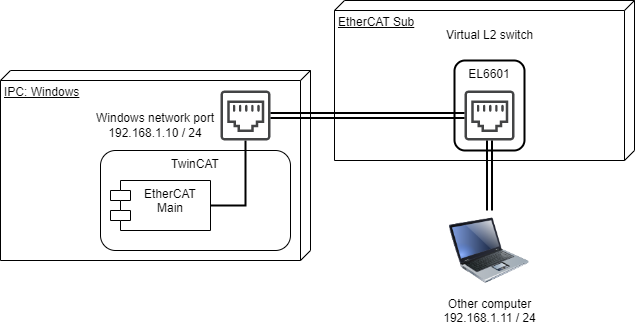

# EoE (Ethernet Over EtherCAT) 通信

[Ethernet Over EtherCAT](https://infosys.beckhoff.com/content/1033/tc3_io_intro/1446581387.html?id=6321655056702470857)とは、EtherCATのMailboxプロトコルを使って、EtherCAT越しにEthernet通信を行うものです。

TwinCATにおいてはEtherCATのメインデバイスがIPCとなっているため、IPC上に仮想のEthernetのポートが設けられます。このゲートウェイを通して、EtherCAT上のネットワークに配置されたEoEデバイスをまたいで様々な機器とIP通信を行うことができます。EoEデバイスは仮想的なL2スイッチとしてふるまいますので、複数のEoEデバイス同士も同一のネットワークとして相互に通信することが可能です。（ {numref}`figure_ethernet_sw_termnal_connection` ）

```{figure-md} figure_ethernet_sw_termnal_connection
{align=center}

Ethernetスイッチポートターミナルの接続例
```

Beckhoff製のEoEデバイスとしては、Ethernetスイッチポートターミナル [EL6601、EL6614](https://infosys.beckhoff.com/content/1033/el6601_el6614/index.html?id=5313826722071648862) があります。

メインデバイス側に設けられる仮想EthernetインターフェースはOSによって仕様が異なりますが、Windowsの場合は、EtherCATが使用するポートのWindowsネットワークアダプタにマッピングされます。

この仮想Ethernetインターフェースに設定したIPアドレスを通じて、IP層のルーティングテーブルによりEoE上に接続された仮想L2スイッチとなるホストと通信を行うことが可能となります。

```{admonition} EL6601/6614によるEAP通信
EL6601およびEL6614には[PDOを経由したリアルタイムEAP通信端末としても機能します](https://infosys.beckhoff.com/content/1033/el6601_el6614/2349504139.html?id=1897135069772557723)が、ここではMailbox通信を経由したイーサネットスイッチとして機能するEoEの機能について説明します。
```

```{toctree}
:caption: 目次

configuration
eoe_on_linux
```