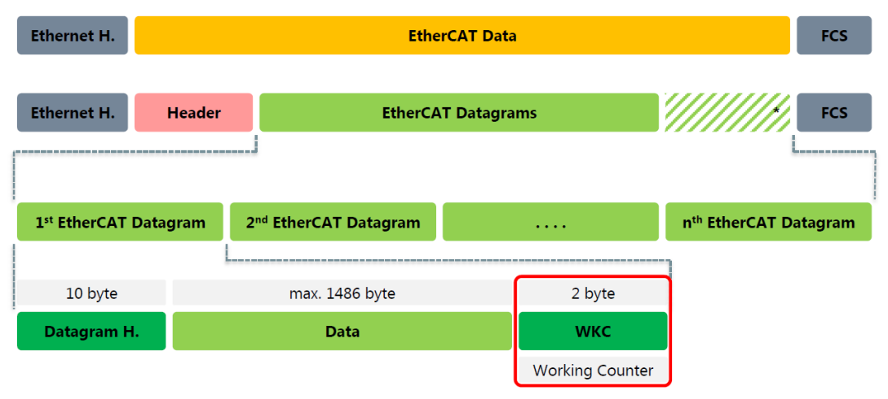
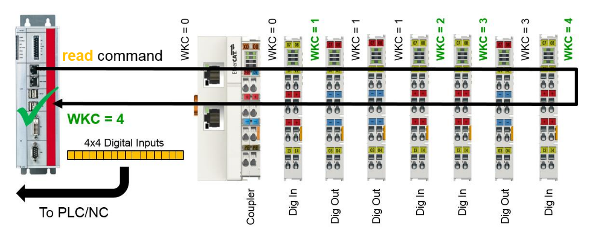
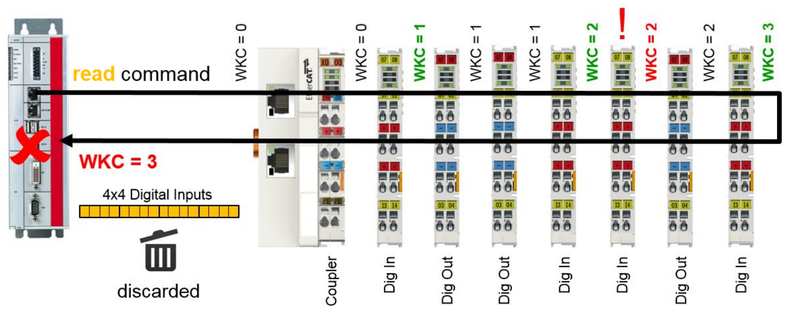

# ET2000を用いたネットワーク解析

EtherCAT診断として用いるET2000の代表的な使い方として、PDOのデータグラムが各デバイスで適切に処理されているかどうか、を確認する目的に使用します。

このため、ワーキングカウンタの値がネットワークのどの箇所でどのように繰り上げられているのか、を特定することが重要です。

## PDOのデータグラムとワーキングカウンタとは

EtherCATの周期的に読み書きを行うプロセスデータは、メインデバイスからサブデバイスに割り当てた論理アドレスを通じてデータの入出力を行います。論理アドレスとはEtherCATネットワークの中で、個々のサブデバイスに割り当てた読み書き可能なデータ（プロセスデータ）に対してメインデバイスが一意に生成する論理的なアドレスです。この生成した論理アドレスは各サブデバイスのFMMU（Fieldbus Memory Management Unit）により保持され、プロセスデータオブジェクト（以後PDO）を処理する際にサブデバイス上の実際の物理アドレスへの変換を行ってデータの読み書きが実施されます。

このとき、EtherCATのPDOのEthernetフレームには論理アドレスとコマンドとデータを組み合わせた「データグラム」によりサブデバイスでの入出力を行います。

一つのデータグラムには、 1:コマンド種別（論理書き込み: LWR, 論理読み込み:LRD, 論理読み書き:LRW）、2:論理アドレス、3:データ長、4:送受信データ、で構成されたコマンドが格納されています。論理アドレス空間は、「Sync unit」という単位で複数のサブデバイスをまたいで連続したアドレス空間となるように割り当てられます。ですから、メインデバイスはデータグラムを生成する際に「3:データ長」により複数のサブデバイスをまたいで一括してデータを操作することができます。（参考：{ref}`section_whatis_sync_unit`）



しかし、サブデバイスをまたいでデータを読み書きを行う場合の問題として、通信上の経路でデータが破損したりサブデバイスの故障により一部だけデータが正しく処理されなくなることが考えられます。これを検出するための仕組みが **ワーキングカウンタ** です。ワーキングカウンタはデータグラムの末尾に付加された2byteの整数データで、初期値が0としてサブデバイスにおいて正常にデータ読み書きが行われるたびにカウントアップされます。

イメージ図は次のとおりです。メインデバイスは、Sync unitごとに、かつ、上限の1498Byteを超えない単位で複数のサブデバイスに連続して割り当てた論理メモリ空間に対して一括して読み書きを行うコマンドを発行します。図の例では、緑色のWKC=*で示された対象のターミナルに連続した論理メモリ空間が割り当てられ、これらから入力データを読み込むLRDコマンドを発行します。

このコマンドは該当するサブデバイスにて入出力が行われるたびにワーキングカウンタを繰り上げてフレームを回し、さいごにメインデバイスに戻ります。メインデバイスはこのワーキングカウンタをチェックし、計画とおり4という値であればすべてのサブデバイスにおいて正常にデータが処理されたものとみなされ、論理アドレス空間のデータは正しいものと判定されます。この結果入力データであればこの値をPLCやモーションなどの値に反映します。しかし、値が適切でなければこのデータは破棄されます。





このワーキングカウンタにより、メインデバイスが論理的にマッピングした複数のサブデバイス間のメモリ空間を取り扱うシンプルさを可能にしつつ、間違えなく読み書きできたことを保証するチェックの仕組みを提供しています。

ただ問題は、メインデバイスでは **どこかのサブデバイスでのデータ入出力の不良は判別できるが、どのサブデバイスでワーキングカウントを失敗したのかはわからない** 点です。

そこで、ET2000をネットワーク上の任意の位置に設置し、EtherCATフレームをチェックすることで、どのポイントでワーキングカウンタが繰り上げられていないのか、を確認することができます。

```{note}
以後の説明は、[InfoSys のこちらのサイト](https://infosys.beckhoff.com/content/1033/et2000/1309655819.html?id=6760361821123822975)を引用しています。
```

## ET2000によるロギング

ET2000のライン1は、IPCとEK1100カプラの間に接続されています。これは、すべてのスレーブが送信フレームをどの程度変更しているかを検証するためです。この情報は、EtherCATマスター上で直接ログに記録するのが最適です。

ET2000のアップリンクは、CP6920のギガビットインターフェースに接続されています。


```{admonition} データロギングに関する情報

ログ >> 10万フレームは、状況によっては使用しているPCのRAMを過負荷にする可能性があります。蓄積されるデータ量を減らすために、フィルタを挿入する必要がある場合があります。ロギングには、CFカードではなく、通常のハードディスクを搭載したPCを使用してください。
```


```{admonition} データログの位置

ログに記録されたデータの有意義な解釈は、通常、接続場所が分かっている場合にのみ可能となります。したがって、マスターと最初のスレーブ間の接続、イーサネットデバイス間の接続、あるいはトポロジーの終端における接続は、調査の目的に応じて意味を持つ可能性があります。ET2000には4つの回線が用意されているため、イーサネットテレグラムを最大4か所で同時に記録できます。
```

## データグラム構成の確認

ここでは、 {numfig}`figure_ethercat_datagram` に示すTwinCAT構成を使用します。

```{figure} https://infosys.beckhoff.com/content/1033/et2000/Images/gif/1309687947__Web.gif
:align: center
:name: figure_ethercat_datagram

構成と送信されるEtherCATデータグラム
```

EtherCATマスター（A）は、プロセスデータ（B）を含むイーサネットフレームを1msごとに周期的に送信します。このフレームには5つのEtherCATデータグラム（C）が含まれています。これらのデータグラムはTwinCAT-EtherCATマスターで自動的に計算されます。計算方法は「詳細設定」またはSyncUnitsによって変更できます。

ここでは、2番目のデータグラム「LWR」を例として取り上げます。この「論理書き込み」は1バイト長（Len = 1）で、4.2GBのEtherCATアドレス空間の論理アドレス0x10800（D）に配置されます。1つ以上のEtherCATスレーブがこのデータグラムを順次処理する必要があります。すべてのスレーブが正常に処理を完了すると、データグラムはWorkingCounter = 1（E）で返される必要があります。

イーサネットフレーム全体は94バイト（F）で構成され、9.44マイクロ秒の長さ/継続時間を持つ1ミリ秒サイクルでは、プロセスデータや非周期/キューイングされたテレグラムのための十分なスペースが確保されています。

非周期テレグラムはアプリケーションの実行中に変化する可能性がありますが、TwinCAT-EtherCATマスターの周期テレグラムは原則として変更されません。これにより、ログの解釈が容易になります。


## サブデバイスに関する情報

次に、EL2008サブデバイスについて説明します。「詳細設定」→「FMMU/SM」の図{numfig}`figure_ethercat_fmmu_setting_sub_device`から、以下のことがわかります。

* FMMU（フィールドバスメモリ管理ユニット）（B）を1つだけ使用する
* そのデータ長は1byteである ( Length = 1 )
* ロジカルアドレス [^f1] は 0x10800 （C）
* bit 0 からスタート（L Start: `.0`）
* bit 7 までの範囲（L EndBit: `7`）
* デバイス上の物理メモリアドレスは `0x0F00` （D）

[^f1]: EtherCATのロジカルアドレスは、メインデバイスがネットワーク上の全サブデバイスのプロセスデータ（PDO）を、ノード（機器）の物理的な並び順やアドレスを意識することなく、仮想的な1つの巨大なメモリ空間として一括で読み書きするための32bitの論理アドレス空間です。

これらのサブデバイスへの設定は、TwinCAT-EtherCATメインデバイスによって自動的に行われます。

```{figure} https://infosys.beckhoff.com/content/1033/et2000/Images/gif/1309691147__Web.gif
:align: center
:name: figure_ethercat_fmmu_setting_sub_device

例）EL2008のFMMUマッピング設定
```

次に、テレグラムログで、ログ番号0x10800のLWRを探してください。

## Wiresharkでのログ確認

EtherCATデータグラムは、Wiresharkログ（{numref}`figure_wireshark_log`）にすぐに表示されます。数千フレームがログに記録されていますが、ここでは例としてフレーム番号4855（クロック時間約1msのマスターからの出力）とフレーム番号4856（設定の範囲に応じて数マイクロ秒後にフィールドから戻ってきたもの）を取り上げます。


```{admonition} 時間列表示
連続する2つのパケット間の間隔を「時間」列に表示すると便利な場合が多いです（{numref}`figure_wireshark_log`）。これは「表示」→「時間表示形式」で設定できます。
```

```{admonition} 時間列の使いやすさ
「時間」列の情報は、フレームがET2000によってログに記録された場合にのみ意味のある評価が可能です。ET2000は各フレームにハードウェアタイムスタンプを付与するためです。Wireshark .dllが説明どおりにインストールされている場合、このタイムスタンプも「時間」列に表示されます。それ以外の場合は、ログ記録用PCのイーサネットドライバで、オペレーティングシステムの時刻をミリ秒単位のラスターとして、ソフトウェアレベルでフレームの到着時刻が使用されます。さらに、この場合、ログ内の順序は通常大幅に変更されるため、ユーザーはまず、EtherCATデータグラムのインデックスフィールドなどを使用して正しい順序を決定する必要があります。したがって、ET2000を使用すると、データの解釈が大幅に簡素化/高速化されます。
```

```{figure} https://infosys.beckhoff.com/content/1033/et2000/Images/gif/1309694347__Web.gif
:align: center
:name: figure_wireshark_log

Wiresharkログ
```

送信フレーム番号4855には5つのコマンド/データグラムが含まれています（C）。ET2000はESL/EtherCatSwitchLink情報（16バイト）にタイムスタンプを付加します（D）。その結果、フレームの長さは110バイトになります（B）。この中から、コマンド/データグラム（C）のツリーを開きます。（{numref}`figure_datagram_interpretation`）

5つのコマンドの中で注目すべきは、{numref}`figure_ethercat_fmmu_setting_sub_device` であらかじめ確認した論理アドレス `0x10800` 番地の`LWR`コマンドです。Addr 部分がこのアドレスとなっているツリーは2番目のデータグラムに該当しています。Wiresharkに統合されているEtherCATパーサーを使用すると、この図のように表示できます。100バイトの生データフィールド内でそれに関連するバイトが強調表示されます。データグラムはデータグラムタイプ（LWR = x0B）で始まり、続いてシーケンシャルインデックス（この場合はx02）が続きます。EtherCATプロトコルの詳細については、www.ethercat.orgのドキュメントを参照してください。

ここで特に注目すべきは、WorkingCounter = 0 であることです。マスターから出力されるすべてのデータグラムは Wc=0 になります。

```{figure} https://infosys.beckhoff.com/content/1033/et2000/Images/gif/1309697547__Web.gif
:align: centter
:name: figure_datagram_interpretation

データグラム解釈
```

```{figure} https://infosys.beckhoff.com/content/1033/et2000/Images/gif/1309700747__Web.gif
:align: center

プロセスデータの実データ

例えばLWRコマンドならメインデバイスからサブデバイスへ書き込む値そのもの
```

{numref}`figure_configuration_transmitted_ec_datagrams` のフレーム番号4856（A）は2µs後に戻ってきた時点のフレームです。これにより下流で通過したすべてのサブデバイスの処理によりWorkingCounterが変更されています（B）。最終的にメインデバイスにフレームが戻ると、この値は、{numref}`figure_ethercat_datagram` に示されている期待値（E）と一致している必要があります。ただし、計測する箇所により上流に分岐ラインがあると、分岐先の未だ処理されていないサブデバイスが存在します。この場合、そのサブデバイスの個数分を差し引いた値となっていることに注意してください。

```{figure} https://infosys.beckhoff.com/content/1033/et2000/Images/gif/1309703947__Web.gif
:align: center
:name: figure_configuration_transmitted_ec_datagrams

構成と送信されたEtherCATデータグラム
```