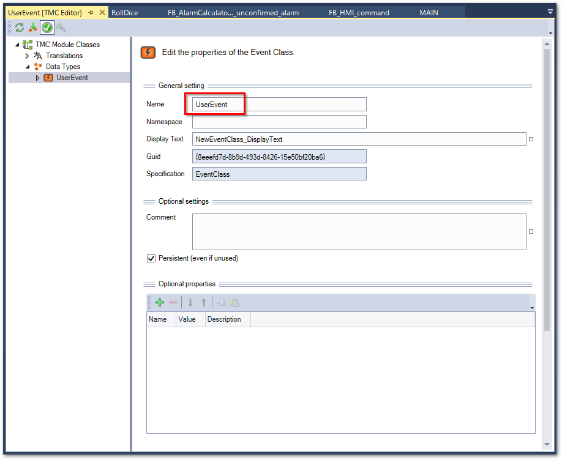
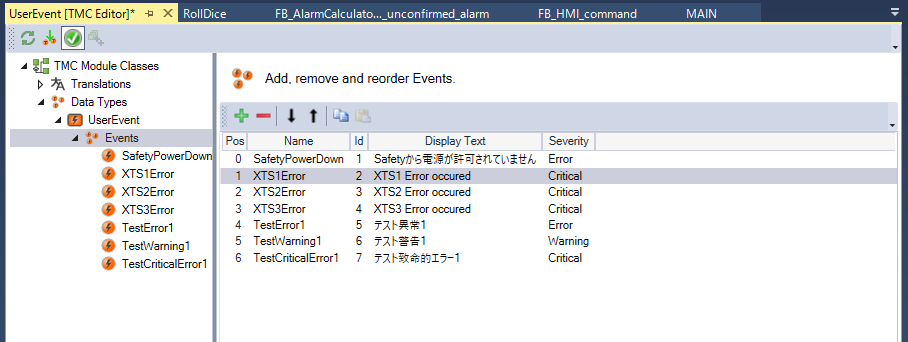
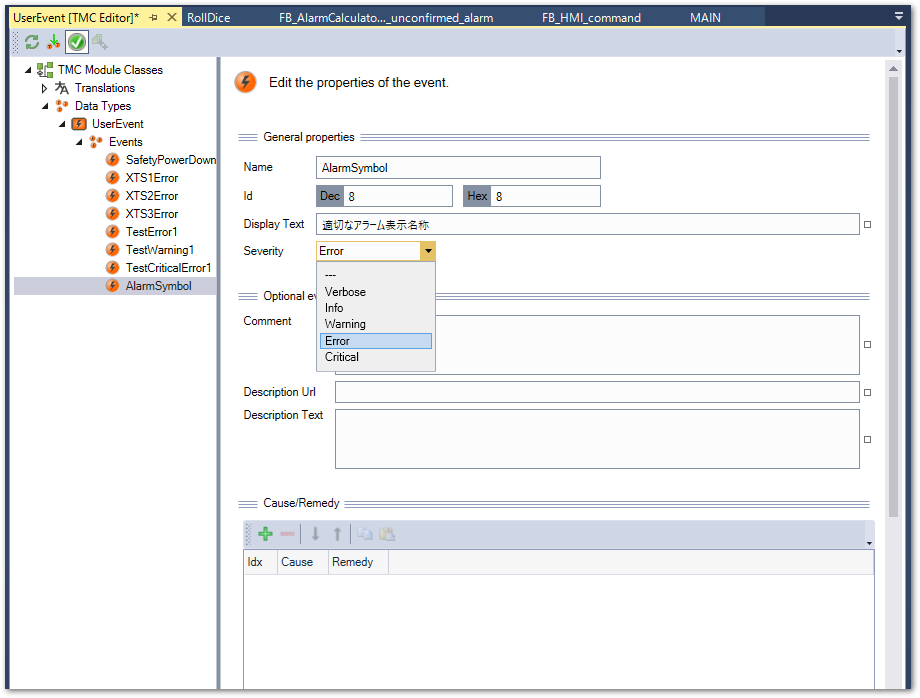
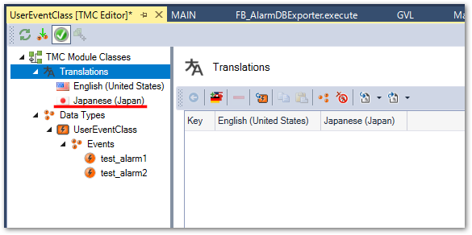
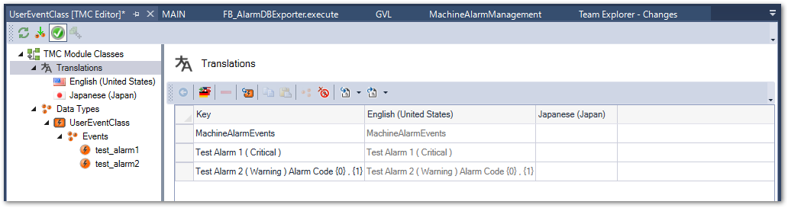
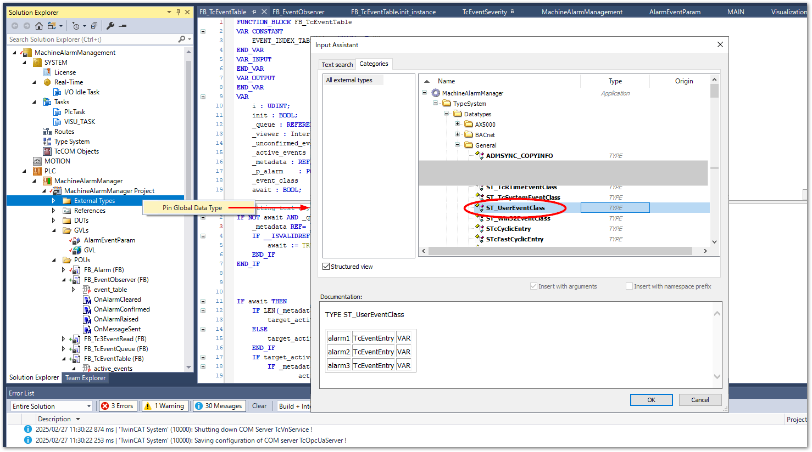

# ユーザイベントの作成

最初に、イベントリストを登録します。次の手順でイベントクラス、および、イベントエントリを登録します。

1. TwinCATプロジェクト以下の `System` > `TypeSystem` からイベントクラスタブを開きます。
2. 余白の部分で右クリックして`New`を選択します。

    {align=center}

3. 新たなイベントクラスが作成されます。Name部分に任意のイベントクラス名を付けます。ここでは`UserEvent`とします。

    {align=center}

4. Eventツリーを開くと次の通り登録可能なイベントが一覧されます。任意の行を選択し、新規追加する場合は緑色の＋アイコン、選択したエントリを削除する場合は赤い－アイコンをクリックします。新規追加した場合、選択した行の次に新しいエントリが追加されます。

    {align=center}

5.  追加したエントリをダブルクリックすると内容を変更できます。最低限重要な項目は以下の3点です。

    Name
        : プログラム上からアクセスする場合に使われるエントリ名です。`TC_Events.<<イベントクラス名>>.<<エントリ名>>` でイベントデータにアクセスすることができます。
    
    Display Text
        : HMI等で表示するイベントメッセージを記述します。多言語化は後から対応しますので、ここでは英語で記述する必要があります。データベース連携においてはこのテキストが記録用に用いられます。

    ```{admonition} 引数（arguments）により動的なデータを表示する方法
    :class: notes
    
    Display Text中に、`{0}`のように、中括弧に数値を記述し、前後に半角スペースを空けますと、{numref}`program_event_logger_arguments` のようにプログラム上で定義された引数が順にテキストへ展開されます。例えば、{numref}`program_event_logger_example` のプログラム例のとおり
    
    `fbTestAlarm2.ipArguments.Clear().AddString('WARN').AddInt(314);`

    と記述した場合、対応するイベントは次図の通り定義すると、`{0}`には文字列型で`WARN`が、`{1}`には数値型で`314`が展開され、`Test Alarm 2 (Warning) Alarm Code WARN . 314` とアラームテキスト表示されます。
    ```

    Severity
        : 重大度を5段階で定義します。最も下の`Critical`が高い重大度となります。後述するFB_AlarmCalculatorにて指定した重大度に応じたアラーム状態の集計結果を返すことができます。

    Comment
        : 補足情報を記載します。

    Description Url
        : 対処方法などマニュアルを記したURLを定義します。

    Description Text
        : 詳細説明を記載します。

    {align=center}

6. 翻訳ファイルの新規作成

    次節の手順に従って言語ファイルを作成します。

## Excelからのインポート

[https://infosys.beckhoff.com/content/1033/tc3_eventlogger/13716277515.html?id=8116147229532100751](https://infosys.beckhoff.com/content/1033/tc3_eventlogger/13716277515.html?id=8116147229532100751)


## 言語設定

1. TMC Module classes ツリーから Translations を選択する。初期状態でEnglish(United States)は一覧されています。

    {align=center}

2. 英語以外を追加する場合は、丸1のアイコンをクリックして言語を追加します。日本語を追加するには言語選択から、`ja-JP`を選択しOKボタンを押すとツリー上に日本語が追加されます。

    {align=center}

    {align=center}

3. 丸2のアイコンを追加し、翻訳編集画面を出現させます。左上のチェックボタンを押してOKボタンを押して対象のイベントの翻訳画面を出現させます。

    {align=center}

    {align=center}

    ```{admonition} 言語設定は必ずおこなってください
    :class: warning

    2の手順で言語を追加しない場合、英語だけであってもこの操作は必要です。この手順を実施しないと、{ref}`chapter_database_coupling` 節に示すデータベース連携の設定を行ってもイベントがデータベースに記録されません。
    ```

4. 追加した言語における対訳を編集する。

    {align=center}

5. アラームを追加した場合は、次図の通り3の手順の操作（丸2のアイコン）から繰り返します。

    {align=center}

## PLCからEventClassへアクセスできるようにする

登録したEventClassをPLC内で使用するには、External Type設定から登録します。Build 4024と4026で設定方法が異なりますのでご注意ください。

Build 4024における登録方法
    : {align=center}

Build 4026における登録方法
    : {align=center}
    : {align=center}