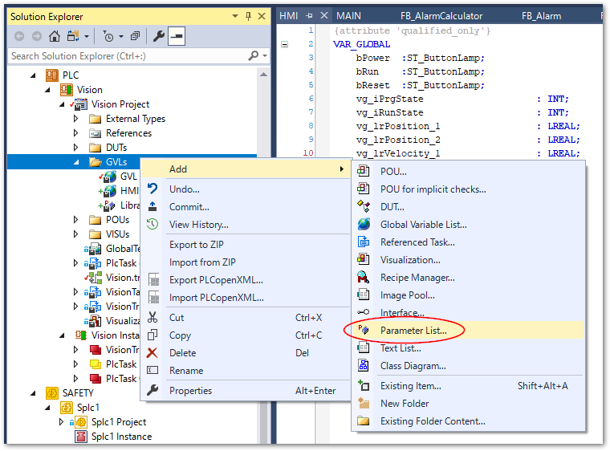
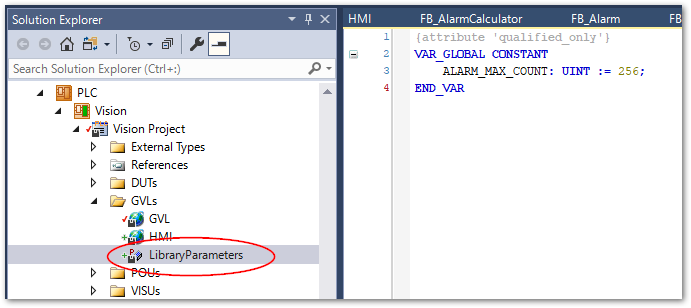

# ユーザアラーム

本節では、PLCプログラム上における異常監視ロジックの実装と、アラームイベントの登録方法、そして全てのアラームの集計や、ブザーやHMIへの表示・制御インターロックへ用いるための一連のデザインパターンをご紹介します。

{ref}`alarm_system_library` 節の実装を独立したライブラリとして保存しておくと、汎用的なアラーム管理フレームワークとして活用いただく事が可能になっています。

## イベントクラスとイベントエントリの登録

最初に、イベントリストを登録します。次の手順でイベントクラス、および、イベントエントリを登録します。

1. TwinCATプロジェクト以下の `System` > `TypeSystem` からイベントクラスタブを開きます。
2. 余白の部分で右クリックして`New`を選択します。

    {align=center}

3. 新たなイベントクラスが作成されます。Name部分に任意のイベントクラス名を付けます。ここでは`UserEvent`とします。

    {align=center}

4. Eventツリーを開くと次の通り登録可能なイベントが一覧されます。任意の行を選択し、新規追加する場合は緑色の＋アイコン、選択したエントリを削除する場合は赤い－アイコンをクリックします。新規追加した場合、選択した行の次に新しいエントリが追加されます。

    {align=center}

5.  追加したエントリをダブルクリックすると内容を変更できます。最低限重要な項目は以下の3点です。

    Name
        : プログラム上からアクセスする場合に使われるエントリ名です。`TC_Events.<<イベントクラス名>>.<<エントリ名>>` でイベントデータにアクセスすることができます。
    
    Display Text
        : HMI等で表示するイベントメッセージを記述します。

    Severity
        : 重大度を5段階で定義します。最も下の`Critical`が高い重大度となります。本章で紹介するPLCプログラム上では、任意の重大度以上のものにフィルタリングして振る舞いを変更する事が可能です。

    {align=center}

(alarm_system_library)=
## ライブラリ実装

個々のイベントエントリをPLCで扱うための`FB_Alarm`ファンクションブロックと、アラームエントリを集計する`FB_AlarmCalculator`ファンクションブロックを実装します。この説のPLCプロジェクトのみライブラリとして保存することで汎用的なアラーム管理フレームワークとして機能します。

### FB_Alarm ファンクションブロック

```{code-block} pascal
:caption: 宣言部
:linenos:

FUNCTION_BLOCK FB_Alarm EXTENDS FB_TcAlarm
VAR_INPUT
	bEvt		: BOOL;	// Set true during something event occured.
	bConfirm	: BOOL;	// True momentally after operator confirming event.
	bLatch		: BOOL := FALSE;	// Keep alarm status raised after bEvt being FALSE.
	bReset		: BOOL := FALSE;	// When the bLatch flag is True and bEvt is False, this flag can be unlatch when raised. 
END_VAR
VAR_OUTPUT
END_VAR
VAR
	bMemEvt: BOOL;
	bMemReset: BOOL;
END_VAR
```

```{code-block} pascal
:caption: 本文
:linenos:

IF bEvt 
	AND NOT bMemEvt 
	AND SUPER^.eConfirmationState <> TcEventConfirmationState.WaitForConfirmation THEN
	SUPER^.Raise(0);
END_IF

IF bConfirm THEN
	SUPER^.Confirm(0);
END_IF

IF bLatch THEN
	IF NOT bEvt 
		AND bReset 
		AND NOT bMemReset 
		AND SUPER^.eConfirmationState = TcEventConfirmationState.Confirmed THEN
		SUPER^.Clear(0, TRUE);
	END_IF
ELSE
	IF bMemEvt AND NOT bEvt THEN
		SUPER^.Clear(0, TRUE);
	END_IF
END_IF

bMemEvt := bEvt;
bMemReset := bReset;
```

FB_Alarmをインスタンス化した際に、次の2点を実施するため、コンストラクタ`FB_init`を記述します。

* FB_AlarmCalculatorオブジェクトを読み込んで、自分自身を登録する。
* イベントクラスに登録した該当イベントエントリをCreateExメソッドを使って登録する。

```{code-block} pascal
:caption: FB_init メソッド
:linenos:

METHOD FB_init : BOOL
VAR_INPUT
	bInitRetains : BOOL; // if TRUE, the retain variables are initialized (warm start / cold start)
	bInCopyCode : BOOL;  // if TRUE, the instance afterwards gets moved into the copy code (online change)
	evtEntry	: TcEventEntry; // Specify event class and entry name
	p_calculator : POINTER TO FB_AlarmCalculator; // Specify pointer to FB_AlarmCalculator.
END_VAR

p_calculator^.reg_alarm(p_alarm := THIS);
SUPER^.CreateEx(evtEntry, TRUE, 0);
```

### FB_AlarmCalcutator ファンクションブロック

先に作成したFB_Alarmファンクションブロックのポインタを配列上に登録し、次の状態のイベント有無を集計する機能を提供します。この状態通知により、次のユースケースを実現することができます。

未だConfirm（確認）されていない状態のイベントの有無
    : 装置の近くにいないオペレータに対して、新たに何等かの異常が発生したことが分かる様にランプやブザー等を鳴動させて知らせる。

有効（Raised）状態のイベントの有無
    : 重大度に応じて動作やサイクルを停止処理する。

#### 登録できる配列のサイズをライブラリパラメータとしてCONST定義する

まず、FB_Alarmのポインタを登録する配列のサイズは、将来ライブラリ化した際にパラメータとして設定できるように、ライブラリパラメータリスト内にCONSTANT変数定義を行います。

{align=center}

このあと、パラメータリスト名を設定するウィンドウが現われますので任意の名前を付けます。ここでは`LibraryParameters`という名前とします。

作成したパラメータリスト内に、次の通りグローバル定数を定義します。初期値として256個のアラームが登録できるようにします。

{align=center}


```{code-block} pascal
:caption: ライブラリパラメータ化されたグローバル定数
:linenos:

{attribute 'qualified_only'}
VAR_GLOBAL CONSTANT
	ALARM_MAX_COUNT: UINT := 256;
END_VAR
```

ライブラリパラメータ化されたCONSTANT定数は、次図の通りライブラマネージャ内で任意の値へ変更する事が可能です。

{align=center}

#### FB_AlarmCalculator ファンクションブロック実装

```{code-block} pascal
:caption: 変数宣言部
:linenos:

FUNCTION_BLOCK FB_AlarmCalculator
VAR_INPUT
END_VAR
VAR_OUTPUT
END_VAR
VAR
	al_index	: UINT := 0;
	p_alarms	: ARRAY [0..LibraryParameters.ALARM_MAX_COUNT - 1] OF POINTER TO FB_Alarm;
END_VAR
```

プログラム本体は有りません。次の5つのメソッドおよびプロパティを追加します。

reg_alarm（メソッド）
    : INTERNALスコープのメソッドで、FB_Alarmファンクションブロックのコンストラクタからのみ呼ばれます。配列にFB_Alarmのポインタを登録します。

any_events_raised（プロパティ）
    : 登録されたFB_Alarmイベントのうち、一つでも `bActive` がTRUEのイベントエントリが有ればTRUEを返します。アクティブなイベントの有無を調べます。

any_unconfirmed_raised（プロパティ）
    : 登録されたFB_Alarmイベントのうち、一つでも `WaitForConfirmation` 状態のイベントエントリが有ればTRUEを返します。未確認イベントの有無を調べます。

is_raised_event（メソッド）
    : パラメータ
        : severity : TcEventSeverity型
    : 指定した重大度以上の重大度の有効なイベントエントリが有ればTRUEを返します。有効なイベントは、`any_events_raised`プロパティと同様の仕組みですが、重大度によるフィルタが可能です。

is_unconfirmed_alarm（メソッド）
    : パラメータ
        : severity : TcEventSeverity型
    : 指定した重大度以上の重大度の未確認イベントエントリが有ればTRUEを返します。有効なイベントは、`any_unconfirmed_raised`プロパティと同様の仕組みですが、重大度によるフィルタが可能です。


```{code-block} pascal
:caption: reg_alarmメソッド
:linenos:

METHOD INTERNAL reg_alarm : BOOL
VAR_INPUT
	p_alarm	:POINTER TO FB_Alarm;
END_VAR

IF LibraryParameters.ALARM_MAX_COUNT <= al_index THEN
	reg_alarm := FALSE;
	RETURN;
END_IF

p_alarms[al_index] := p_alarm;
al_index := al_index + 1;
reg_alarm := TRUE;
```

```{code-block} pascal
:caption: any_events_raisedプロパティ
:linenos:

// TRUE if any of the registered events is in Raised state.
PROPERTY PUBLIC any_events_raised : BOOL

GET:

VAR
	i :DINT;
	bRaised: INT;
END_VAR

any_events_raised := FALSE;
FOR i := 0 TO al_index - 1 DO
	IF p_alarms[i]^.bActive THEN
		any_events_raised := TRUE;
		RETURN;
	END_IF
END_FOR
```

```{code-block} pascal
:caption: any_unconfirmed_raisedプロパティ
:linenos:

// TRUE if any of the registered events is in WaitForConfirmation state.
PROPERTY PUBLIC exist_unconfirmed_events : BOOL

GET:

VAR
	i: DINT;
END_VAR

exist_unconfirmed_events := FALSE;
FOR i := 0 TO al_index - 1 DO
	IF p_alarms[i]^.eConfirmationState = TcEventConfirmationState.WaitForConfirmation THEN
		exist_unconfirmed_events := TRUE;
		RETURN;
	END_IF
END_FOR
```

```{code-block} pascal
:caption: is_raised_eventメソッド
:linenos:

// TRUE if the registered events filtered by specified severity level is in Raised state.
METHOD PUBLIC is_raised_event : BOOL
VAR_INPUT
	severity : TcEventSeverity := TcEventSeverity.Error; // Filterd minimum serverity level
END_VAR
VAR
	i:	UINT;
END_VAR

is_raised_event := FALSE;
FOR i := 0 TO al_index - 1 DO
	IF p_alarms[i]^.eSeverity >= severity THEN
		IF p_alarms[i]^.bActive THEN
			is_raised_event := TRUE;
			RETURN;
		END_IF
	END_IF
END_FOR
```

```{code-block} pascal
:caption: is_unconfirmed_alarmメソッド
:linenos:

// TRUE if the registered events filtered by specified severity level is in WaitForConfirmation state.
METHOD PUBLIC is_unconfirmed_alarm : BOOL
VAR_INPUT
	severity : TcEventSeverity := TcEventSeverity.Error; // Filterd minimum serverity level
END_VAR
VAR
	i:	UINT;
END_VAR

is_unconfirmed_alarm := FALSE;
FOR i := 0 TO al_index - 1 DO
	IF p_alarms[i]^.eSeverity >= severity THEN
		IF p_alarms[i]^.eConfirmationState = TcEventConfirmationState.WaitForConfirmation THEN
			is_unconfirmed_alarm := TRUE;
			RETURN;
		END_IF
	END_IF
END_FOR
```

## ライブラリの使い方

### 変数宣言部の実装

宣言部で指定するのは次の3つです。

1. FB_AlarmCalculatorのインスタンス定義
2. アラームイベント毎にFB_Alarmのインスタンス定義し、次の引数を設定
    * あらかじめイベントクラスに登録したイベントエントリを指定。
    * FB_Alarmのインスタンス定義時にFB_AlarmCalculatorのポインタを指定。

また、プログラム本体では、インスタンス毎に次の設定を行います。

### FB_Alarmファンクションブロック入力変数

bLatch: bool
    : アラーム条件が解除されたら自動解除されるタイプか、アラーム条件解除後、ボタン操作等でリセットが必要な保持（ラッチ）タイプかどうか

bEvt: bool
    : アラーム条件の入力です。サイクリックに監視するよう、常に状態を入力し続けてください。

bConfirm: bool
    : アラーム確認ボタン入力により確認済みとなります。

bReset: bool
    : bLatchがTRUE（保持タイプ）の場合、アラーム条件が無くなった後もアラーム有効な状態が保持されます。本フラグをHMI等のリセットボタン操作によりTRUEにすることで保持が解除されます。

### FB_Alarmファンクションブロック出力変数

[基底クラス`FB_TcAlarm`](https://infosys.beckhoff.com/content/1033/tc3_eventlogger/5001926923.html?id=6291374471499984104) を参照の上、様々なアラーム個別の制御にご利用ください。とくに `bActive` がTRUEの場合[^bActive]、該当アラームが有効な状態となります。これにより様々な動作インターロックを設けてください。なお、`bLatch` を有効にしたものは、`bReset` により解除するまで有効な状態が保持し続けられます。

[^bActive]: 例えば、実装例における`alarm_safety_prohibited`に登録したアラームの有効状態を参照する場合は、`alarm_safety_prohibited.bActive`を用います。

### アラーム集計とHMIへの表示実装例

下記の実装例では、HMIのボタン表示状態を次の通り変化させています。

新規アラーム発生時：点滅
    : 重大度が`Error`以上を指定した `is_unconfirmed_alarm` メソッドの戻り値がTRUEであることによりランプが1秒間隔で点滅します。


有効なアラーム発生中：点灯
    : 重大度が`Error`以上を指定した `is_unconfirmed_alarm`メソッドの戻り値がFALSEで、`is_raised_event`メソッドの戻り値がTRUEであることによりランプが点灯状態となります。

### 実装例

```{code-block} pascal
:caption: プログラム実装
:linenos:

PROGRAM MAIN
VAR
    // User alarm event
	alarm_calculator : FB_AlarmCalculator;
	alarm_safety_prohibited	: FB_Alarm(evtEntry := TC_Events.UserEvent.SafetyPowerDown, p_calculator := ADR(alarm_calculator));
	alarm_xts1_error	: FB_Alarm(evtEntry := TC_Events.UserEvent.XTS1Error, p_calculator := ADR(alarm_calculator));
	alarm_test1		: FB_ALarm(evtEntry := TC_Events.UserEvent.TestError1, p_calculator := ADR(alarm_calculator));
	alarm_test2		: FB_ALarm(evtEntry := TC_Events.UserEvent.TestWarning1, p_calculator := ADR(alarm_calculator));

    // Timer for light blinking
    tFlicker_Alarm	: TON;
END_VAR

//Alarm制御
// アラーム条件解除で即アラーム解除となるアラーム実装例
alarm_safety_prohibited(
	bEvt := bSafetyPowerOff,        //安全コントローラによる電源断条件
	bConfirm := HMI.bReset.switch   // HMIによるアラーム確認ボタン
);

// アラーム条件解除後も保持（ラッチ）し、リセットボタン操作が必要なアラーム実装例

alarm_xts1_error(
	bEvt := stMover1.NcToPlc.ErrorCode <> 0,    // XTSのエラー状態etc.
	bLatch := TRUE,
	bConfirm := HMI.bReset.switch,    // HMIアラーム確認ボタン
	bReset := HMI.bReset.switch     // HMIアラーム確認ボタン
);

alarm_test1(
    bEvt := bErrorState,
	bLatch := TRUE,
	bConfirm := HMI.bReset.switch,
	bReset := HMI.bReset.switch
);

// Warningレベルでラッチしないアラーム

alarm_test2(
    bEvt := bWarningState,
	bLatch := FALSE
);

//　全てのアラームを集計しHMIランプ表示制御を行う

IF alarm_calculator.is_raised_event(severity := TcEventSeverity.Error) THEN
	IF alarm_calculator.is_unconfirmed_alarm(severity := TcEventSeverity.Error) THEN
		tFlicker_Alarm(IN := NOT tFlicker_Alarm.Q, PT := T#1S);
		IF tFlicker_Alarm.Q THEN
			HMI.bReset.lamp := NOT HMI.bReset.lamp;
		END_IF
	ELSE
		HMI.bReset.lamp := TRUE;
	END_IF
ELSE
	HMI.bReset.lamp := FALSE;
END_IF

```

