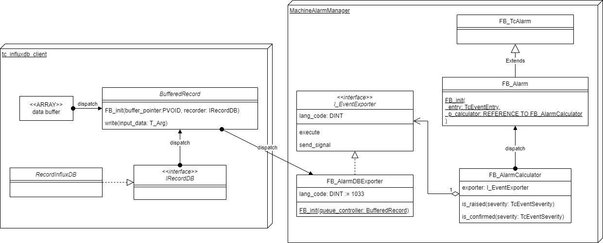

(alarm_system_library)=
# APIドキュメント

個々のイベントエントリをPLCで扱うための`FB_Alarm`ファンクションブロックと、アラームエントリを集計する`FB_AlarmCalculator`ファンクションブロックを実装します。

また、`FB_AlarmCalculator`では、アラーム発生、消滅のイベントを監視し、`I_EventExporter`を実装したファンクションブロックによりさまざまなメディアにイベント通知を送ることができます。

本ライブラリにはTF6420を通じて{ref}`chapter_influxdb`へエクスポートするファンクションブロックが内包されています。インターフェース仕様に応じて独自のエクスポート機能を実装することも可能です。

## クラス図

{align=center}

## API

### FB_Alarm

`FB_TcAlarm`を継承した本フレームワーク独自のファンクションブロックです。次の追加プロパティを備えています。

入力変数
    : bEvt: BOOL
        : アラーム発生要因を制御します。
    : module_name :STRING
        : アラームのモジュール名を設定します。
    : bConfirm : BOOL
        : アラームを確認済みを通知するため、一瞬だけTrueにします。
    : bLatch : BOOL
        : TrueにするとbEvtがFalseとなってもアラームの発生状態を保持します。Falseの場合はbConfirmedにより確認済みとなったあとはbEvtに同期して自動解除となります。
    : bReset : BOOL
        : bLatchがTrueの場合、このフラグを一瞬Trueにすることでアラームは解除されます。

calculator FB_init コンストラクタ引数
    : アラーム集計を移譲する `FBAlarmCalculator` のインスタンスを指定します。

get_alarm_text メソッド :BOOL
    : ADSを介してアラームデータベースにアクセスし、指定した言語コードのアラームテキストを収集します。PLCのサイクルとは非同期です。テキストの取得が完了したら戻り値がTrueとなります。

alarm_text プロパティ : STRING
    : `get_alarm_text` で取得したテキストが取得できます。

last_raise_time プロパティ :ULINT
    : 前回アラームが有効になったシステム時刻（`F_GetSystemTime()` で取得した100ns精度の時刻 ）を返します。

last_reset_time プロパティ :ULINT
    : 前回アラームが消滅したシステム時刻（`F_GetSystemTime()` で取得した100ns精度の時刻 ）を返します。

sequence_number プロパティ :ULINT
    : アラームが発生してから、消滅するまでを単位シーケンスとしたカウンタ値を参照します。`bLatch`がTRUEに設定されたFB_Alarmについてカウンタはすでにアクティブな状態においてbEvtが何度もTrue/Falseを繰り返してもシーケンス番号は繰り上がりません。

### FB_AlarmCalculator

登録された`FB_Alarm`を走査し、発生中アラーム、また、新規（未確認）アラームの有無を集計することができます。また、最大10個までのI_Observerを実装したリスナオブジェクトを登録する事で、アラームの発生、解除時に該当する`FB_Alarm`を受け取って任意の処理を行うことができます。

lang_code プロパティ
    : `add_listener` を通じて登録したリスナオブジェクトにアラームを通知する際に参照するアラームテキストの言語コードを設定します。アラームテキストは引数を伴うものが存在し、状態によりテキスト内容が変化します。従って、アラームが発生したタイミングでの本プロパティで指定した言語コードのアラームテキストを参照し、オブザーバメソッドに渡します。

is_active メソッド
    : 指定したレベル以上のアラームイベントにおいて、一つでも`FB_Alarm`の`bEvt`入力変数がTrueのアラームが有る場合にTrueが返ります。

is_raised メソッド
    : 指定したレベル以上のアラームイベントにおいて、一つでも`FB_Alarm` のRaisedステータスの場合にTrueが返ります。Raisedステータスでは、`bLatched` がTrueとなっているFB_Alarmにおいて、`bEvt` がFalseになった後もTrueが保持されます。`bConfirm`, `bReset` を順番に立てないとFalse（解除状態）になりません。

is_unconfirmed メソッド
    : 指定したレベル以上のアラームイベントにおいて、一つでも`FB_Alarm`のスタータスがWaitForConfirmation状態にあるものが見つかると、Trueを返します。

add_listener メソッド
    : 引数で指定した`I_Observer` 実装ファンクションブロックを登録します。10個までオブザーバは登録できます。正常に登録できると、1以上の整数値（オブザーバへのリファレンスを登録した配列アドレス）を返します。戻り値が0の場合は登録数が上限に達しており、登録に失敗したことを示します。

rm_listener メソッド
    : 引数で指定した`I_Observer` 実装ファンクションブロックを登録します。

clear_listeners メソッド
    : 全てのリスナへのリファレンスを削除します。

### I_Observer

`FB_AlarmCalculator`により監視されたアラームの発生、消滅の際の通知機構を定義したインターフェースです。

send_signal メソッド
    : アラームの発生・解除時にFB_AlarmCalcutatorにより呼び出されます。
    : 引数
        : pAlarm : POINTER TO FB_Alarm
            : 該当する`FB_Alarm`オブジェクトへのポインタを受け取ります。

(section_ads_alarm_listener_api)=
### FB_AlarmSimpleListener

組み込みの`I_Observer`を実装ファンクションブロックです。`AlarmMessage`構造体型の変数へアラームメッセージをマッピングするシンプルなメッセージ通知機構です。ADSを通じて各種外部クライアントにデータを通知する場合に便利です。

デバイスのデータ変更をトリガにADSを通じてメッセージを受け取るためのメソッド、[`AddDeviceNotification`](https://infosys.beckhoff.com/content/1033/tc3_adsnetref/7313417355.html?id=4173604048256371055)を通じて上記構造体変数を登録しておくことでアラームイベントの外部への通知が可能です。

### FB_AlarmDBListener

組み込みの`I_Observer`を実装ファンクションブロックです。{ref}`chapter_influxdb`にアラームの発生、解除イベントを記録するエクスポートロジックを実装しています。詳細は{ref}`chapter_database_coupling`をご覧ください。
