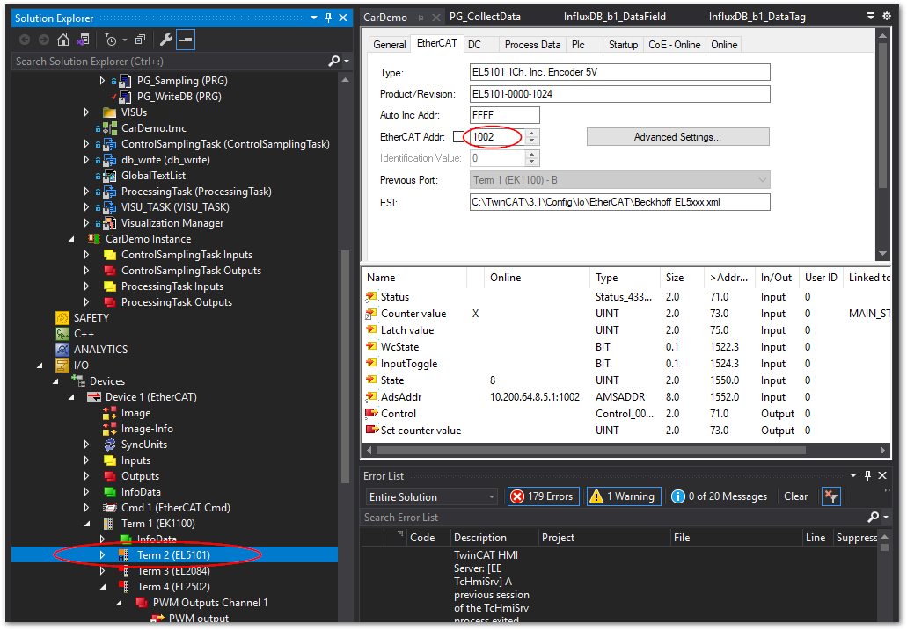
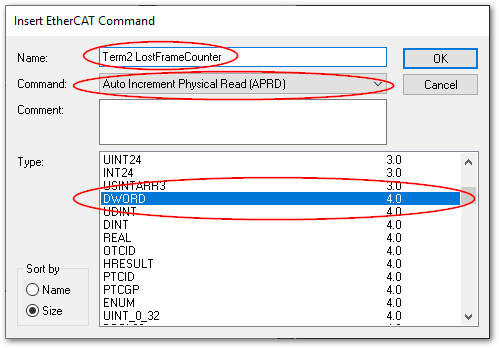
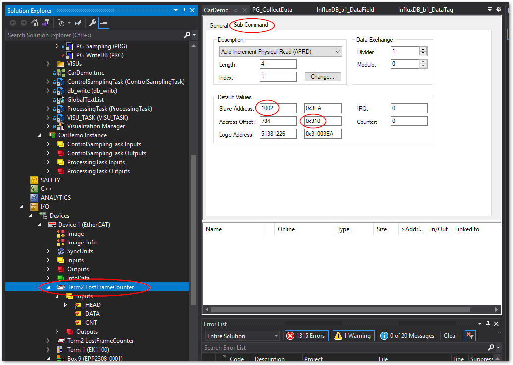
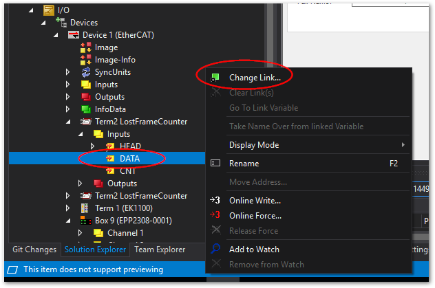

# EtherCATスレーブごとのフレームエラーの記録方法をおしえてください

TwinCAT上の各スレーブでは、前段のターミナルから届いたフレームをチェックし、次の種類のエラー毎に個別にカウントし、特定のレジスタに記録する機能があります。

ロストリンクカウンタ
    : Ethernet物理層がケーブルの断線等を検出し、リンクが切れた事を表します。接触不良やEMC障害によって一時的に異常な電位となる場合にこの症状となります。

RXエラーカウンタ
    : 物理層におけるチェックで、フレーム内のデータ異常、電位の異常を検出した際にこのエラーとなります。

CRCエラーカウンタ
    : ソフトウェア演算により巡回冗長検査によるサムチェックを行い、照合異常となった場合このエラーになります。

これらのエラーカウンタをTwinCAT上の変数に割り当てて監視する方法を示します。変数の値を時系列で記録する方法については {numref}`chapter_iot_solution` をご覧ください。

## 設定手順

1. 該当するスレーブのアドレスを調べます。

    次図の通りスレーブターミナルをダブルクリックし、`EtherCAT` タブの`EtherCAT Addr: `フィールドの値（10進数）を確認する。

    {widht=400px align=center}

2. EtherCATマスターのコンテキストメニューから`Append EtherCAT Cmd`を選択してください。

    {widht=300px align=center}

3. Insert EtherCAT Commandウィンドウが現われたら、Name欄に監視する対象ターミナルが判別できる適切なタイトルを設定し、Command フィールドでは`Auto Increment Physical Read (APRD)`を、Typeフィールドでは`DWORD`を選択し、最後に`OK`ボタンを押してください。

    {widht=300px align=center}

4. 追加したコマンドがマスター以下のメニューに追加されます。

    {widht=400px align=center}

    これを開いたウィンドウの`Sub Command`タブを開いて、次の通り設定します。

    ```{csv-table}
    :header: 設定項目, 設定内容
    Default Values/Slave Address:, Step1で調べたターミナルアドレスを左側（10進数）に入力
    Default Values/Address Offset:, 右側（16進数）に、{numref}`table_lostframe_register_address` のとおり監視したい対象のカウンタのレジスタアドレス（例えばポート0のロストリンクカウンタなら`0x310`）を入力
    ```

    EtherCATのターミナルのポートの概念は{numref}`figure_ethercat_terminal_port` のとおりです。また、各ポートは、前段のターミナルからフレームが到着した際にチェックされ、カウンタ値を更新します。
    
    例えばEtherCATカプラEK1100等の場合は、INPUTとOUTPUTがあり、それぞれPort0とPort2に接続されています。カプラに取り付けられた各IOターミナルに向けてはPort1が接続されます。Port0については前段のターミナルからのINPUTフレームをチェックします。Port1は、カプラに取り付けられた各ターミナルから返ってきたフレームをチェックします。Port2については、本カプラの後段のターミナルから返ってきたフレームをチェックします。

    ```{figure-md} figure_ethercat_terminal_port
    {widht=600px align=center}

    EtherCATターミナルのポート概念
    ```

    ```{csv-table} レジスタ一覧表
    :align: center
    :widths: 1,1,8
    :header: レジスタ, 長さ, 説明
    :name: table_lostframe_register_address
    0x0300, 1 byte, ポート0のCRCエラーカウンタ
    0x0301, 1 byte, ポート0のRXエラーカウンタ
    0x0302, 1 byte, ポート1のCRCエラーカウンタ
    0x0303, 1 byte, ポート1のRXエラーカウンタ
    0x0304, 1 byte, ポート2のCRCエラーカウンタ
    0x0305, 1 byte, ポート2のRXエラーカウンタ
    0x0306, 1 byte, ポート3のCRCエラーカウンタ
    0x0307, 1 byte, ポート3のRXエラーカウンタ
    0x0310, 1 byte, ポート0のロストリンクカウンタ
    0x0311, 1 byte, ポート1のロストリンクカウンタ
    0x0312, 1 byte, ポート2のロストリンクカウンタ
    0x0313, 1 byte, ポート3のロストリンクカウンタ
    ```

5. 追加したコマンドの、`Inputs/DATA` をTwinCAT上の変数（DWORD型）に任意の変数をリンクしてください。

    {widht=300px align=center}

6. 他の対象ターミナル、カウンタ毎にこれまでと同様の手順を繰り返し実施します。全て設定が完了したらリンクした変数を監視してください。

```{warning}
対象スレーブのカウンタ値は、EtherCATフレームを発行する同一Sync groupにあるタスク上で、毎サイクル記録するようにしてください。Slaveの設定によってはカウンタ値は自動リセットされる可能性があります。
```