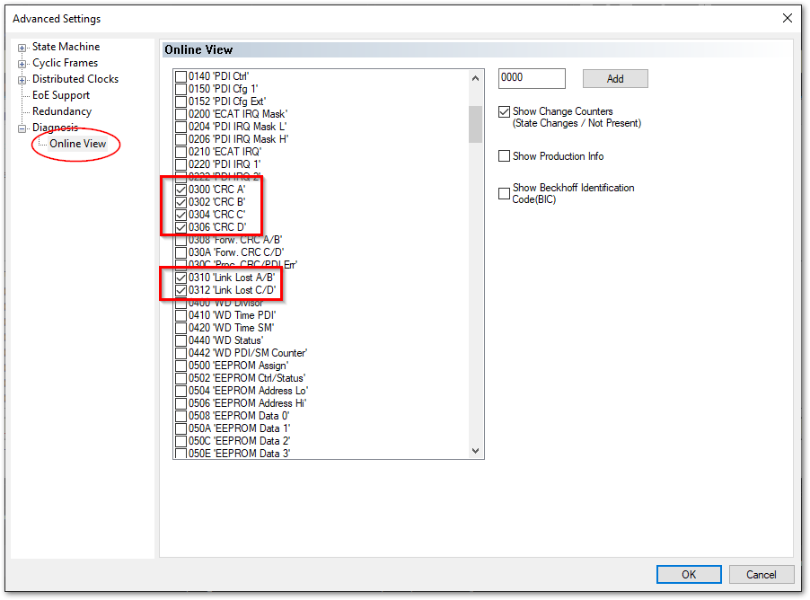
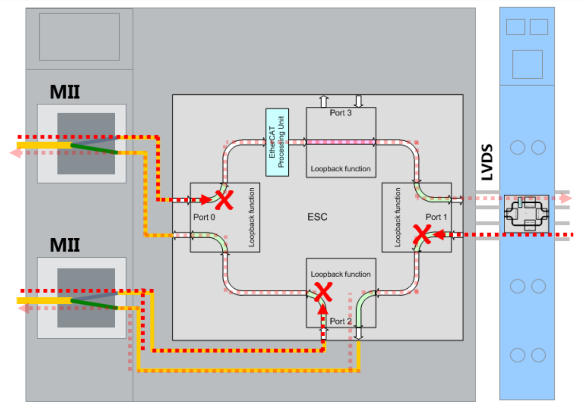

# EtherCATスレーブごとのフレームエラーの記録方法をおしえてください

TwinCAT上の各スレーブでは、前段のターミナルから届いたフレームをチェックし、次の種類のエラー毎に個別にカウントし、特定のレジスタに記録する機能があります。

ロストリンクカウンタ
    : Ethernet物理層がケーブルの断線等を検出し、リンクが切れた事を表します。接触不良やEMC障害によって一時的に異常な電位となる場合にこの症状となります。

RXエラーカウンタ
    : 物理層におけるチェックで、フレーム内のデータ異常、電位の異常を検出した際にこのエラーとなります。

CRCエラーカウンタ
    : ソフトウェア演算により巡回冗長検査によるサムチェックを行い、照合異常となった場合このエラーになります。

これらのカウンタ値をEtherCATマスターに読みだしてログ記録する機能について説明します。

## 設定手順

1. EtherCATマスターのメニューから、`EtherCAT` タブを開き、`Advanced Settings...`ボタンを押します。

    {widht=500px align=center}

2. ツリーメニューから`Diagnosis` > `Online View` を選択し、{numref}`figure_ethercat_diagnosis_online_menu` のとおり6個所にチェックを入れます。

    ```{figure-md} figure_ethercat_diagnosis_online_menu
    {widht=400px align=center}

    オンライン診断設定
    ```

3. Active configurationを行ってRUNモードにし、`Online` タブを開きます。

    {numref}`figure_ethercat_diagnosis_online` のとおり、各ターミナルのレジスタ上に1byteづつ割り当てられたカウンタ値の現在値が一覧されます。

    ```{figure-md} figure_ethercat_diagnosis_online
    {widht=600px align=center}

    EtherCATオンライン診断画面
    ```

    たとえば、Term 1 EK1100のPort0のリンク切れが0x20 (32回) 発生していることがわかります。


## オンラインビューの見方

EtherCATのターミナルのポートの概念は{numref}`figure_ethercat_terminal_port` のとおりです。また、各ポートは、前段のターミナルからフレームが到着した際にチェックされ、カウンタ値を更新します。

例えばEtherCATカプラEK1100等の場合は、INPUTとOUTPUTがあり、それぞれPort0とPort2に接続されています。カプラに取り付けられた各IOターミナルに向けてはPort1が接続されます。Port0については前段のターミナルからのINPUTフレームをチェックします。Port1は、カプラに取り付けられた各ターミナルから返ってきたフレームをチェックします。Port2については、本カプラの後段のターミナルから返ってきたフレームをチェックします。

これらの各カウンタ値は1byteのサイズとなっています。よってオンラインビュー上では16進数の上位2桁、下位2桁を分けて値を確認してください。

```{figure-md} figure_ethercat_terminal_port
{widht=600px align=center}

EtherCATターミナルのポート概念
```

```{csv-table} レジスタ一覧表
:align: center
:widths: 3,1,6
:header: レジスタアドレス, 長さ, 説明
:name: table_lostframe_register_address
0x0300, 1 byte, ポート0のCRCエラーカウンタ
0x0301, 1 byte, ポート0のRXエラーカウンタ
0x0302, 1 byte, ポート1のCRCエラーカウンタ
0x0303, 1 byte, ポート1のRXエラーカウンタ
0x0304, 1 byte, ポート2のCRCエラーカウンタ
0x0305, 1 byte, ポート2のRXエラーカウンタ
0x0306, 1 byte, ポート3のCRCエラーカウンタ
0x0307, 1 byte, ポート3のRXエラーカウンタ
0x0310, 1 byte, ポート0のロストリンクカウンタ
0x0311, 1 byte, ポート1のロストリンクカウンタ
0x0312, 1 byte, ポート2のロストリンクカウンタ
0x0313, 1 byte, ポート3のロストリンクカウンタ
```
