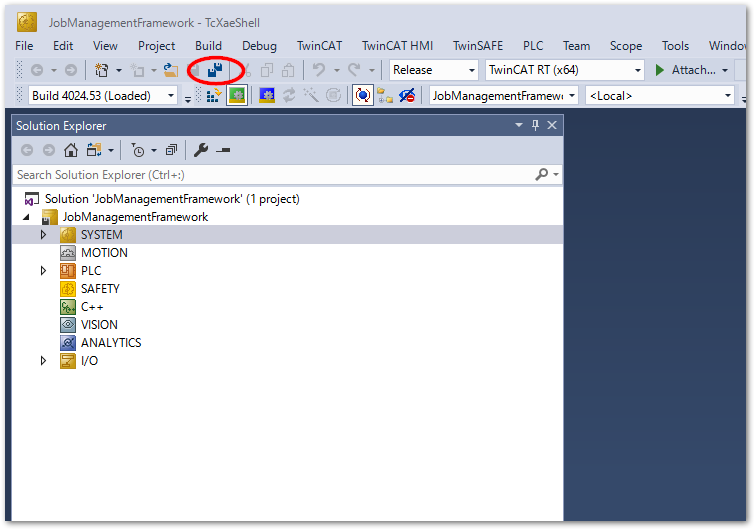

# リモートIPCからTwinCATプロジェクトを読み出す方法をおしえてください

```{admonition} 事前条件
:class: tip

接続したIPCからTwinCATのPLCソースを読み出すには、IPCにインストールされたPLCプロジェクトの設定が次図の通りとなっている必要があります。

{align=center}

PLC プロジェクトの Settings で、Target Archive に少なくとも Project Sources および Complied Libraries がチェックされていること。
```

以下の手順でターゲットIPCのプロジェクトを読み出すことができます。

1. Visual StudioまたはTwinCAT XAE Shellを開き、File メニューの `Open` > `Open Project form Target...` を選びます。

    {align=center}

2. 次図の右上のウィンドウが現れます。接続先を選択してください。接続先が一覧に無いか、未接続（？アイコン）であれば、SearchボタンからリモートIPCと接続設定を行ってください。

    {align=center}

3. 読みだしたプロジェクトを保存する先の空フォルダを指定します。

    {align=center}

4. しばらくすると Solutionツリーに、TwinCATプロジェクトが展開されます。ショートカットキーでCtrl + Shift + S を押すか、`File` > `Save All`を操作するか、フロッピーディスクが2枚重なったアイコンを押してプロジェクトを上書き保存してください。

    {align=center}

5. 一度 Visual Studioまたは TcXaeShellを閉じたあとも、手順3.で指定したフォルダ内の `*.sln` ファイルを開くと、TwinCATプロジェクトを開くことができます。
