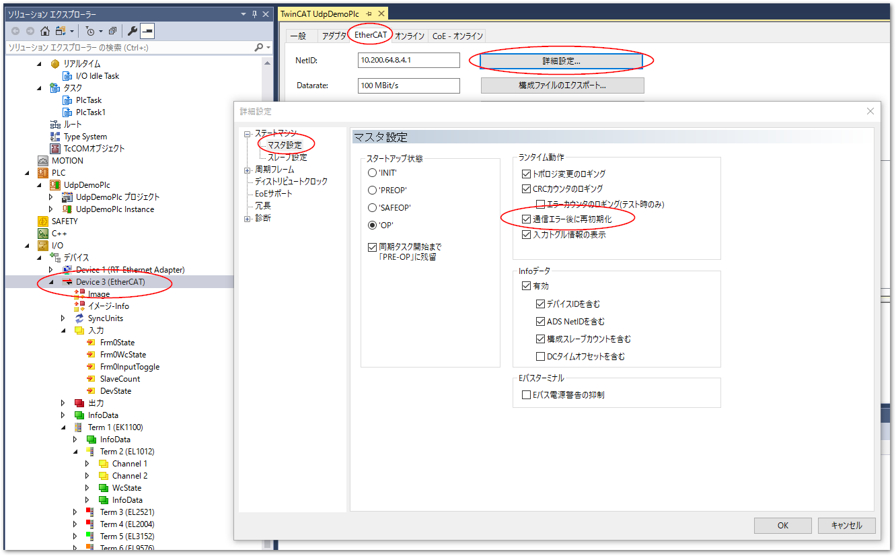

# EtherCATの通信異常が発生した後に自動的にOPに回復するにはどの設定が必要ですか

下記の設定になります。

    EtherCATマスタ > EtherCAT タブ > 詳細設定 > ステートマシン > マスタ設定 > ランタイム動作 > 通信エラー後に再初期化

{align=center}

この設定により以下の通り挙動が変わります。

ON
    : 必ずINIT状態に戻り、スタートアップ動作となるため、スレーブ側に問題が無ければスタートアップ状態設定（デフォルトではOP）に移行する。

OFF
    : マスタは通信異常が発生した直前の最終状態を記憶しており、その状態に移行する。

マスタのオンラインタブで各スレーブのステートが一覧できます。

本設定がONの場合、通信切断中は該当するスレーブ状態が ``INIT NO_COMM`` になり、復活するとスタートアップで指定した状態へ遷移します。

OFFの場合、通信中断中は直前の状態でERR表記となり、例えば直前にSAFEOPへ移行してから通信異常状態となると、``ERR SAFEOP NO_COMM`` の表記になり、通信異常が回復するとSAFEOPへ戻ります。
