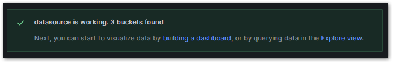
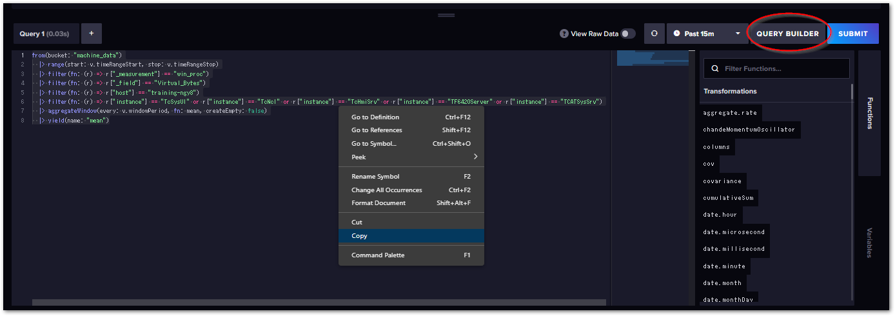
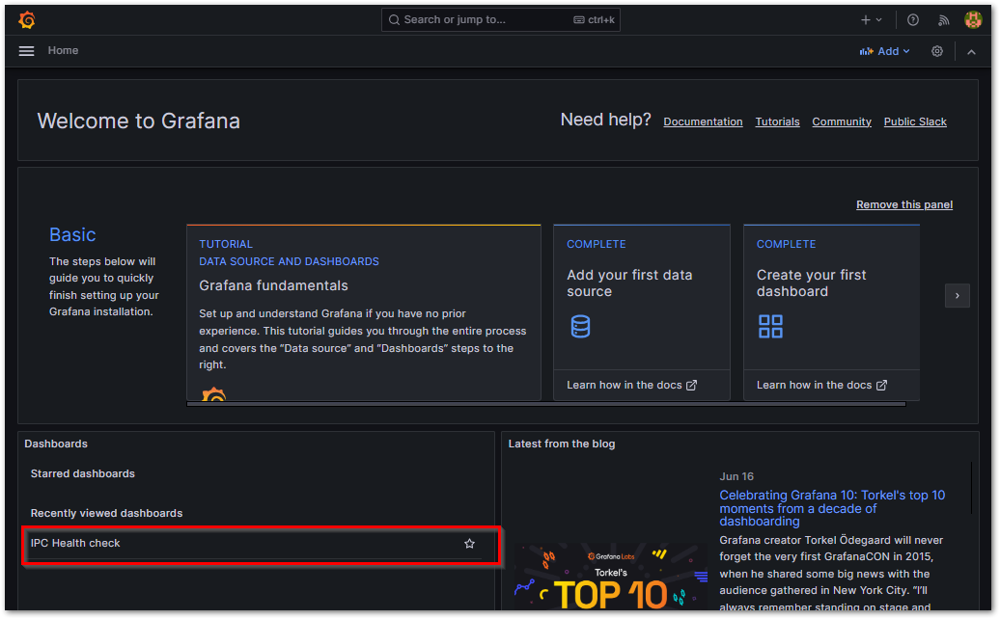

(section_grafana_dashoboard)=
# Grafanaを用いたデータ可視化

Grafanaは、より見やすく操作しやすいダッシュボード作成のための豊富な機能を備えた可視化WEBアプリケーションです。

まず、InfluxDBをデータソースとして登録し、そこからInfluxDBへクエリを発行してダッシュボードに各種可視化グラフ表示を行います。

このグラフは、マウス操作等で拡大縮小、軸の選択などが対話的に可能になっており、ブラウザさえあれば、スマートフォンやタブレット等を通じて同様の操作が可能になっています。

## データソースの設定

1. Grafanaにログインし、メニューから`Connection`を選択します。

    {align=center}

2. Searchフィールドから、 `influxdb` と入力する。InfluxDBコネクタが検索されるので、クリックする。

    {align=center}   {width=200px align=center}

3. Create a InfluxDB data source ボタンを押す。

    {align=center}

4. 次の設定項目を埋めます。

    ```{csv-table}
    :header: 設定項目, 設定値
    :widths: 2,8
    Query Language, Fluxを選択
    URL, Docker compose 内部のネットワークにより、Grafanaからは、`influxdb` という名称で、influxdbのホスト名にアクセスすることができます。よって、 `http://influxdb:8086` と入力します。
    Basic Auth Details, データベース管理者のユーザ、パスワードを入力します。
    InfluxDB Details, "Organization, API Token, Default Bucketを入力します。 "
    ```

    {align=center}

    Save & Testを押すと、設定を保存するとともに、`datasource is working` としたコメントで接続成功を確認することができます。

    {align=center}


## ダッシュボードの作成

Grafanaでダッシュボードを作成するために、InfluxDBからデータを抽出し、ボード上に可視化グラフのパネルを配置します。

まずはInfluxDBからクエリを作成し、そのFluxスクリプトによるクエリ文を取得します。これをGrafanaのダッシュボードパネルに設定することで、InfluxDBから抽出したデータを可視化グラフとして描画させることができます。

1. InfluxDBのWEBから、{numref}`figure_script_editor_view` のように{ref}`figure_script_editor_view`にて目的のデータクエリを作成して確認します。

    {align=center}

    {align=center}

2. 取り出したflux言語のクエリを、Grafanaのダッシュボードのデータソースに

    {align=center}

3. Newボタンを押して、新しいパネルを生成します。つづく画面で`Add visualization`ボタンを押してください。

    {align=center}
    {align=center}

4. 現われたパネル編集画面の下部に、さきほどコピーしたfluxクエリ言語を貼り付けます。また、パネルのタイトルを入力し、Applyを押します。

    {align=center}

5. ダッシュボードにパネルが生成されます。大きさを調整するためには、右下（赤丸部）をドラッグして調整します。

    {align=center}

6. これまでの手順を繰り返して必要なパネルを全て配置し終わったら、フロッピーディスクアイコンをクリックしてボードを保存します。

    {align=center}

7. ダッシュボードの名前を付けて保存します。

    {align=center}

8. Homeページのダッシュボードに追加されます。

    {align=center}


## ダッシュボードの編集

ダッシュボードを編集する際は、次図のとおり各パネルの右上にあるMenuから、Editを選択してください。

{align=center}

```{warning}
パネル編集した結果は、ダッシュボードを上書き保存（フロッピーディスクアイコン）しなければ編集内容が失われます。
```