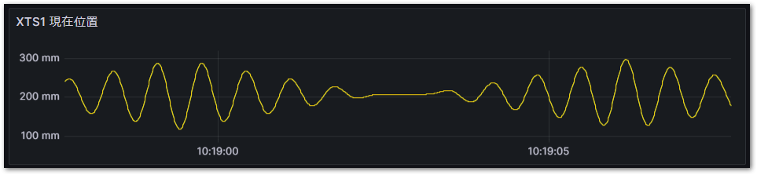
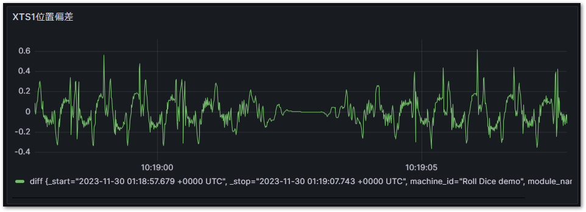

# 応用編：さまざまなクエリパターン

## 二つのフィールドの値同士を計算した新たなフィールドを定義する

設定位置（`set_position`）と、現在位置（`position`）をプロットするクエリは下記の通りです。

```{code-block} flux
from(bucket: "machine_monitoring")
  |> range(start: v.timeRangeStart, stop: v.timeRangeStop)
  |> filter(fn: (r) => r["_measurement"] == "MotionActivityData")
  |> filter(fn: (r) => r["_field"] == "position" or r["_field"] == "set_position")
  |> filter(fn: (r) => r["module_name"] == "XTS1")
  |> aggregateWindow(every: v.windowPeriod, fn: mean, createEmpty: false)
  |> yield(name: "mean")
```

このクエリをGrafanaで可視化すると次図の通りとなります。このスケールではset_positionもpositionも重なって表示されてしまっています。このpositionとset_positionだけのデータからクエリで編差を計算し、可視化してみましょう。

{align=center}

influxDBでは、`_time` 列に時刻が、 `_field` 列にフィールドが、 `_value` にその値が格納された縦持ちリストとなっています。

```{csv-table}
:header: _time, module_name, _field, _value

2023-12-08 10:00:00.000, XTS1, position, 122.99843
2023-12-08 10:00:00.000, XTS1, set_position, 123.0000
:
```

まず、`pivot`で行を`_time`, 列を `_field` その値を `_value` 列にあるものを縦横変換してみます。

```
  |> pivot(rowKey: ["_time"], columnKey: ["_field"], valueColumn: "_value")
```

この結果、次の通りとなります。

```{csv-table}
:header: _time, position, set_position

2023-12-08 10:00:00.000, 122.99843, 123.0000
:
```

次に、新たに diff という列を追加してset_positionからpositionの差を計算した値をセットします。

```
  |> map(fn: (r) => ({r with diff: r.set_position - r.position}))
```

この結果、次の通りとなります。

```{csv-table}
:header: _time, position, set_position, diff

2023-12-08 10:00:00.000, 122.99843, 123.0000, 0.00157
:
```

欲しいのは偏差だけなので、positionとset_position列は削除します。

```
  |> drop(columns: ["set_position", "position"])
```

最後にGrafana等の表示スケールに合わせて自動的にダウンサンプリングする命令を加えます。ダウンサンプリングに用いる関数は`mean`（平均化）です。他にも中央値`median`, 最小`min`、最大`max`などがあります。

ダウンサンプリングを加えておかないとPLCの高速サイクルデータのそのままの精度をグラフ表示しようとして、あっという間にリソース不足になってしまいます。（その前にGrafana側でエラーが発生しますが・・・）

```
  |> aggregateWindow(column: "diff", every: v.windowPeriod, fn: mean, createEmpty: false)
```

これで時刻と位置偏差だけのデータになります。まとめると次のクエリとなります。

``` flux
from(bucket: "machine_monitoring")
  |> range(start: v.timeRangeStart, stop: v.timeRangeStop)
  |> filter(fn: (r) => r["_measurement"] == "MotionActivityData")
  |> filter(fn: (r) => r["_field"] == "position" or r["_field"] == "set_position")
  |> filter(fn: (r) => r["module_name"] == "XTS1")
  |> pivot(rowKey: ["_time"], columnKey: ["_field"], valueColumn: "_value")
  |> map(fn: (r) => ({r with diff: r.set_position - r.position}))
  |> drop(columns: ["set_position", "position"])
  |> aggregateWindow(column: "diff", every: v.windowPeriod, fn: mean, createEmpty: false)
```

```{csv-table}
:header: _time, diff

2023-12-08 10:00:00.000, 0.00157
:
```

これをGrafanaで可視化したものが次のとおりです。単なるpositionとset_positionだけでは見えなかった精度での編差が可視化できました。

{align=center}


## アラームやイベントの発生期間を調べる

イベントのタイトルが`text`フィールドに、その変化後の状態がboolean型で`status`フィールドに記録される`EventLogger`メジャメントをクエリする例です。次の手順でデータ加工を行います。

1. pivotにより、_fieldに記載されたフィールド名毎に列を分けた表に変換します。
2. イベント種類である`text`毎にグループ化します。
3. `events.duration`によりtrue/false間それぞれの間隔を秒数で計算し、`duration`列に出力します。

```{note}
events.durationについては以下をご参照ください。unitを変更することでより精度の高い間隔時間を計算することができます。

[https://docs.influxdata.com/flux/v0/stdlib/contrib/tomhollingworth/events/duration/](https://docs.influxdata.com/flux/v0/stdlib/contrib/tomhollingworth/events/duration/)
```

これにより、イベントの発生時刻、解消時刻と、その間隔が一覧される表が出力されます。

``` flux
import "array"
import "contrib/tomhollingworth/events"
from(bucket: "machine_monitoring")
  |> range(start: v.timeRangeStart, stop: v.timeRangeStop)
  |> filter(fn: (r) => r["_measurement"] == "EventLogger")
  |> pivot(rowKey: ["_time"], columnKey: ["_field"], valueColumn: "_value")
  |> group(columns: ["text"])
  |> events.duration(unit: 1s)
  |> yield(name: "mean")
```

クエリにより得られたデータをCSVに出力した結果例は以下の通りです。

```{csv-table}
:header: 
#group,false,false,false,false,false,false,false,false,false,false,false,false,true,false
#datatype,string,long,dateTime:RFC3339,dateTime:RFC3339,dateTime:RFC3339,string,string,string,string,string,long,boolean,string,long
#default,mean,,,,,,,,,,,,,
,result,table,_start,_stop,_time,_measurement,machine_id,module_name,uuid,event_id,severity,status,text,duration
,,0,2023-11-29T21:00:00Z,2023-11-30T09:01:00Z,2023-11-29T23:35:34.911Z,EventLogger,Roll Dice demo,Event,11881C9C-6ABE-4B99-86DD-C74B4FE79496,1,3,true,!! EMO Stop !!,667
,,0,2023-11-29T21:00:00Z,2023-11-30T09:01:00Z,2023-11-29T23:46:42.498Z,EventLogger,Roll Dice demo,Event,11881C9C-6ABE-4B99-86DD-C74B4FE79496,1,3,false,!! EMO Stop !!,4351
,,0,2023-11-29T21:00:00Z,2023-11-30T09:01:00Z,2023-11-30T00:59:13.723Z,EventLogger,Roll Dice demo,Event,11881C9C-6ABE-4B99-86DD-C74B4FE79496,1,3,true,!! EMO Stop !!,17
,,0,2023-11-29T21:00:00Z,2023-11-30T09:01:00Z,2023-11-30T00:59:31.427Z,EventLogger,Roll Dice demo,Event,11881C9C-6ABE-4B99-86DD-C74B4FE79496,1,3,false,!! EMO Stop !!,384
,,0,2023-11-29T21:00:00Z,2023-11-30T09:01:00Z,2023-11-30T01:05:55.983Z,EventLogger,Roll Dice demo,Event,11881C9C-6ABE-4B99-86DD-C74B4FE79496,1,3,true,!! EMO Stop !!,6
```
