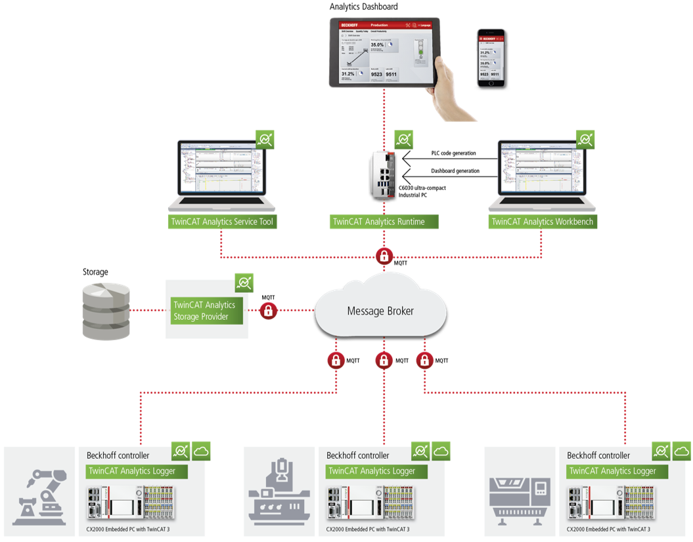
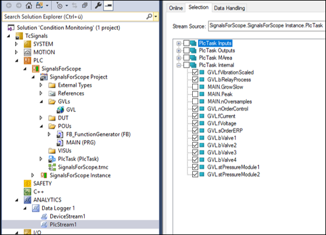

(section_iot_overview)=
# IoT製品紹介

近年デジタルツインという概念により現実世界をデジタルに投影し、そこから改善モデルを構築する手法が注目されています。発達したIoT技術で収集したデータを活用してビジネス上の競争力を高めることを目的としています。しかし、部分的な取り組みに終わり永続的でないことや、分析止まりで製造現場や設計現場にフィードバックされないなど、データ活用には高いハードルがあります。

要因として、製造に関する4M（Man, Machine, Material, Method）と呼ばれる製造資源を表すデータ管理がまず手の内化できていない事にあることが考えられます。このような資源データを扱うものにはERPやPLMというシステムが代表的です。特に日本ではこれらのシステムを高度に個別カスタマイズすることが慣例化し、システム内の利便性だけが追及されました。反面、外部とのデータ入力・出力方法の標準化（API化）とその活用は重視されず、製造側のシステムと連携することが立ち遅れてしまっています。同じことは製造システム側にも言えます。PLC、SCADA、MESといった製造システム上のインターフェース仕様は標準化が進まず、大きなブラックボックスです。これがデータ活用の大きな障害になっていると考えられます。

## オープン性を追及した製造システム間通信規格 OPC UA

近年、設備のデータを収集するプロトコルとして欧州を中心に拡大しているのがOPC UAです。OPC UAはただデータを送るだけの規約ではなく、どのようなデータがアクセス可能なのか、というデータの仕様「情報モデル」を事前に相互にやり取りする機能があることが大きな特徴です。ドキュメントだけに頼らずソフトウェア上でデータ仕様が公開された状態となっており、機器間やERP、PLMといったエンタープライズシステムとのデータ交換が容易になっています。

さらには、近年ではその「情報モデル」がドイツ機械工業連盟（VDMA）によって標準仕様策定が進められています。これを「コンパニオン仕様」と呼び、この仕様の普及、発展を推進する団体umatiが企業・業界を跨いで推進活動を行っています。弊社もこれに則り、コンパニオン仕様をTwinCATプロジェクトへ実装するためのヘルパーツールTE6100 OPC UA ノードセットエディタをまもなくリリース予定しています。


## リアルタイムデータ分析の方法

さらにデジタルツインと呼ばれるデータ活用領域に広げるには、より現実に近い解像度のデータ収集が必要になります。最近の制御コントローラは、1kHz（1ms）以上の高速サイクルタイム制御が可能となっており、「止まらない製造ライン」を作るにはこの解像度でのデータ活用が求められます。こちらはオープン性よりも重要な伝送の高速性、データ収集システムとしての可用性がより重要になります。弊社のTwinCATはPC上でこの周期制御を行っているため、データベースやクラウド等へのデータ転送シームレスに行っていただくことが可能になっています。これらを実現する製品をご紹介いたします。

(section_scope_view)=
### TwinCAT Scope view

TwinCATのリアルタイム制御モジュールがWindowsやBSDなどの汎用OSと通信する手段としてADS通信があります。この通信ストリーム上でデータを圧縮したものをリアルタイムに可視化グラフへ表示する単体ソフトがScope Viewです。

{width=800px align=center}

単体のソフトではありますが、Ethernetでアクセス可能ならば複数のIPCに対して接続することができます。これにより別途ロガーを取り付けることなく必要な変数を監視・記録することができます。

(section_tc_analytics)=
### TwinCAT Analytics

[https://www.beckhoff.com/ja-jp/products/automation/twincat-analytics/](https://www.beckhoff.com/ja-jp/products/automation/twincat-analytics/)

Scope viewで記録するデータストリームを、MQTTと呼ばれる汎用の通信基盤を通じてクラウドを通してデータ共有するための拡張製品が、TwinCAT Analytics製品群になります。この製品群は、データ活用に必要なワークフローを包括的にサポートする製品の集合となっています。

{width=800px align=center}

1. データ収集

   まず各設備制御用のエッジIPCからは、[TF3500 Analytics logger](https://www.beckhoff.com/ja-jp/products/automation/twincat/tfxxxx-twincat-3-functions/tf3xxx-measurement/tf3500.html) というソフトウェアによりMQTTメッセージブローカへパブリッシュする事ができます。公開方法は極めて簡単です。PLCのプログラムにおいて変数宣言した個所に`{attribute 'TcAnalytics'}`を付加します。

   ```{code-block} iecst
   {attribute ‘TcAnalytics’}
   変数名     : 型名
   ```

   このように宣言した変数一覧から公開したいものをチェックリストで選ぶだけです。

   {width=400px align=center}

2. データレイクへの記録

   MQTTからサブスクライブしたデータをストレージに記録するのが [TF3520 Storage Provider](https://www.beckhoff.com/ja-jp/products/automation/twincat/tfxxxx-twincat-3-functions/tf3xxx-measurement/tf3520.html) という製品になります。保存先は独自のAnalytics binaryファイル、Micorosoft SQLサーバ、Microsoft Azure blobの3つです。

3. データ分析

   MQTTからサブスクライブして得られるリアルタイムデータ、もしくはデータレイク（Storage provider）上の過去データを取り出して抽出・分析・加工するのが、[TE3520 Service tool](https://www.beckhoff.com/ja-jp/products/automation/twincat/texxxx-twincat-3-engineering/te3500.html) または [TE3500 Workbench](https://www.beckhoff.com/ja-jp/products/automation/twincat/texxxx-twincat-3-engineering/te3500.html) です。Service tool はより簡易的なソリューションで、データの可視化ができますが次に示すRuntimeを生成することはできません。

   どちらの製品も、{numref}`workbench-ui` のようにフィルタや分析器の組み合わせをGUI上で定義し、MQTTで購読したデータをリアルタイムにモニタしながらデータ処理ロジックを組み立てることができます。

   :::{figure-md} workbench-ui
   {width=800px align=center}

   TE3500 Analytics workbenchのUIイメージ
   :::

   フィルタはC++などを用いて独自に実装いただくことが可能です。さらに次のアドオンにより多彩なフィルタ・解析器をご利用いただくことができます。

   [TF3680 Filter](https://www.beckhoff.com/ja-jp/products/automation/twincat/tfxxxx-twincat-3-functions/tf3xxx-measurement/tf3680.html)
      : IIRフィルタ、移動平均、n次フィルタなどさまざまな特性を持つLPF, BPF, HPFを提供します。
   
   [TF3600 Condition monitoring](https://www.beckhoff.com/ja-jp/products/automation/twincat/tfxxxx-twincat-3-functions/tf3xxx-measurement/tf3600.html)
      : 波高率計測、FFT解析、歪解析、RMS（実効値）、ケプストラム..etc
   

4. 抽出・変換・常時監視・書き出し（ETL）

   分析ツールにWorkbenchをご利用されていれば、その分析パターンを常時監視ロジックとして弊社のIPC上に実装頂くことができます。常時監視ロジックで実現可能な機能は以下の通りです。
   
   * TwinCAT HMIを用いたダッシュボード

      Workbench上で整形したデータを用いて、WEBアプリケーションによるダッシュボード画面を作成することができます。作成した画面はRuntime上で動作するHMI serverにより提供され、次図のような可視化画面を、PC、タブレット、スマートフォンのWEBブラウザを通してご覧いただけます。

      {width=200px align=center}

   * トリガや定周期でのレポート機能

      指定した周期やトリガが発生した際に、JSON/HTML/PDFのいずれかの形式でKPIレポートを作成します。作成したレポートは、指定された場所にファイル保存、もしくは、指定した宛先にメール送信することができます。

   * リアルタイムデータ書き出し

      各種フィルタや分析器を経て整形されたデータは、再度JSON形式でMQTTにパブリッシュされる事ができます。また、.Net-5 / Framework 4.5.2 によるData Exchange APIが用意されていますので、これらのデータを外部ソフトウェアと連携する事が可能です。
   


```{admonition} まとめ
:class: tip

製造現場のデータを収集する場合、仕様の異なる複数設備からのデータ収集で避けられない単位やデータ型合わせ、また、ノイズ除去などのデータクレンジング処理が必要になります。従来はこのロジックをPLC側やゲートウェイPCといったエッジ側で実装することが一般的でした。これにより欲しいデータをすぐに集める、といったアジリティ（俊敏さ）を損なう要因になり、データ活用のボトルネックになっているのではないでしょうか。

Analytics製品を使う事で、中央側で制御可能なWorkbenchによりこの処理ができ、データ解像度が高いままさまざまな用途にデータを即座に活用いただくことが可能になります。より高度なDigital Twin環境をご提供する土台になるのではないでしょうか。

{width=800px align=center}

```

### Database server

これまでご説明では、ダッシュボードで表示したり、アラートやレポートを作成したり、データベースへ書き込むまでのデータストリームをすべて弊社製品群を使って実現する方法をご紹介しました。

ここでご紹介する[TF6420 TwinCAT Database server](https://www.beckhoff.com/ja-jp/products/automation/twincat/tfxxxx-twincat-3-functions/tf6xxx-connectivity/tf6420.html)は、PLC上のサイクリックな周期で得られたデータを生のまま直接データベースに記録する機能を提供します。この製品はさまざまなデータベース製品に接続することが可能ですが、特に時系列データベースである[InfluxDB](https://www.influxdata.com/) が高速周期データを記録する用途には最適です。

この方法ではライセンス費用が低価格抑えられますが、これまでご紹介した以下の機能実装や作業を自前で行っていただく必要があります。

* サイクリックに収集するデータを都度書き込むのではなく、まとまった量貯めてから書き込む、「バッファ機構」をPLC上に実装いただく必要があります。
* データベースを稼動させるサーバの性能やネットワーク環境により、上記のバッファから切り出して一度にデータベースに書き込むサイズの最適値を評価する必要があります。
* 収集した後のデータを分析したり、クレンジングする機能を自前で実装いただく必要があります。

PLCにおけるバッファ機能はオープンソースソフトウェアではありますがライブラリとして公開しております。[TC influxDB client プロジェクト](https://github.com/Beckhoff-JP/tc_influxdb_client) をご覧ください。

また、データ分析・監視・クレンジングソリューションとしては以下のものがあります。

可視化/監視ツール
   : [Grafana](https://grafana.com/docs/grafana/latest/getting-started/get-started-grafana-influxdb/)により可視化、および監視を行うことができます。異常値を発見した場合、メール通知やWEB APIへの登録、Slackなどへの自動通知も行うことが可能です。
   
分析
   : InfluxDBのPythonライブラリである[influxdb-client-python](https://github.com/influxdata/influxdb-client-python)と[Jupyter lab](https://jupyter.org/)を用いることで、対話的なデータ加工と可視化によるデータ分析を行うことができます。

データクレンジング
   : [Python pandas](https://pandas.pydata.org/)へ抽出し、[SciPy](https://scipy.org/)などをご利用いただくことで、{numref}`section_tc_analytics` でご紹介した高度なフィルタ（TF3680）や解析器（TF3600）と同等の事が可能です。

{width=800px align=center}
