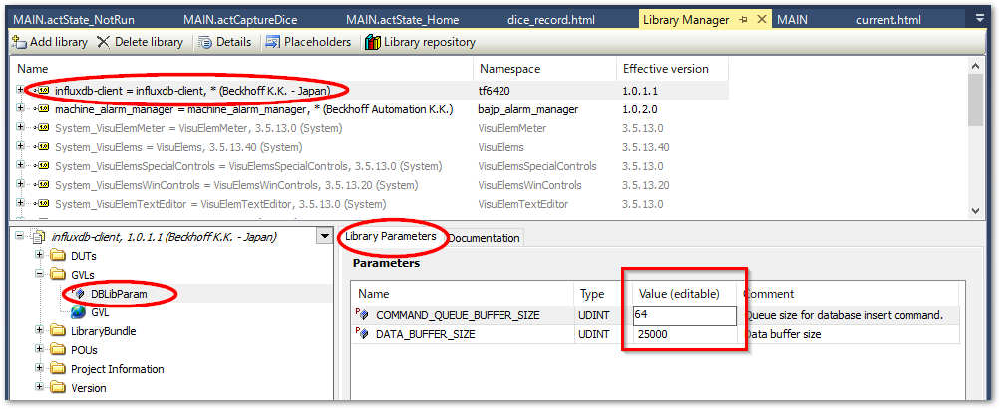

(section_use_library)=
# ライブラリを読み込んで使う

ユーザライブラリを使用するには次の2ステップが必要です。

1. {ref}`install_library`
   
    配布された `*.library` ファイルを開発環境（XAE）へインストールします。開発環境においてライブラリが使用可能な状態となります。ライブラリが新しいバージョンに更新される場合も同様の手順でインストールが必要です。ただしライブラリバージョンが固定されたPLCプロジェクト（placeholderが指定されたPLCプロジェクト）にはインストールだけでは最新に更新されませんのでご注意ください。（{ref}`update_library`節参照）

2. {ref}`import_library`
   
   インストールされたライブラリを任意のPLCプロジェクト内に「参照」設定して使用できる状態にします。

順にこの操作手順を説明します。

(install_library)=
## ライブラリのインストール

ユーザライブラリをXAEにインストールを行う手順について説明します。

```{note}
{ref}`section_make_library` で紹介するライブラリの作成を行ったものと同じXAEの場合、作成したライブラリ保存時に`Save as library and install ...`を選択すると、ライブラリのインストールも同時に実行されます。

この場合、この節の手順の実行は不要です。{ref}`import_library` へ進んでください。
```

1. PLCのプロジェクトツリーから `References` 以下のメニューをダブルクリックします。

    これによりメインウィンドウにライブラリマネージャが現れます。

    ```{image} assets/2023-02-21-13-37-07.png
    :width: 800px
    :align: center
    :name: 2023-02-21-13-37-07
    ```

2. `Library repository`ボタンを押してください。

    ```{image} assets/LibraryManager_Main.png
    :width: 800px
    :align: center
    :name: LibraryManager_Main
    ```

3. `Library Repository`ウィンドウからインストールする  

    `Install...` ボタンを押すとエクスプローラが現れます。インストールしたい library ファイルを選択します。

    ```{image} assets/LibraryRepository_Main.png
    :width: 500px
    :align: center
    :name: LibraryRepository_Main
    ```

4. ここで一度プロジェクトを上書き保存してXAEを終了します。

    ```{admonition} 警告
    :class: warning

    インストールしたライブラリを正しくお使いいただくには一度ライブラリ呼び出し側のプロジェクトのVisualStudioもしくはXAEシェルを再起動する必要があります。再起動なしにライブラリマネージャを閲覧した場合、特に{ref}`chapter_documentation` で説明する、ライブラリのドキュメントの表示が行われない問題が生じます。
    ```

5. 再度プロジェクトを開いてライブラリマネージャの Library repositoryを開くと、インストールしたライブラリが一覧されていることが確認できます。

    ```{figure} assets/LibraryRepository_InstalledLibrary.png
    :width: 700px
    :align: center
    :name: LibraryRepository_InstalledLibrary

    追加したライブラリ
    ```

(import_library)=
## プロジェクトへのライブラリの追加

XAEにインストールしたライブラリをプロジェクトへ追加する手順を説明します。

1. 以下いずれかの方法でライブラリの追加を行います。

   * Library Manager から `Add library` ボタンを押す
    
        ```{image} assets/LibraryManager_Addlibrary.png
        :width: 800px
        :align: center
        :name: LibraryManager_AddLibrary
        ```
   * PLCプロジェクトツリーの`References`を右クリックして`Add library...`を選択する


2. 登録したライブラリを追加します。

    ```{image} assets/AddLibrary_UseLibrary.png
    :width: 700px
    :align: center
    :name: AddLibrary_UseLibrary
    ```

3. ライブラリパラメータがあれば設定します。

    {ref}`section_library_parameter` に示す通りライブラリ内で使用されるリソースがスケールする場合は、パラメータ化されている可能性があります。この場合、ライブラリを追加した後に`Library Parameters`タブからリソース量を変更することができます。

    {align=center}
    
4. 登録したライブラリが References に追加されることを確認します。

    ```{image} assets/Solution_References.png
    :width: 250px
    :align: center
    :class: with-shadow
    :name: Solution_References
    ```

(update_library)=
## ライブラリの更新

新しいライブラリが発行されましたら{ref}`install_library` を行うことで最新版が使える状態となります。

デフォルトでは常に最新版を使う設定になっていますので、新しいライブラリをインストールすれば即プログラムは更新された状態となります。しかし、Placeholderを使わずにライブラリをインストールしていたり、特定バージョンにPlaceholderが固定されている場合は、新しいライブラリをインストール後、そのバージョンを使うように設定しなおす必要があります。

この場合、{numref}`placeholder_change_resolution`の図の通り`References`以下の目的のライブラリを選択し、右クリックして現れたサブメニューから`Properties`を選ぶと、`Properties`ウィンドウが現れます。この中の`Misc`カテゴリに`Resolution`という項目から選択することができます。

常に最新バージョンを使う設定にする場合は、ライブラリ名の後がバージョン番号ではなくアスタリスク `*` のものを選択してください。

```{figure} assets/2023-03-02-16-13-13.png
:width: 1000px
:align: center
:name: placeholder_change_resolution

Placeholderに紐づいたライブラリのバージョン切替方法
```
