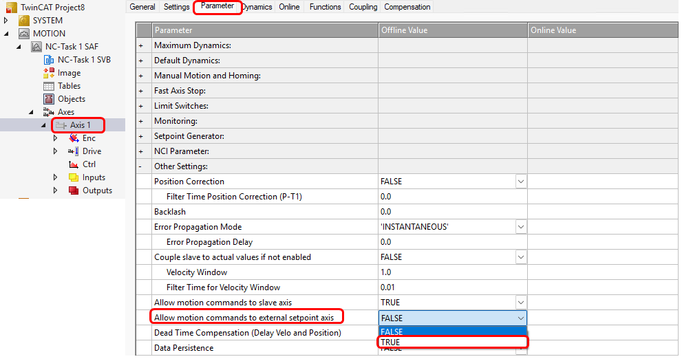

# 論理軸設定

外部セットポイントでPLCから介入させるには論理軸の以下の設定を変更します。

`Axis` > `Parameter` > `Allow motion commands to external setpoint axis`

{align=center width=500px}

論理軸のパラメータから Allow motion commands to external setpoint axis の設定をFALSEからTRUEへ変更します。
このパラメータをTRUEにすることで当該論理軸はPLC I/Fより外部セットポイントの介入を受け付ける設定になります。

1. Beckhoffパッケージサーバへの認証ファイルの定義

    ```{code} bash
    $ sudo nano /etc/apt/auth.conf.d/bhf.conf
    ```

    次の2つのサーバそれぞれに、my beckhoff で作成したユーザ名とパスワードを定義します。

    ```{code} yaml
    machine deb.beckhoff.com
    login <my beckhoffのBeckhoff カウント>
    password <my beckhkoffのログインパスワード>

    machine deb-mirror.beckhoff.com
    login <my beckhoffのBeckhoff カウント>
    password <my beckhkoffのログインパスワード>
    ```


```{code} iecst
FUNCTION F_Sum : DINT;
VAR_IN_OUT
    aData     : ARRAY [*] OF INT;
END_VAR
VAR
    i, nSum   : DINT;
END_VAR

```{tip}
接続後は様々なテキスト形式の設定ファイルを編集してサーバの設定を行います。ターミナル上で利用可能なテキストエディタは、`vi` および、 `nano` です。使い方がより直感的なのは `nano`, キー操作を多用し、操作効率が高いエディタは `vi` です。本ドキュメントでは、主に `nano` を使った例でコマンド紹介します。
```


[https://infosys.beckhoff.com/content/1033/tc3_plc_intro/2525821323.html?id=5426534269789408632](https://infosys.beckhoff.com/content/1033/tc3_plc_intro/2525821323.html?id=5426534269789408632)

 


Beckhoffの各種製品ソフトウェアは、事前にご登録いただきましたログイン名、およびパスワードを通して debian の apt パッケージマネージャを通じて取得できます。従いまして、事前に[my beckhoff](https://www.beckhoff.com/en-en/mybeckhoff-registration/index.aspx)からユーザアカウントを作成してください。その上でパッケージリスト、およびインストール済みパッケージを最新のものに更新します。

<!-- -->