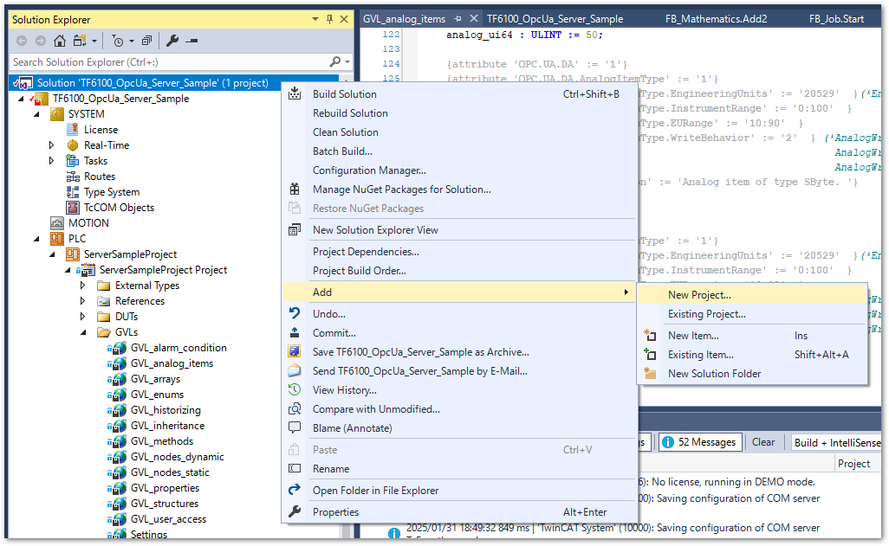

# TF6100 OPC UA Server

TF6100 OPC UA Serverを用いた接続方法は次の2通りあります。

直接接続
    : 個々のIPCにサーバ機能があり、クライアントは個々のIPCのサーバへ直接アクセスします。
        {align=center}

エッジPC経由の接続
    : 個々のIPCにADSで接続したエッジPC内にゲートウェイを設置します。クライアントはゲートウェイを経由して個々のIPCのデータにアクセスします。
        {align=center}

エッジPC経由を用いた接続方法は、IPC毎にTF6100のライセンスが必要ないので経済的ではありますが、エッジサーバに対する負荷が大きく、特にIPCの台数が増えるほどIPCとゲートウェイ間の通信量が増し、エッジPCにも多くのメモリを要します。また、エンドポイントIPCのPLCのプログラムコード変更に伴い、都度ゲートウェイとの間でシンボルリストの交換が必要になり、保守上の手間が増えます。

ここでは、個々のIPCにサーバ機能を搭載し、直接接続する手順について説明します。

## インストール

次のコンポーネントを個々にインストールしてください。

TF6100 | TwinCAT 3 OPC UA Server
    : IPCにインストールします。

TF6100 | TwinCAT 3 OPC UA Configurator
    : XAE側にインストールします。

## 手順

### IPCのファイヤウォール設定

IPCのファイヤウォール設定にて、TCPプロトコルポート 4840 の外部アクセスを有効にします。

{align=center}


### Configuratorによるサーバ構成

```{admonition} 前提条件

Configuratorは、[スタンドアロンアプリケーション](https://infosys.beckhoff.com/content/1033/tf6100_tc3_opcua_configurator/15555668491.html?id=1251015389796173606)として起動する方法と、[XAE Visual Studio上でConfiguratorのプロジェクトとして構成する方法](https://infosys.beckhoff.com/content/1033/tf6100_tc3_opcua_configurator/15555215755.html?id=7151566535546389617)の二通りがあります。本節では後者の手順でサーバ構成手順をご説明します。
```

#### Configuratorプロジェクトの追加

Solutionプロジェクトの最上位から、`Add` > `New Project...` を選択します。

{align=center}

Connectivity Projectを新規生成します。

{align=center}

OPC UA Server Projectを新規生成します。

{align=center}

#### サーバ接続設定

ターゲットIPCのIPアドレスを調べます。

{align=center}

{align=center}

ターゲットIPCのIPアドレスが、`169.254.233.34`であることが分かります。次に、ツールバーにOPC UA Configuratorの表示を有効にします。

{align=center}

追加されたOPC UA Configurator のツールバーから次の操作を行います。


1. Serverlist選択フィールドから、`Edit Serverlist` を選択してください。

    {align=center}

2. 現われた Server configuration ウィンドウ左下の `Add Server` ボタンを押すとEndpoint configurationウィンドウが現われます。次を入力してください。

    {align=center}

    UaServer URL
        : デフォルトが `opc.tcp://<XAEのホスト名>:4840` の`<XAEのホスト名>`部分を接続先IPCのホスト名に変更する。ホスト名がDNSにより解決されていない場合は、IPアドレスにします。`169.254.233.34` の例では、`opc.tcp://169.254.233.34:4840` としてください。

    Endpoint
        : セレクトフィールドをクリックすると自動的に接続確認を行い、エンドポイント一覧されます。この際、IPCに設定されたコンピュータ名ではなく、IPアドレスでアクセスした場合は次の通り警告が現われます。`はい(Y)` を選択してください。
        : {align=center}

    設定が済むと次の通りとなります。その他は設定せず、`OK`ボタンを押してください。

    {align=center}

3. 次の通りServer configurationに設定が一覧されます。`OK` ボタンを押してウィンドウを閉じてください。

    {align=center}

これまでの手順にてサーバ設定が完了したら、OPC UA Server ツールバーの `Edit Serverlist` 選択フィールドは、設定したサーバが選択可能になります。サーバを追加して、右隣にある`Connect`ボタンを押してください。

{align=center}

初回はサーバに一切認証ユーザが登録されていません。次の通り初期ユーザ登録するウィンドウが現われます。接続を許可するユーザ名、パスワードを入力してください。

{align=center}

### PLCプロジェクトの作成

ライセンスを有効にします。

{align=center}

OPC UAによるデータアクセスを許可したいPLC変数宣言部に以下のとおり attributeを設定します。

```{code-block} iecst

{attribute 'OPC.UA.DA' := '1'}
nMyCounter : INT;
```

PLCプロジェクトの Settingsにて、Target Files内の `TMC File`にチェックを入れます。

{align=center}

### 接続確認


{align=center width=450px}

{align=center}

{align=center}

{align=center}

{align=center}