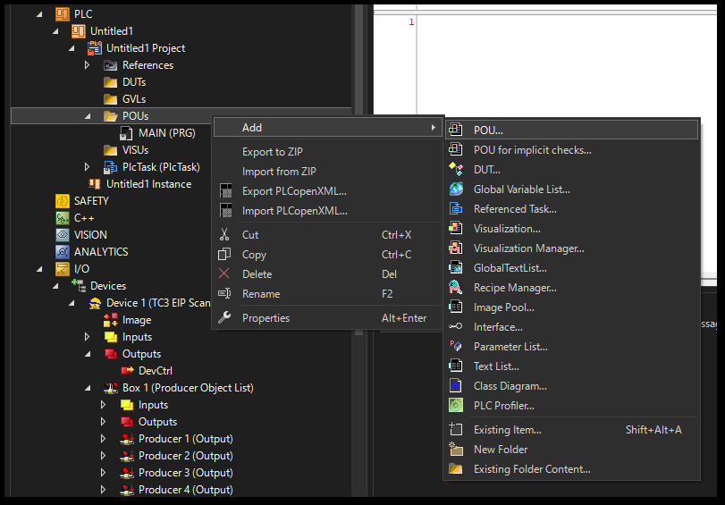

# ファンクションブロック化

プログラムで一定のロジックパターンが見え、これが並行度の高いモジュール化が可能となる場合、ファンクションブロック化とすると良いでしょう。

ここでは前節で紹介したボタンランプの点滅ロジックをファンクションブロック化するプログラムを用いて様々なリファクタリング例をご紹介します。

```{admonition} 要求仕様

ファンクションブロックの仕様は`bStart`をTRUEにすると`bInterval` で設定した時間間隔で`bBlink`のTRUE/FALSEを切り替えるものとします。

入力変数
    : bStart : BOOL
        : 点滅開始入力

      tInterval : TIME
        : 点滅間隔指定

出力変数
    : bBlink : BOOL
        : 点滅出力
```

上記のファンクションブロックをまず定義し、次にこのファンクションブロックを用いたボタンランプ制御プログラムを実装します。

```{tip}

ファンクションブロックとは、プログラムと異なり実行する主体ではありません。あくまでも型（モデル）の定義です。

型（モデル）とは、言い換えると雛形やテンプレートのようなものです。それ自体を実行することはできず、この雛形を基に「実体化」するという過程を経て実行可能なプログラムにすることが可能になります。よって、開発手順としては次の2段階が必要です。

STEP1 : モデル定義
  : ファンクションブロック自体の定義

STEP2 : プログラム実装
  : ファンクションブロックを **インスタンス変数化（実体化）** してインスタンス変数を用いて実行するプログラムを定義する
```

## モデル定義

新たにPOUを追加します。この際、Typeから `Functtion block` を選びます。使用言語は何でも構いません。

```{list-table}
- * {align=center}
  * {align=center}
```

仕様に基づき、入力変数、出力変数を定義します。また、前節で作成したプログラムから、入力変数、出力変数に置き換えたロジックを定義します。

```{code-block} iecst
FUNCTION_BLOCK FB_Blinker
VAR_INPUT
  bStart    : BOOL; // 点滅開始入力
  tInterval : TIME; // 点滅間隔指定
END_VAR
VAR_OUTPUT
  bBlink    : BOOL; // 点滅出力
END_VAR
VAR
  interval_timer  : TON;
END_VAR

IF bStart THEN
  interval_timer(IN := NOT interval_timer.Q, PT:=tInterval);

  IF interval_timer.Q THEN 
    bBlink := NOT bBlink;
  END_IF
ELSE
  bBlink := FALSE;
END_IF
```

## プログラム実装

MAINプログラムにファンクションブロックをインスタンス化してプログラム定義します。

```{code-block} iecst
PROGRAM MAIN
VAR
  button1  AT%I*    : BOOL;
  light1   AT%Q*    : BOOL;
  fbBlinker1        : FB_Blinker;
  
  button2  AT%I*    : BOOL;
  light2   AT%Q*    : BOOL;
  fbBlinker2        : FB_Blinker;
END_VAR

// Button & light 1 
fbBlinker1(
  bStart := button1,
  tInterval:= T#0.5S,
  bBlink => light1
);

// Button & light 2 
fbBlinker2(
  bStart := button2,
  tInterval:= T#0.5S,
  bBlink => light2
);
```

ファンクションブロックそのものも配列変数化してみましょう。


```{code-block} iecst
PROGRAM MAIN
VAR CONSTANT
  NUM_OF_BUTTONS : UDINT := 2;
END_VAR

VAR
  buttons  AT%I*    : ARRAY [1..NUM_OF_BUTTONS] OF BOOL;
  lights   AT%Q*    : ARRAY [1..NUM_OF_BUTTONS] OF BOOL;
  fbBlinkers        : ARRAY [1..NUM_OF_BUTTONS] OF FB_Blinker;
    module_number   : UDINT;
END_VAR

FOR module_number := 1 TO NUM_OF_BUTTONS DO
  fbBlinkers[module_number](
    bStart := buttons[module_number], 
    tInterval:= T#0.5S, 
    bBlink => lights[module_number]
  );
END_FOR
```

このプログラムを動作させてみましょう。`AT%I*` 定義した `buttons[1]`, `buttons[2]` 変数にリンクしたIOがあればこのIOアドレスの入力状態を操作すれば良いのですが、IOが存在しない場合は次のとおり`Preparation`列に状態をセットし、`Write value` にて変数の状態を操作してください。

{align=center}

```{figure} ./assets/twincat_ope.webm
:class: controls
:width: 100%

モニタ、変数への値書き込み、ウォッチ登録、ファンクションブロックモニタ
```

操作した変数に応じて `lights[1]`、`lights[2]` の何れかの点滅が開始するでしょう。

さて、先ほどまでの問題として、配列化してしまうと個々のロジックの動きのモニタができなくなってしまった事でした。しかしファンクションブロックにすることによって、インスタンス変数個々のモニタが可能となります。

