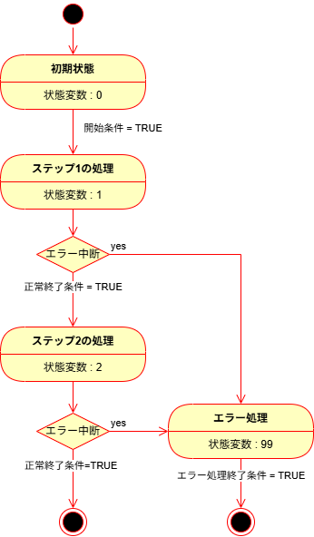

# 制御構文

## 評価式

評価式とは、制御構文の中で使用されるプログラムブロックを実行するか否かを制御するための`TRUE`/`FALSE`を返す式をいいます。

```{code-block} iecst
VAR
    evaluated_value : UDINT := 3;
END_VAR

IF evaluated_value = 2 THEN
    <evaluated_value = 2 が TRUE の時の処理>
ELSE
    <evaluated_value = 2 が FALSE の時の処理>
END_IF

```

上記の通り、代入とは異なり等価であることを評価する場合は、`=` を用います。他にも次の評価構文があります。

```{role} iecst(code)
   :language: iecst
```

```{csv-table}
:header: 式, 説明,,式,説明

{iecst}`A`,BOOL型の場合はAがTRUEであればTRUE、それ以外の型では0以外はTRUE,,{iecst}`A = B`,AとBが等しければTRUE
{iecst}`A <> B`, AとBが等しくなければTRUE,,{iecst}`A < B`,AはB未満ならTRUE
{iecst}`A > B`,BがA未満ならTRUE,,{iecst}`A <= B`,AはB以下ならTRUE
{iecst}`A >= B`,BがA以下ならTRUE,, {iecst}`A AND B`, AとBどちらもTRUEならTRUE。BYTE以上の型であればビット論理積
{iecst}`A OR B`, AまたはBがTRUEならTRUE。BYTE以上の型であればビット論理和,,{iecst}`A XOR B`, "AとB が同じ値ならFALSE, 違う値ならTRUE。BYTE以上の型であればビット排他的論理和"
{iecst}`A AND_THEN B`, "AとBどちらもTRUEならTRUE。ANDとの違いはAを評価してFALSEであればBは評価しない。",, {iecst}`A OR_ELSE B`, "AとBどちらかがTRUEならばTRUE。ORとの違いはAを評価してTRUEであればBは評価しない。"
```

````{tip}
{iecst}`A AND_THEN B`や、{iecst}`A OR_ELSE B`は、Aの条件が成り立たなければBの条件評価によりプログラムエラーが発生する可能性がある場合に使用しましょう。（むしろこれだけを使うでも良い）

たとえば、参照型変数を評価する場合に使用できます。itemが未設定のまま {iecst}`item <> 0`を評価すると、プログラムエラーとなってしまいます。その前に {iecst}`__ISVALIDREF()` で参照設定済みの変数であることを確認しておく必要があります。

```{code-block} iecst
VAR
    item : REFERENCE TO UDINT;
END_VAR


IF __ISVALIDREF(item) AND_THEN item <> 0 THEN
    ....
END_IF
```
````

## 繰り返し構文

### FOR文

配列など添え字を持つものに対して、任意の整数型の変数値を繰り上げながら繰り返します。

```{code-block} iecst
:caption: 書式

FOR カウンタ変数 := 初期値 TO 最終値 BY 繰り上げ数 DO
    繰り返し処理
END_FOR
```

以下に実装例を示します。繰り返し回数は、多くの場合配列などの変数と併用することが多いのですが、配列のサイズを超えてアクセスするとTwinCAT自体が異常終了してしまい、最悪の場合Windowsがブルースクリーンとなって停止してしまいます。

これを避けるため、実際の値を使うのではなく、 `CONSTANT` 変数を使ってサイズ、および繰り返しアクセス数を統合的に管理する必要があります。

```{code-block} iecst
:caption: 実装例
VAR CONSTANT
    NUM_OF_ITEMS : UDINT := 10;
END_VAR
VAR
    i : UDINT;
    any_variables : ARRAY [1..NUM_OF_ITEMS] OF REAL;
    data : LREAL;
END_VAR

FOR i := 1 TO NUM_OF_ITEMS DO
    data := any_variables[i]; // 配列の要素からひとつづつdataに値を転送する
END_FOR
```

### WHILE文

条件が成り立つ間繰り返します。繰り返し実行条件は、TRUEかFALSEが返るような条件を定義します。

```{code-block} iecst
WHILE <繰り返し実行条件評価式> DO
    繰り返し処理
END_WHILE
```

### REPEAT文

REPEAT文は、繰り返し実行した後にその結果により継続するか否かを判定します。UNTIL以後の条件文は繰り返し処理を実行した直後に評価します。WHILE文との違いは、

```{code-block} iecst
REPEAT
    繰り返し処理
UNTIL
    終了条件評価式（終端の;は無し）
END_REPEAT
```

```{admonition} WHILE と REPEAT の使いどころ
`WHILE`も`REPEAT`も条件判定が成立するまで繰り返す制御構文ですが、条件評価が、繰り返し処理の前（`WHILE`）に行われるか、後に行われる（`REPEAT`）かの違いがあります。

例えば最初から条件が成立していない状態で`WHILE`ループを実行すると、その中の処理は一切行われませんが、`REPEAT`の場合、そのブロック内の処理は一度だけ必ず実行されます。
```

## 状態制御文

### IF文

```{code-block} iecst
IF 評価式1 THEN
    評価式1が成立した場合に実行されるプログラムブロック。評価式2に関しては関知しない。
ELSIF 評価式2 THEN
    評価式1が成立せず評価式2が成立した場合に実行されるプログラムブロック
ELSE
    評価式1も評価式2も成り立たない場合に実行されるプログラムブロック
END_IF
```

### CASE文

状態マシン作成にCASE文を使用します。

``````{grid} 2
`````{grid-item}

```{code-block} iecst
VAR
    状態変数 : UDINT;
END_VAR
CASE 状態変数 OF
    0:
        // 初期状態
        IF 開始条件 THEN
            状態変数 := 1;
        END_IF
    1:
        ステップ1の処理
        IF ステップ1正常終了条件 THEN
            状態変数 := 状態変数 + 1;
        ELSIF エラー発生 THEN
            状態変数 := 99;
        END_IF
    2:
        ステップ2の処理
        IF ステップ2正常終了条件 THEN
            状態変数 := 状態変数 + 1;
        ELSIF エラー発生 THEN
            状態変数 := 99;
        END_IF
    99:
        エラー処理
        IF エラー処理終了 THEN
            状態変数 := 状態変数 + 1;
        END_IF
    ELSE
        状態変数 := 0;

END_CASE
```
`````
`````{grid-item}
{align=center}
`````
``````