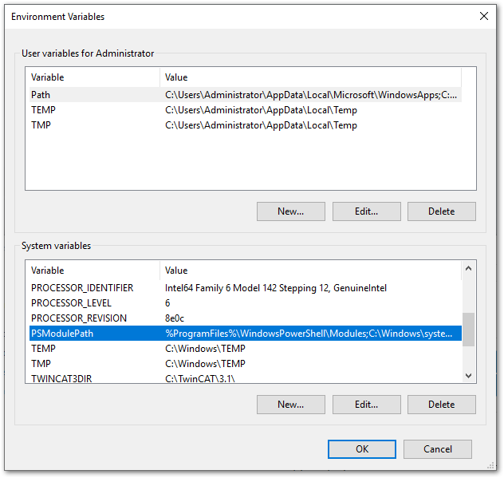
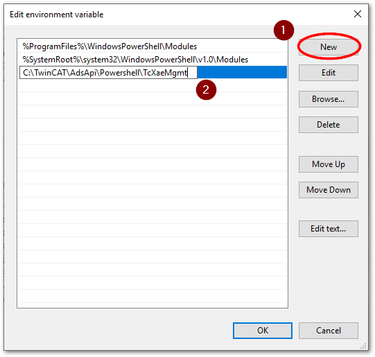

# セットアップ

```{note}
この手順はIPC上で行ってください。
```

## 環境変数の追加

`PSModulePath`に、`C:\TwinCAT\AdsApi\Powershell\TcXaeMgmt`を追加してください。





## サンプルTwinCATプロジェクト

今回用意するTwinCATのプロジェクトは、PLCのグローバル変数`GVL`に以下の

```{code-block} iecst
:caption: 8要素のREAL型配列変数定義
:name: my_array

TYPE my_array : ARRAY [1..8] OF REAL; END_TYPE
```

```{code-block} iecst
:caption: 子要素の構造体定義
:name: sub_struct

TYPE sub_struct :
STRUCT
    datetime: STRING(255);
    value: UDINT;
END_STRUCT
END_TYPE
```

```{code-block} iecst
:caption: 親要素の構造体定義
:name: my_struct

TYPE my_struct :
STRUCT
    ar_8 : my_array;
    flag : BOOL;
    r_1 : REAL;
    record: ARRAY [0..1] OF sub_struct;
END_STRUCT
END_TYPE
```

```{code-block} iecst
:caption: グローバル変数 `GVL.test_data` の宣言
:name: GVL_test_data

{attribute 'qualified_only'}
VAR_GLOBAL
    test_data : ARRAY [1..10] OF my_struct; 
END_VAR
```