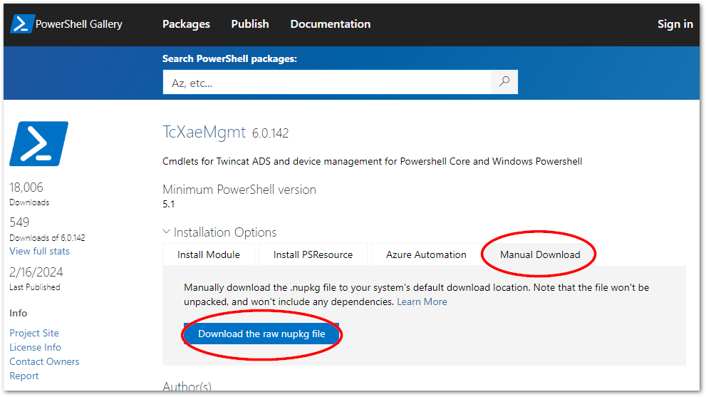

# セットアップ

TwinCATのPowerShell版ADSクライアントモジュール`TcXaeMgmt`のセットアップ方法についてご説明します。

(section_update_tcxaemgmt)=
## TcXaeMgmtの最新版のインストール

次のInfosysのページで紹介されているADSの機能を使用可能なPowerShell moduleのインストール方法について説明します。

{bdg-link-info}`参考Infosys <https://infosys.beckhoff.com/content/1033/tc3_ads_ps_tcxaemgmt/11227002123.html?id=4658283848064243519>`

### オンラインインストール（インターネット環境に接続可能な場合）

インターネットに接続された環境の場合は、次の手順でTcXaeMgmtの最新モジュールをインストールできます。管理者モードでPowerShellを起動してください。

1. スクリプト実行を許可する

    ```{code} powershell
    PS> Set-ExecutionPolicy RemoteSigned
    ```

2. PowershellGetモジュールの最新版をインストール

    ```{code} powershell
    PS> Install-Module PowershellGet -Force
    ```

3. 一度PowerShellを閉じ、もう一度管理者モードでPoweShellを起ち上げます

4. TcXaeMgmtツールをインストールします

    ```{code} powershell
    PS> Install-Module TcXaeMgmt -Force -AcceptLicense -SkipPublisherCheck
    ```

5. もう一度PowerShellを再起動します。次は一般ユーザモードで起ち上げます

6. 次のコマンドにて正しくインストールされたか確認します。

    `TcXaeMgmt`のVersionが6.*のものがあれば合格です。 

    ```{code} powershell
    PS > get-module -listavailable

    ディレクトリ: C:\Program Files\WindowsPowerShell\Modules

    ModuleType Version    Name                                ExportedCommands
    ---------- -------    ----                                ----------------
    Script     1.0.1      Microsoft.PowerShell.Operation.V... {Get-OperationValidation, Invoke-OperationValidation}
    Script     1.4.8.1    PackageManagement                   {Find-Package, Get-Package, Get-PackageProvider, Get-Packa...
    Binary     1.0.0.1    PackageManagement                   {Find-Package, Get-Package, Get-PackageProvider, Get-Packa...
    Script     3.4.0      Pester                              {Describe, Context, It, Should...}
    Script     2.2.5      PowerShellGet                       {Find-Command, Find-DSCResource, Find-Module, Find-RoleCap...
    Script     1.0.0.1    PowerShellGet                       {Install-Module, Find-Module, Save-Module, Update-Module...}
    Script     2.0.0      PSReadLine                          {Get-PSReadLineKeyHandler, Set-PSReadLineKeyHandler, Remov...
    Script     7.0.135    TcXaeMgmt                           {Add-AdsRoute, Close-TcSession, Copy-AdsFile, Copy-AdsRemo...
    ```

### オフラインインストール

制御システムとして設置されたIPC上の環境に対しては、インターネットに繋がっていない場合もあります。こういった環境については次の手順で最新版を適用してください。

```{warning}
[Microsoftのサイト](https://learn.microsoft.com/ja-jp/powershell/gallery/how-to/working-with-packages/manual-download?view=powershellget-3.x&viewFallbackFrom=powershell-7.2) の冒頭の「注意」にあるとおり、この手順はコマンドレットによりオンラインでモジュールを更新する方法の代替手段とはなりません。もし今後のバージョンアップによりTcXaeMgmtが他のモジュールとの依存関係が生じた場合、この方法では自動的に依存モジュールがインストールされず正常に実行できなくなる可能性があることをご承知おきください。
```

1. 最新のNuGetパッケージをダウンロードします

    [https://www.powershellgallery.com/packages/TcXaeMgmt/](https://www.powershellgallery.com/packages/TcXaeMgmt/)

    {align=center}

2. ダウンロードしたファイルの末尾に、`.zip`という拡張子を付けます

    ```
    tcxaemgmt.6.0.142.nupkg.zip   <--- tcxaemgmt.6.0.142.nupkg からの変更
    ```

3. 次のパスのとおり `TcXaeMgmt` というフォルダを新規作成し、この中に先ほどリネームしたzipアーカイブを解凍します

    ```
    C:\Program Files\WindowsPowerShell\Modules\TcXaeMgmt
    ```

4. 一度PowerShellを新規で立ち上げ、正しくインストールされたか確認します。

    `TcXaeMgmt`のVersionが6.*のものがあれば合格です。 

    ```{code} powershell
    PS > get-module -listavailable

    ディレクトリ: C:\Program Files\WindowsPowerShell\Modules

    ModuleType Version    Name                                ExportedCommands
    ---------- -------    ----                                ----------------
    　:
    Script     6.0.142    TcXaeMgmt                           {Add-AdsRoute, Close-TcSession, Copy-AdsFile, Get-AdsRoute...
    ```