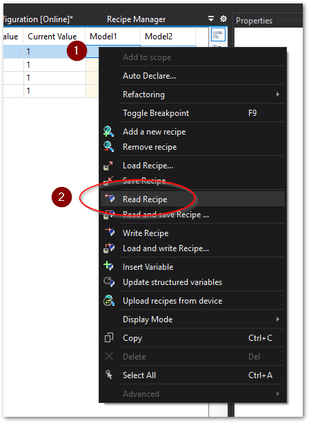
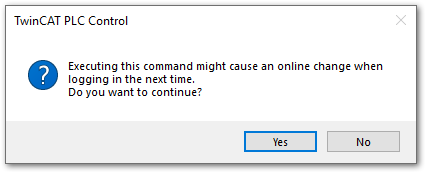
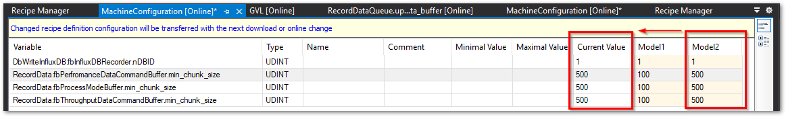
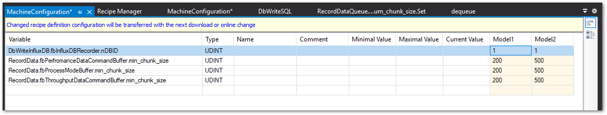

# レシピの使い方

レシピを操作する方法は、PLCのファンクションブロックによる方法と、TwinCAT XAE上の操作で行う方法があります。

ここでは、TwinCAT XAEによる操作方法について説明します。

## レシピファイルの編集とファイルへの保存

レシピデータを編集するには、まずターゲットIPCに接続し、前節で示した手順でRecipe Definitionおよび、Recipeを設定したPLCプロジェクトにて、Active Configurationを行い、RUNモードにしていログインします。これにより、まずはCurrent Value列に、登録した変数の値が一覧されます。

{align=center}

以後、レシピを追加するたびにActive Configurationまたは、Login操作によるOnline ChangeによりターゲットIPCへの反映が必要となります。

まずは、この現在値をレシピに読み込みます。読み込みたいレシピの列のどの項目でも良いので選択した状態で右クリックし、コンテキストメニューから`Read Recipe`を選びます。

{align=center}

この操作により、プログラム変更は実施していなくても次回ログイン時にOnline changeが行われる旨警告が出ます。これはレシピの設定に変更が加えられるためです。

OKボタンを押してください。

{align=center}

OKを押すと次の通り現在値がレシピ編集画面に反映されます。

{align=center}

ここから任意の値へ変更します。

{align=center}

編集が終わったら、値を反映してみます。任意のレシピの列の値を選択した状態で右クリックし、ポップアップメニューから`Write Recipe`を選択します。

{align=center}

これによりCurrent Valueが選択したRecipeの値で更新されます。

{align=center}

レシピ編集を行った後は、必ず一度ログアウトし、再度ログインする事で、Online changeを行います。

{align=center}

これにより編集したレシピデータがターゲットIPCのレシピファイルへ反映されます。

```{warning}
レシピの値の編集値は、ターゲットIPC上の指定したパスに保存されます。編集操作により行われたレシピ変更は次回ログイン時のOnline ChangeまたはActive Configurationを実施するまでこのファイルへ反映されません。

これまでの間、次図の通りレシピ編集画面の上部にその旨を知らせる警告が出ます。必ず反映させてからプロジェクトを閉じてください。

なお、XAEのプロジェクトを保存して閉じた場合、編集状態は記憶され、次回ログイン、または、Active ConfigurationによりターゲットIPCへ反映されます。

{align=center}
```

## レシピのエクスポートとインポート

XAEプロジェクトによりレシピファイルをエクスポートしておくと、他の同一プロジェクトへレシピデータを展開することができます。

### レシピファイルのエクスポート（ターゲットから収集）

最も簡単な方法は、IPC上のレシピファイルを収集する方法です。ただし、レシピの保存形式をテキスト形式に設定している場合に限ります。

IPC上では、指定したディレクトリ以下に次の次の形式のファイル名でレシピファイルが保存されています。

```
<<Recipe name>>.<<Recipe define name>>.<<Recipe extension>>
```

ファイルの保存ディレクトリ、Recipe define名、Recipe名はそれぞれ{ref}`section_setup_recipe` の節で説明している作業で設定した名称となっています。

例えばこれまでの例では次の通りのファイル名になっています。

```{code-block} powershell
:caption: ターゲットIPC内のレシピファイル
:name: ipc_recipe_ls

    Directory: C:\MachieRecipe


Mode                LastWriteTime         Length Name
----                -------------         ------ ----
-a----         8/8/2023   6:28 PM            222 Model1.MachineConfiguration.txtrecipe
-a----         8/8/2023   6:28 PM            222 Model2.MachineConfiguration.txtrecipe
```

このファイルを取得して保存しておいてください。

### レシピファイルのエクスポート（XAEで保存）

レシピマネージャの編集画面上でファイルを保存する事もできます。任意のレシピの列の任意の値にカーソルを合わせて右クリックして現われるコンテキストメニューから、`Save Recipe...`を選択してください。

{align=center}

ファイル保存用のエクスプローラが現われますので、任意の場所へ名前を付けて保存してください。

{align=center}

### レシピの変更と反映

これまでの手順でエクスポートされたレシピファイルはテキスト形式に限り以下のような形式で保存されています。

``` iecst
DbWriteInfluxDB.fbInfluxDBRecorder.nDBID:=1
RecordData.fbPerfromanceDataCommandBuffer.min_chunk_size:=100
RecordData.fbProcessModeBuffer.min_chunk_size:=100
RecordData.fbThroughputDataCommandBuffer.min_chunk_size:=100
```

このテキストファイルを編集し、その結果をXAEを通じて反映する手順について説明します。

1. テキストエディタで変数の内容を編集する

    例として`Model1.txtrecipe`ファイルの2行目以後を全て200へ変更します。
    ``` iecst
    DbWriteInfluxDB.fbInfluxDBRecorder.nDBID:=1
    RecordData.fbPerfromanceDataCommandBuffer.min_chunk_size:=200
    RecordData.fbProcessModeBuffer.min_chunk_size:=200
    RecordData.fbThroughputDataCommandBuffer.min_chunk_size:=200
    ```

2. XAEのレシピマネージャから該当するレシピ列を選択し、右クリックして現われるコンテキストメニューから`Load Recipe...`を選んで現われるエクスプローラから編集した`Model1.txtrecipe`を選択する。

    {align=center}

3. レシピ編集画面上では読み込んだ値が反映された状態になり、編集後の警告が現われます。

    {align=center}

4. ターゲットIPCに接続してログインし、 Online Change を行います。これによりターゲットIPCに読み込んだレシピデータが反映されます。

5. 実際の変数の値をレシピの値に反映させる場前は、現在値との差異をしっかり確認し、反映しても問題ないことを確認してから`Write Recipe...` を行います。これにより変数の値も読み込んだレシピのデータに更新されます。

    {align=center}

```{warning}
* 変数の値はレシピのデータで一斉上書きされます。これにより設備の動作条件が変わり、意図しないトラブルにつながる恐れがあります。
* 作業時には設備の稼働状況などよくお確かめの上、十分に注意して値を反映してください。
* 読み込んだレシピの内容と、現在の変数（Current Value）の値の差をよくお確かめください。
```

