# 設定

(section_dedicated_safety_task)=
## Safety専用タスクの作成

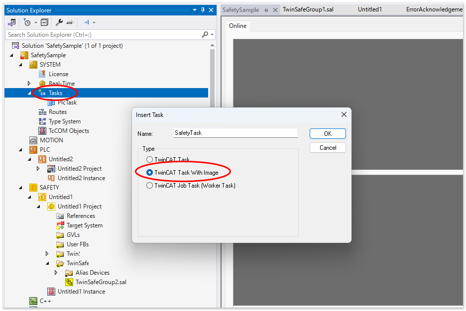{align=center}

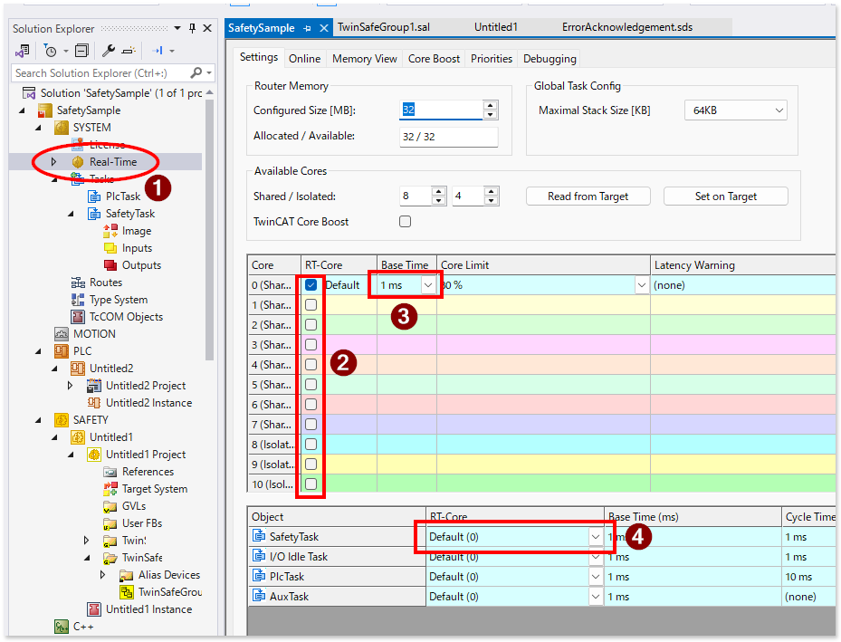{align=center}

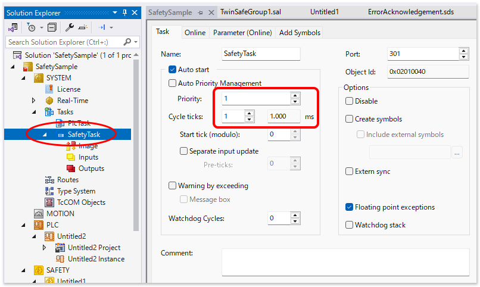{align=center}

## EtherCATの構成

例として次のEtherCATネットワークコンフィギュレーションを行います。

````{grid} 2

```{grid-item}
以下の構成で、図の赤枠と青枠、および、それ以外で区別した sync unit の設定を目指します。Safetyロジックは Term 1 以下にぶら下がっているEL6910に書き込みます。Term 14以下のEL6910は使いません。

Term 1  EK1101
    : EL6910（Safetyロジックターミナル）と EL1904 x  2 と EL2904を配置します。

Term 14 EK1101
    : 同じ構成ですが、Hot connect group = 1 を設定します。

```
```{grid-item}
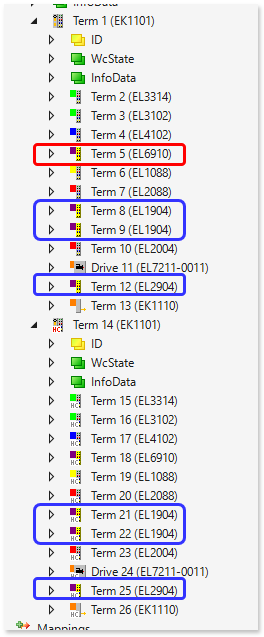{align=center}
```
````

Hot connectを設定すると、次の通り自動的にグループ専用の sync unit が設定されます。

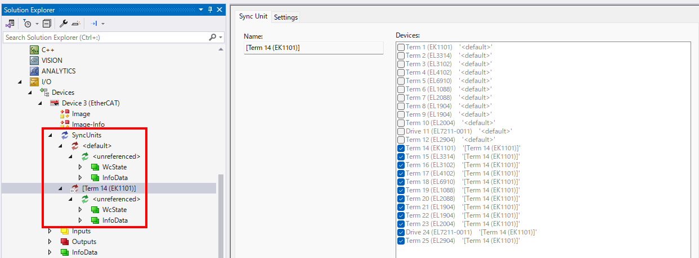{align=center}

ここからさらに、青枠で示した sync unit の設定を後ほど行います。

## Sync unitの設定

```{admonition} ポイント
:class: note

Hot connect グループ内の Safetyターミナルに特別なsync unitを設定するには、いちど Hot Connectを解除する必要があります。先にSafetyターミナルの sync unit を設定してから、再度 Hot Connectグループ設定を行います。
```

``````{grid} 1
`````{grid-item-card} カプラ内にあるSafetyターミナルを別の sync unit に設定するため、最初にホットコネクトグループから抜けます。
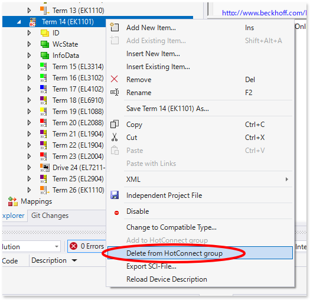{align=center}
`````
`````{grid-item-card} Safety ロジック、Safey IO 個別の sync unit を作成します。
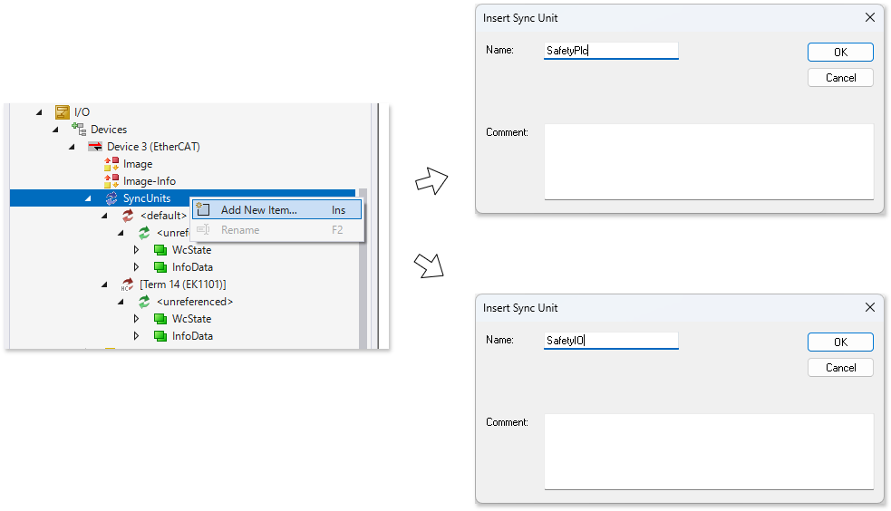{align=center}
`````
`````{grid-item-card} Safety ロジック、Safey IO 個別の sync unit を作成します。
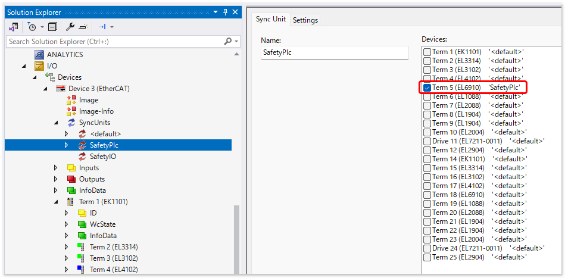{align=center}
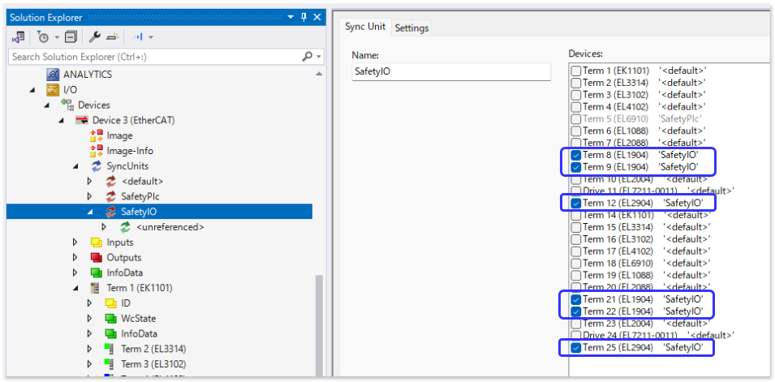{align=center}
`````
`````{grid-item-card} 再度ホットコネクトグループを設定します
````{grid} 2
```{grid-item}
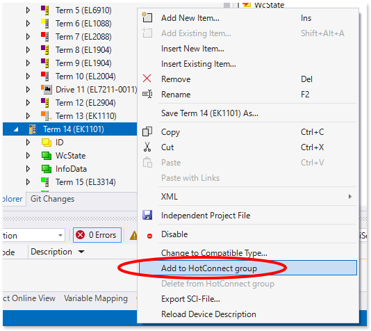{align=center}
```
```{grid-item}
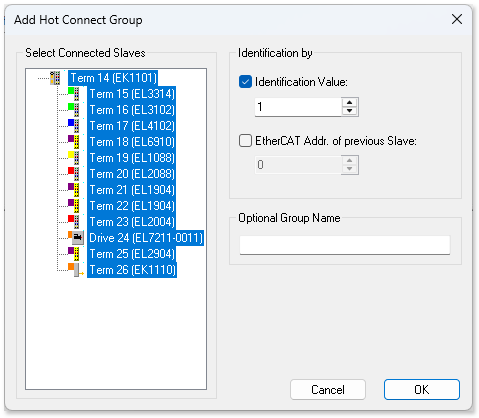{align=center}
```
````
`````
`````{grid-item-card} 設定を確認すると、SafetyPlc, SafetyIO, Hot connect グループ内にあるSafetyIO, Hot connectグループ内にあるそれ以外のIO という四象限の sync unit ができ、に属する
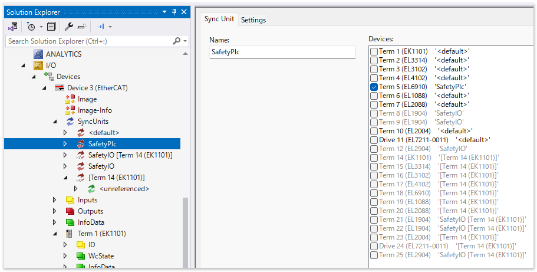{align=center}
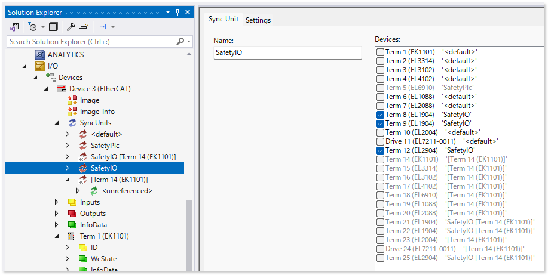{align=center}
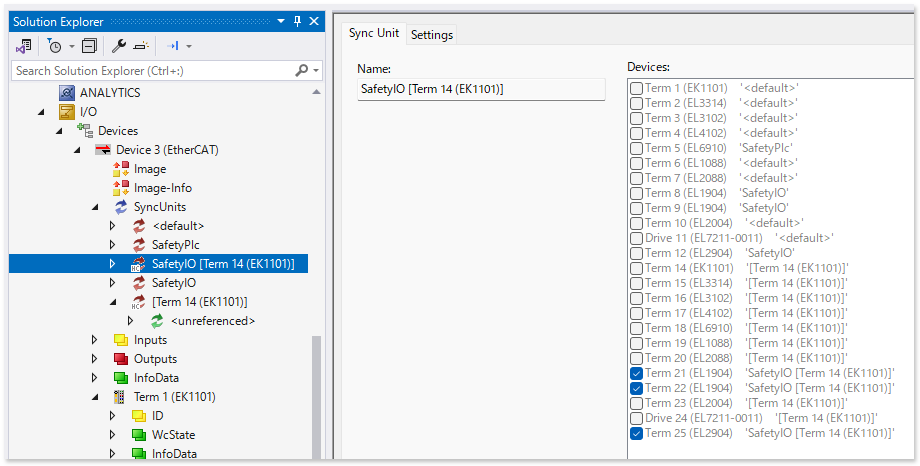{align=center}
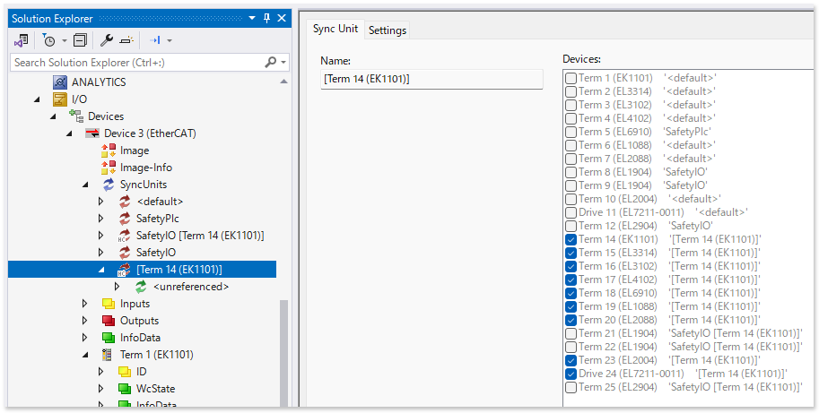{align=center}
`````
``````

## Sync unit task の設定

以下の設定により、PlcTaskにより巡回していたFSoEフレームが専用タスク `SafetyTask` のものに切り替わります。先に {ref}`section_dedicated_safety_task` を実施してください。

``````{grid} 1
`````{grid-item-card} EtherCAT メインデバイスの EtherCAT タブから、 Sync Unit Assignment... ボタンをクリック
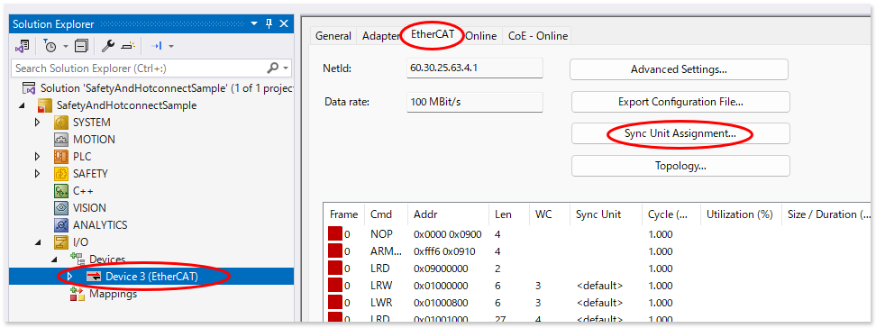{align=center}
`````
`````{grid-item-card} 現れたウィンドウのターミナル一覧から、Shiftボタンを押しながらSafety関連のIOターミナルを全て選択します。次に右下の Forced Sync Unit Tasks の中から、最初に作成した専用タスク SafetyTask をクリックします。
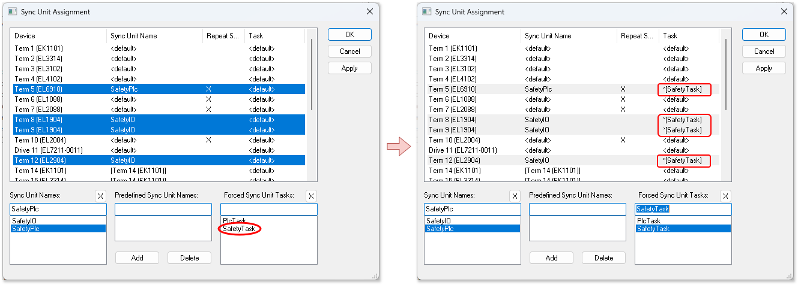{align=center}
`````
``````