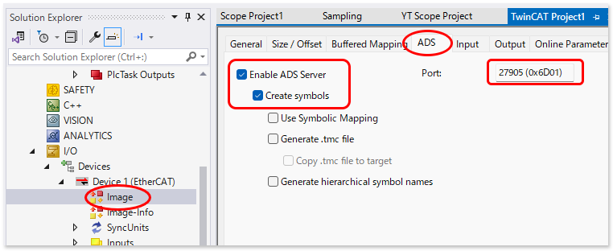
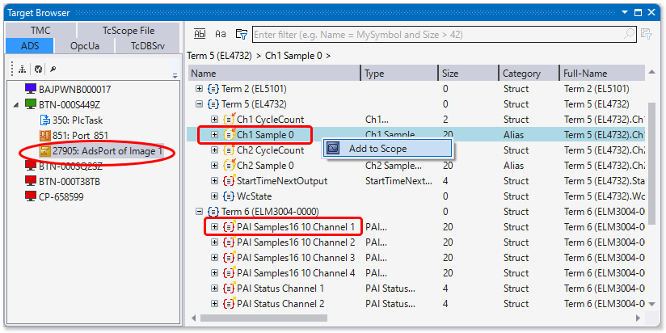
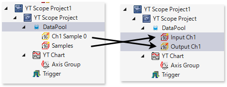

# オーバーサンプリング入出力ターミナル同士でDC同期させてYT Scopeへプロットする

Beckhoffのアナログ出力ターミナル **EL4732** と、高精度アナログ入力モジュール **ELM3004** を例に相互接続し、**DC（Distributed Clocks）タイムスタンプを用いて完全同期** させたデータを TwinCAT 3 Scope View にオーバーサンプリング表示させるための設定手順です。

---

## EtherCAT I/O 側のオーバーサンプリング・DC設定

両ターミナルでDC同期およびオーバーサンプリングのPDO（プロセスデータ）を有効化します。

### EtherCAT マスタの確認
1. TwinCATの I/O ツリーから **EtherCAT Master** を選択します。
2. **`DC`** タブを開き、`Advanced Settings...` ＞ `Distributed Clocks` から、マスタがDC動作（基準クロックが有効）していることを確認します。

### EL4732（アナログ出力側）の設定
1. EL4732 の **`DC/Oversampling`** タブを開き、次のとおり設定します。実際に収集できるデータの解像度は、`Sync Unit Cycle Time` / `Oversampling Factor` のサイクル時間となります。
   ```{csv-table}
   :header: 設定項目, 値
   Operation mode, 使用するチャンネル数
   Oversampling Factor,10（任意の係数） 
   ```
2. **`Process Data`** タブ（またはSync Manager 2）を開きます。
3. **`StartTimeNextOutput`**（インデックス `0x1A82` 等に含まれるタイムスタンプ情報）のチェックボックスをオンにし、PDOマッピングに追加します。
4. プロセスデータツリーにStartTimeNextOutputが現れていることを確認してください。

### ELM3004（アナログ入力側）の設定
1. ELM3004 の **`DC`** タブを開き、同様に **`DC-Synchron (input based)`** に対応するモードを選択します。
2. **`Process Data`** タブを開き、次の設定を行います。
   * Predefined PDO Assignment: の部分を選択し、適切なオーバサンプリング係数、および取得できるデータ型のものを選択します。
   * PDO Assignemnt (0x1C13)の中から、次のPDO Assignment登録項目を探してチェックを入れます。
      ```{csv-table}
      :header: Ch., CoE
      1,`0x1A10`
      2,`0x1A31`
      3,`0x1A52`
      4,`0x1A73`
      ```
3. プロセスデータツリーに、各チャンネル毎に`PAI Timestamp Cannnel *` が現れていることを確認してください。

```{attention}
双方の「EtherCATタスクサイクルタイム」と「オーバーサンプリング倍率」から計算されるサンプリング周期（例：1ms ÷ 10倍 ＝ 100kHz）が一致、または同期の取れる整合性のある値になっていることを確認してください。
```
---

## IOのADSシンボル公開とScopeへの読み込み

TwinCAT 3スコープでは、オーバーサンプリング値を単一の変数で表現できます。オーバーサンプリング時には、各サイクルでn個の値（nはオーバーサンプリング係数）が記録されます。また、XFC対応IOをADS公開した際にTwinCATシステムマネージャは、`StartTimeNextOutput` や、 `StartTimeNextLatch` に記録されたタイムスタンプに従って、各値に対応するタイムスタンプを自動的に並べ替えます。この配列をScope view上にタイムスタンプに従いプロットすることが可能です。

**したがって、Scopeや外部システム上でXFC対応ターミナルにおけるオーバサンプリングされたデータをDCタイムスタンプと共に収集するには、PLC等へリンクするのではなく、IOツリーから直接ADS公開された値を取得する必要があります。**

ここでは、TwinCATシステムマネージャの設定でEtherCATプロセスイメージをADS公開し、Scope viewに読み込む手順を説明します。

https://infosys.beckhoff.com/content/1033/te13xx_tc3_scopeview/182331147.html?id=3812552154561438343

1. EtherCATメインデバイス直下にある `Image` ツリーを開きます。
2. ADSタブを開き、「シンボルの作成」オプションをオンにします。ここに表示されているADSポート（下部例では27905）を記憶しておいてください。

   {align=center}

3. TwinCATを **`Activate Configuration`** してRunモードにします。
4. オーバサンプリングされたサンプリングデータをAdd to Scopeします。

   {align=center}

5. YT Scope の DataPool に追加されていますが、名称が元のままでは分かりにくいので、適切な名前に変更します。
   
   {align=center}

6. それぞれの値を選択し、Propertiesウィンドウの次の項目を設定します。

   Symbol - Force Oversampling
      : `True` 

   Symbol - Oversampling
      : 設定したオーバサンプリング係数（配列の個数）

   Symbol - Sample Mode
      : `Task Sampletime`

7. 設定したDataPoolの変数をAxis上に配置し、軸名称など最適化させた上で記録を開始してください。

```{tip}
* `StartTimeNextOutput`や`StartTimeNExeLatch`などのシンボルは読み込む必要はありません。すでにシステムマネージャにより各サンリングデータに時刻が紐づいています。
* 外部アプリケーションによりADS Notificationなどを通じて値を取り込む場合、配列の先頭のタイムスタンプが紐づきます。サイクルタイムの情報などを手掛かりに、オーバサンプリング係数の各値に対して適切なタイムスタンプを計算して割り当ててください。
```

