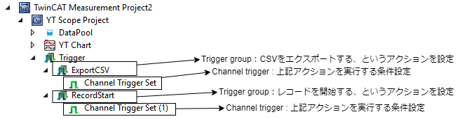
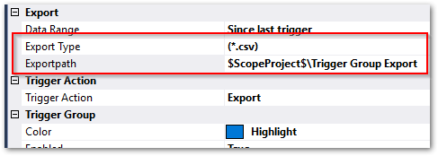
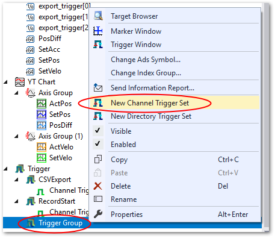

トリガとアクションの設定
==========================

トリガメニューでは、次の二つのアクション実現するトリガを作成します。

* RecordStart

  モーション軸が動作開始したことを開始して、自動的に記録開始する。

* ExportCSV

  前回のトリガから溜まったデータをCSVファイルへ保存する。

これら二つのトリガは、:numref:`trigger_setting_tree` の様な構造でツリー表示されます。
上位階層に ``Trigger group`` と呼ばれるトリガによる具体的なアクション設定を、その子階層に ``Channel trigger`` と呼ばれるトリガを発行する条件を設定します。

    トリガ設定のツリーの構成

まずは、二つのアクション ``RecordStart`` と、 ``ExportCSV`` のTrigger Groupを作成する手順を次項にて説明します。

Trigger Groupの作成
-------------------------------

1. ``Trigger`` を右クリックし、 ``New trigger group`` を選択します。

   .. figure:: image/add_trigger_group.png
    :align: center
    :width: 400px

2. ``Trigger`` の下に ``Trigger Group`` が出来ます。これに下記の操作を行います。

   * 選択してF2キーを押すか、右クリックして ``Rename`` を選択し、Trigger groupから任意のアクションを示す名称へ変更する。

     例: CSVExport, RecordStart 等

   * 新たに現れた ``Trigger Group`` メニューを右クリックして ``Properties`` を選択。

3. 現れた Properties ウインドウのTrigger Action項目から、アクションを選択する。

   .. figure:: image/choose_trigger_action.png
      :align: center
      :width: 400px

   * ``StartRecord`` の場合は、 ``Start Record`` を選ぶ
   * ``CSVExport`` の場合は、 ``Export`` を選ぶ

``StartRecord`` を選択した場合は、特に他に設定する項目はありません。続いて ``Channel trigger`` の追加項目へ進んでください。

.. _section_csv_export:

CSVエクスポートの設定
-------------------------------

Trigger Action にて、 ``Export`` を選択した場合は、エクスポートするファイルの情報を設定する必要があります。設定個所は次の2個所です。

Exportpath
~~~~~~~~~~~~~~~~~~~~~~~~~~

どこへCSVファイルを保存するか、フォルダ名称を指定します。初期値は ``$ScopeProject$\Trigger Group Export`` となっていて、 ``$ScopeProject$`` の部分は、Measurement project のルートフォルダのパスを表す変数となっています。

Measurement project のルートフォルダの場所の確認方法は、 :numref:`section_measurement_project_property` で説明しています。

Export Type
~~~~~~~~~~~~~~~~~~~~~~~~~

本フィールドの値入力フィールドにカーソルを合わせると、右端にボタンが現れます。このボタンを押すと、ウィザード形式でExportする書式を設定する事ができます。

次の通りの設定を行ってください。

.. list-table::

    * - .. figure:: image/csv_export1.png
            :width: 400px
            :align: center
            :name: csv_export1

            CSVを選択
      - .. figure:: image/csv_export2.png
            :width: 400px
            :align: center
            :name: csv_export2

            記録不要な要素を選択してExcludeで右側へ移動する
    * - .. figure:: image/csv_export3.png
            :width: 400px
            :align: center
            :name: csv_export3

            そのまま次へ
      - .. figure:: image/csv_export3-2.png
            :width: 400px
            :align: center
            :name: csv_export3-2

            CSV-SeparatorはCommaを、Decimal markはPointを選びます。HeaderはCSVファイルそれぞれに付加されるメタデータの要否を設定します。問題なければFull headerを選びます。

最後に、確認画面が現れます。問題なければ ``Create`` ボタンを押すと、設定内容が ``Export Type`` フィールドの値に反映されます。

.. _section_add_channel_trigger:

Channel trigger の追加
-------------------------------

これまでTrigger groupにて設定した二つのアクションを始動する条件は、Channel triggerにて設定します。 :numref:`add_channel_trigger` の様に ``Trigger group`` を右クリックして現れるメニューから、 ``New Channel Trigger Set`` を選びます。

    Channel trigger set の追加

追加された ``Channel Trigger Set`` を右クリックして現れたメニューから ``Properties`` を選択すると、 Properties ウィンドウが現れます。

それぞれ次の意味を持ちます。

* Combine

  同一Trigger group内の他のChannel triggerと条件をどの様に合成するかを設定します。ANDを選択した場合、他のchannel条件がTRUEとなることでトリガが発生します。ORを選択した場合、他のchannel条件と関わりなくトリガを発生することができます。
  単一channelの場合はどちらでも構いません。

* Release

  Thresholdの設定値に上昇方向に到達、または超えた場合にトリガを発生させたい場合はRising Edgeを、Thresholdの設定値を下降方向に到達、または超えた場合にトリガを発生させたい場合はFalling Edgeを選択します。

* Threshold

  User Dataで設定する変数を監視してトリガを発生するための閾値を設定します。

* User Data

  フィールドの右端のセレクトボタンを押して、DataPoolに登録したトリガ条件の評価対象の変数を選択します。

