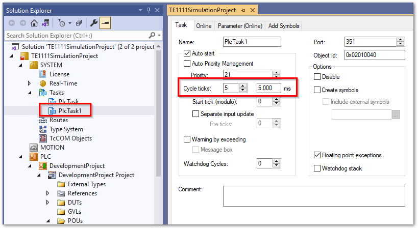
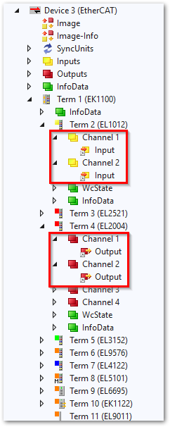
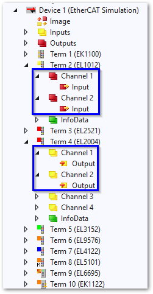

# シミュレーション用PLCプロジェクトの作成

今回の構成では、同一IPC内に制御用のPLCプロジェクト（赤枠）と、シミュレーション用PLCプロジェクト（青枠）の二つを混在させます。


まずは、このように2つのPLCプロジェクトを新規作成します。それぞれのPLCのタスクは次の通りに設定してください。

制御用のPLCモジュール
    : 制御に必要なサイクルタイム、およびCPUコアを設定します。
    {align=center}

シミュレーション用PLCモジュール
    : 制御用PLCに割り当てたタスクの1/2の周期のサイクルタイムに設定します。シミュレーションと実制御対処で性能面で変化が出ない様に出来る限り独立したCPUコアに割り当ててください。
    {align=center}

## 制御用のプロジェクトへのI/Oマッピング

通常のPLCソフトウェアを作成した上で、変数とI/Oをマッピングします。今回は{numref}`cylinder_pid` に示す次のI/Oをマッピングします。

出力
    : * 3位置5ポート電磁弁の押し側の電磁弁
    : * 3位置5ポート電磁弁の引き側の電磁弁

入力
    : * エアシリンダの押し側の近接センサ
    : * エアシリンダの引き側の近接センサ

PLCソフトウェアでは、I/Oを次の通り構造体で定義します。

```{code-block} iecst
TYPE cylinder2IO :
STRUCT
    pull_sensor    AT%I*    :BOOL;
    push_sensor    AT%I*    :BOOL;
    pull_output    AT%Q*    :BOOL;
    push_output    AT%Q*    :BOOL;
END_STRUCT
END_TYPE
```

## シミュレータプロジェクトへのI/Oマッピング

シミュレータプロジェクト内で、制御対象と同じ振る舞いとなるロジックを実装し、その変数とI/Oをマッピングします。制御用のプロジェクトと同一のアドレスにマッピングしますが、入力と出力が逆転している点にご注意ください。

出力
    : * エアシリンダの押し側の近接センサ
    : * エアシリンダの引き側の近接センサ

入力
    : * 3位置5ポート電磁弁の押し側の電磁弁
    : * 3位置5ポート電磁弁の引き側の電磁弁

```{code-block} iecst
TYPE cylinder2IO :
STRUCT
    _pull_sensor    AT%Q*    :BOOL;
    _push_sensor    AT%Q*    :BOOL;
    _pull_output     AT%I*    :BOOL;
    _push_output     AT%I*    :BOOL;
END_STRUCT
END_TYPE
```
```{list-table}
:header-rows: 1

-   * 制御用
    * シミュレータ用
-   * 
    * 
```

```{warning} 
これまでの操作後、Active configurationの際、設定によって自動的にRUNモードへ自動的に移行します。しかし、このままではSimlatorのサブデバイスのコマンドが初期化されず、プロセスデータの通信ができません。このあと再度次のアイコンを押してRestartを行ってください。

{align=center}
```