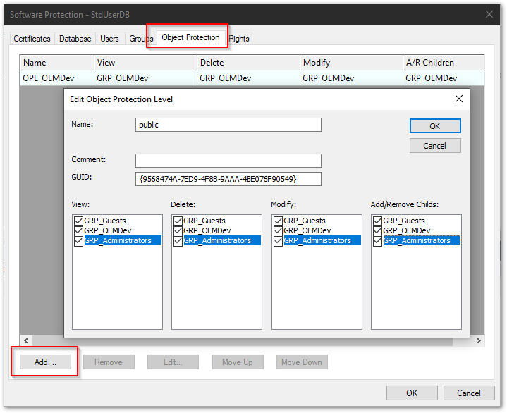
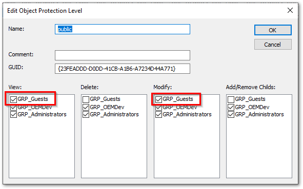

# グループと権限の設定

ここでは、実際にユーザデータベースに対して、ユーザ（User）、および役割（Group）を設定し、役割毎に紐づいたオブジェクト保護、および、システム・プロジェクト権限を設定する方法を説明します。

まずは、{numref}`protection_menu2` メニューを選択し、Software Protectionウィンドウを開いてください。

:::{figure-md} protection_menu2
{align=center width=350px}

TwinCATメニューのSoftware Protection
:::

Software Protectionでは、認証をUserという単位で行い、権限はGroupという単位毎に割り当てられます。
したがって、まずはGroupを定義し、Group毎に権限を設定したあと、ユーザがどのグループに属するかを設定する手順となります。

## Group定義

Groupの追加削除は、`Groups` タブから行います。

1. 役割の追加

    `Add...`ボタンを押し、`Name` 欄にグループ名を入力します。OKボタンを押すと、一旦はEdit User Groupウィンドウが閉じ、追加したユーザが一覧されます。

2. 役割名の変更

    表に一覧された任意のGroup名の行をダブルクリックするか、選択してから `Edit...` ボタンを押すと名称を変更できます。

{align=center width=600px}


## Groupに権限を与える

(system_acl)=
### システム・プロジェクトへのアクセス権限

TwinCATのシステム、および、プロジェクト固有の設定変更を許可する権限は、`Rights` タブに集約されています。

{align=center width=500px}

この中で、任意の権限項目の行のどのセルでも良いのでダブルクリックすると、次の通りGrant Right to User Groupウィンドウが開きます。左下の、`Grant to:` に一覧されているグループのチェックボックスに、該当する権限を許可したいグループにチェックを入れてOKボタンを押してください。

{align=center width=500px}


### オブジェクトユニット（POU）へのアクセス権限

プログラムやファンクションブロックなど、POUの権限を制御するには、次の2段階での定義が必要となります。

1. Object Protection Levelの定義

    Software Protectionウィンドウの `Object Protection` タブからObject Protection Levelを定義します。

    `Add...`ボタンを押すと、View:（読み取り権限）, Delete:（削除権限）, Modify:（変更権限）, Add/Remove Childs:（オブジェクトの子要素の追加削除権限）についてそれぞれ許可を与えるグループにチェックを入れます。下記の例では、全グループへ全ての権限を与えた "public" という名称のObject Protection Levelを追加する例となっています。

    {align=center width=600px}

    一度作成したObject Protection Levelは、`Edit...`ボタンで編集、`Remove`ボタンで削除、`Move Up`, `Move Down` ボタンで一覧される行位置を変更することができます。

2. PLCプロジェクトの暗号化とObject Protection Levelの割り当て

    PLC プロジェクトツリーを選択し、Properties内の、"Security" 欄の項目を次の通り設定します。本設定は全てのPOUに継承されます。

    {align=center width=750px}

    Encrypted
        : Trueにすることで暗号化が有効になります。

    ObjectProtection
        : 権限の設定を行います。前ステップで設定したObject Protection Levelを割り当てます。

    Signed
        : 必ず `True` にしてください。Falseのままにすると、Windows OSのファイル操作によって、同名のPOUファイルにより差し替えられた場合もチェックされず、プログラムが動作する、いわゆる、「なりすまし」が可能になります。`True` とすることで、TwinCATは名前だけでなく署名されたPOUのみ実行を許可します。

3. 各POU（プログラムやファンクションブロック）個別のObject Protection Levelの設定

    最初にプロジェクト単位で暗号化、署名、およびObject Protection Levelを設定すると、子要素全てに継承されますが、特定のPOUを選択して同様の設定を行うことで、個別のObject Protection Level等を割り当てることができます。

    {align=center width=750px}


```{admonition} 未ログインのユーザに権限を与えるには
Guestユーザは、未ログイン状態を示すシステムユーザです。このユーザに権限を与えるには、`GRP_Guests`に権限を与えてください。

例えば、TwinCATプロジェクトをただ開くだけであれば、未ログインユーザにも許可したい場合は、`Decrypt Project Files` のRights項目に、`GRP_Guests` を加えます。

{align=center}

また、Object Protectionに対しても一工夫必要です。PLCプロジェクトを開くには、最低でもViewとModifyの権限が与えられている必要があります。よって、次の通り設定します。

1. Guest権限にもViewとModifyが与えられた`public`の権限レベルを作成する。

    {align=center}

2. 既存の`OPL_OEMDev`の権限レベルから`GRP_Guests`を取り除く。

    {align=center}

3. PLCのトップレベルプロジェクトには、`public`権限レベルを設定する。

    {align=center}

4. 個別のPOU等に対してInheritedを解除し、`OPL_OEMDev`を設定する。

    {align=center}

以上により、Guest権限でも最低限PLCプロジェクトを開く事はできるが、個別のPOUにアクセスするにはGRP_OEMDev, GRP_Administratorsなどのグループユーザにログインしなければならない設定となります。

```