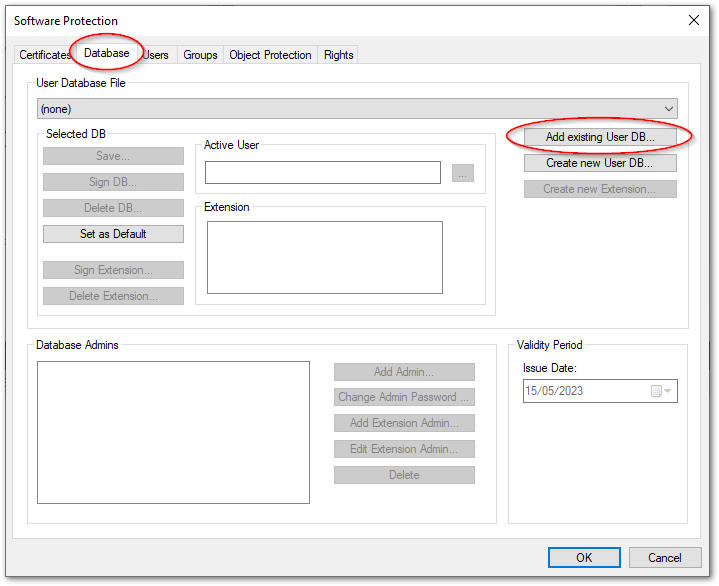

# TwinCATプロジェクトの配布

適切に制限されたTwinCATプロジェクトを配布する際には、暗号化されたTwinCATプロジェクトだけではなく、作成したユーザデータベースファイルも同梱する必要があります。

## 配布ファイルの抽出とTwinCATプロジェクトの配布

TwinCATメニューの `Software Protection` 項目を選択し、`Database` タブの中の`User Database File`の項目に記載されているパスを確認し、直接そのパスにある`*.tcudb`ファイルを取り出します。

{align=center width=500px}

配布先に対しては、保護されたTwinCATプロジェクトと、このtcudbファイルの二つを配布します。

## 配布先でのTwinCATプロジェクトへのアクセス方法

配布先では、次の手順でユーザデータベースを読み込み、与えられたユーザに切り替えてTwinCAT プロジェクトにアクセスします。

1. TwinCATプロジェクトを開く前にtcudbファイルを読み込む

    TwinCATメニューの `Software Protection` 項目を選択し、`Database` タブを開いて `Add existing User DB...` ボタンを押します。

    {align=center width=600px}

    同梱された `*.tcudb` ファイルを読み込んでから、User Database File項目を(None)から読み込まれたユーザデータベースに切り替え、OKボタンを押します。

    {align=center width=600px}

2. 保護されたTwinCATプロジェクトを読み込む

    保護されたプロジェクトを読み込むと、最初下記の通り復号化が許可されていないメッセージが現れます。これは、現在のユーザが初期状態でGuestとなっているためです。

    {align=center width=400px}

    Login as a defferent user メッセージに対して `Yes` ボタンを押すと、ユーザ切り替えウィンドウが現われます。配布先に与えられたユーザ、およびパスワードを入力すると、プロジェクトを開く事ができます。

    {align=center width=400px}

```{note}
ユーザ自身によるパスワード変更はできません。これは、{ref}`system_acl` で設定した `Rights` タブの項目の中の、`User DB Management` がユーザデータベース管理者にしか許可されていないためです。ユーザデータベース管理者が与えたユーザ名およびパスワードを用いてください。
```