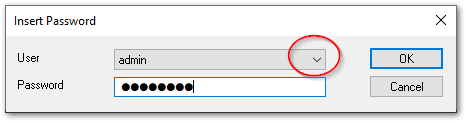

# 導入

保護機能を使うには、初回だけユーザデータベースの作成と、対象のTwinCATプロジェクトをユーザデータベースに接続する設定が必要です。

おおまかな流れは次の通りです。

```{blockdiag}
blockdiag {
    A [label = "OEM証明書の要求"];
    B [label = "OEM証明書のインストール"];
    C [label = "ユーザDBの作成"];
    D [label = "プロジェクトをユーザDBに接続"];
    E [label = "プロジェクトファイルの暗号化"];

    A -> B -> C -> D -> E;

    C -> D [folded];
}
```

## OEM証明書の発行

1. OEM証明書の要求

    以下の2点をご用意いただき（リンクから取得手順をご参照ください）、弊社営業スタッフへ以下の製品をオーダしてください。法人単位でOEM証明書を弊社より発行させていただきます。

    * [OEM署名書リクエストファイルの作成](https://infosys.beckhoff.com/content/1033/tc3_security_management/1850044555.html?id=1304993444435440001)
    * [フィンガープリントの取得](https://infosys.beckhoff.com/content/1033/tc3_security_management/6924333067.html?id=5370541940021133171)

    TC0007
        : TwinCAT OEM 証明書 スタンダード
            
            本章で説明するTwinCAT Software Protection用途のみ。

    TC0008
        : TwinCAT OEM 証明書 拡張認証

            TC0007に加え、C++モジュールで作成されたTcCOMオブジェクトをWindowsカーネルドライバとして組み込む際に必要となる署名機能付き証明書。

    ```{note}

    TC0007はTC1200およびその上位コアランタイムライセンスをご購入いただきました法人お客様、また、TC0008はTC1210、TC1300およびその上位コアランタイムライセンスをご購入いただきました法人お客様に向けてのみ発行可能です。
    ```

2. OEM証明書のインストールとサイン

    証明書 `.tccert` ファイルを受け取られましたら、TwinCAT XAEを起動し、`TwinCAT`メニュー > `Software Protection...` > `Certificates` タブ > OEM Certificate の `Import...` ボタン を押して、ファイルを読み込ませます。

    {align=center}

    {width=500px align=center}

(create_user_db)=
## ユーザDBの作成

1. ユーザDBの作成

    `Database` タブ > `Create new User DB...` ボタンを押す。

    {align=center width=500px}

2. ユーザ情報の入力

    Database Name
        : データベース名を設定します。

    Database Unique Name
        : 組織内で一意となるようなデータベース名を設定します。設定変更した際に区別できるように、バージョン名を付加します。

    Database Admin
        : データベースの管理者名を設定します。
    
    以上を入力して、OKボタンを押す。

    {align=center width=500px}

3.  `Database Admin` のパスワード設定

    データベースの管理者のパスワードを新規に設定します。
    同じものを二つ入力したらOKボタンを押します。

    {align=center width=400px}


4. TwinCAT Version3.1 4024より新しいバージョンでのみ有効である説明の書かれた確認ウィンドウが現われます。OKボタンを押してください。

    {width=400px align=center}


5. OEM証明書に付加されたパスワードを入力

    弊社より提供されたOEM証明書に付加されたパスワードを入力します。

    {width=400px align=center}

6. ユーザDBの作成完了

    以下の確認メッセージが現れたら正常終了です。OKボタンをおして閉じてください。

    {width=200px align=center}


## プロジェクトが参照するユーザデータベースを設定して暗号化する

この節の手順では、目的のTwinCATプロジェクトが参照するユーザデータベースを設定し、PLCプロジェクトを暗号化します。

```{admonition} 作業を行う前に確認してください
:class: note

さいしょに、TwinCAT XAEが前項で作成したユーザデータベースファイル選ばれているか確認してください。複数のユーザデータベースを作成されているXAEの環境では、プロジェクトにリンクするユーザデータベースをあらかじめロードしておく必要があります。前項からの続きで本項の手順を実施される場合は、すでに作成されたユーザデータベースが読み込まれていますので確認不要です。
確認方法は以下の通りです。
1. Software Protectionを開く

    {align=center width=350px}

2. `User Database File` の欄が作成した目的のデータベースファイルになっているか確認する。異なる場合は変更する。

    {align=center width=500px}
```


1. 対象のTwinCATプロジェクトを開きます。
2. 作業ユーザをユーザデータベースの管理者ユーザに変更します。

    1. TwinCATメニューの中の `Change Active User...` を選択
    
        {align=center width=400px}

    2. {ref}`create_user_db` で作成した、管理者User、パスワードを入力します。

        {align=center width=500px}

3. プロジェクトツリーの `SYSTEM` をダブルクリックします。
4. `Setting` タブを開きます。
5. User Databaseエリアの `Connect with current user database` にチェックを入れます。

    {width=600px align=center}

    これにより現在開いているTwinCATプロジェクトがユーザデータベースに接続されます。

5. ソリューションエクスプローラの中の、TwinCATプロジェクトを選択し、右クリックして現われたメニューから、`Encript Project File` を選択します。

6. Propertiesの中の`Security` ブロックの、 `EncriptFile` を`True`に設定します。

    {width=600px align=center}

以上により、TwinCATプロジェクト内のデータが暗号化されます。次の節で許可されたユーザだけがアクセスできる状態となります。

## TC0007 / TC0008証明書ファイルが期限切れ後の更新方法

期限切れとなりましたら、同様の手順で新しいOEM署名ファイルを申請してください。その後新しい署名ファイルを入手されましたら、次の手順で既存のユーザDBを新しいOEM署名ファイルで更新してください。

{align=center}