# Windowsの起動後にTwinCATを遅延させて起動する方法

TwinCATが起動する前に何等かのWindows上のプログラムを稼働させたい場合、その起動が完了した後の十分な時間を置いてからTwinCATを自動RUNモードに移行させることが必要なケースがあります。このための設定手順を説明します。

``````{grid} 1

`````{grid-item-card} 1. まず、プロジェクトの自動起動は Config mode に設定します。
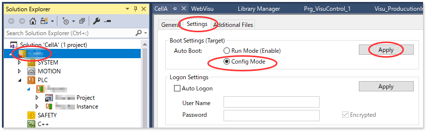{align=center}
起動時の初期状態はConfig modeとし、このあとの設定で遅延時間後にRUNモードへ移行する設定を行います。
`````
`````{grid} 2
````{grid-item-card} 2. IPCのスタートメニューから Windows Administrative Tools > Task Scheduler を起動する。

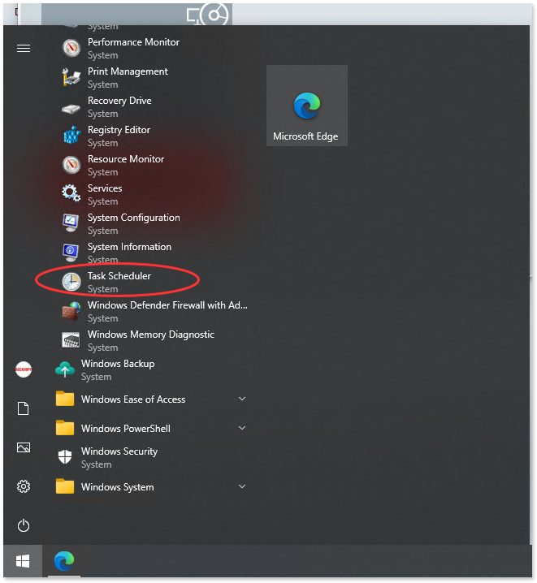{align=center}
````
````{grid-item-card} 3. Task Scheduler (Local) > Task Schedule Library メニューツリーで右クリックし、コンテキストメニューから Create Basic Task... を選択します。
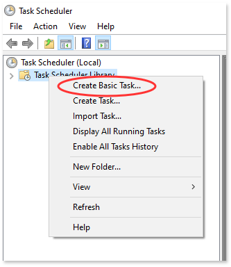{align=center}
````
`````
`````{grid-item-card} 4. Wizardに従い設定を行います。
1. 名称を `TwinCAT System Service` とします
    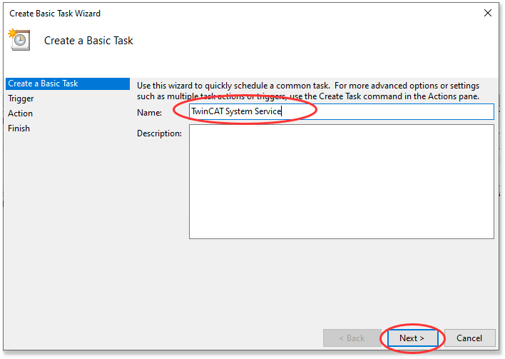{align=center}
2. コンピュータ起動時（未ログイン）時に実行します
    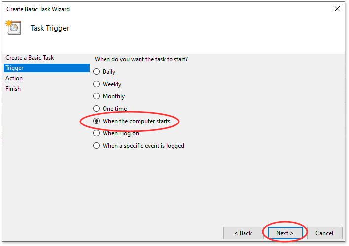{align=center}
3. 任意のプログラムを実行するを選択します
    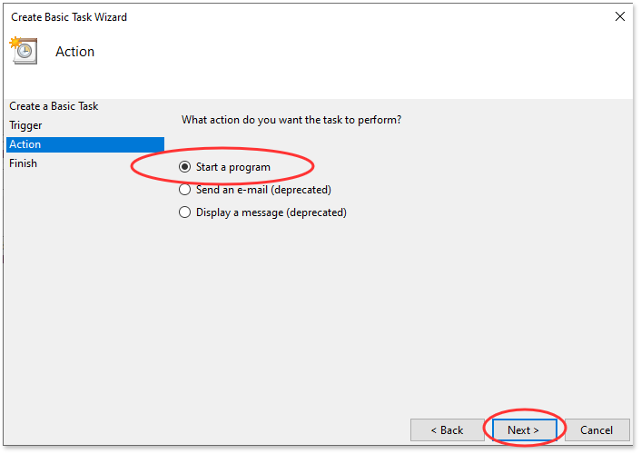{align=center}
4. 次の通り入力します。

    Program/script:
        : `sc`
    
    Add arguments(optional):
        : `control TcSysSrv 131`
    
    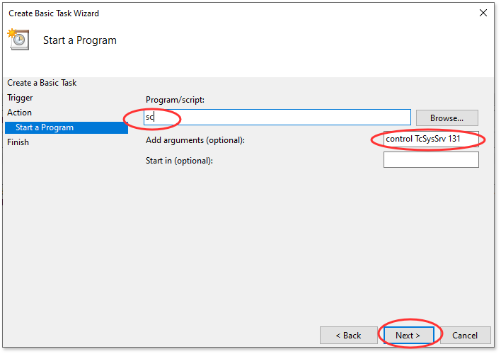{align=center}

5. Open the Properties dialog for this task when I click Finish にチェックを入れて Finish ボタンを押します
    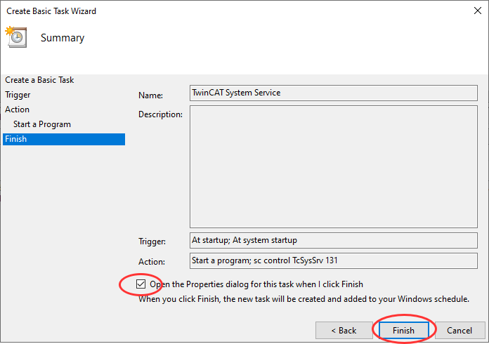{align=center}
`````
`````{grid-item-card} 5. TwinCAT System Service Propertyes (Local Computer) が開きます。各タブを次のとおり設定してください
General タブ
    : 次の通り設定します。

      Run whether user is logged on or not
        : 選択

      Run with highest privileges
        : ON

      Configure for:
        : 現在稼働しているIPCのOSを選択

      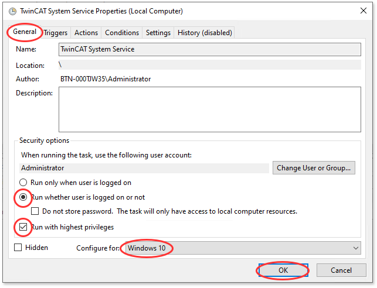{align=center}

Triggers タブ
    : At startup の行部分をダブルクリックして現れる Edit Trigerを次の通り設定します。

      Delay task for
        : チェックを入れ、任意の遅延時間を記述します。選択項目は最小　`1 minutes` ですが、自由記述ですので、任意の秒数に続き `seconds` を記述してください。 

      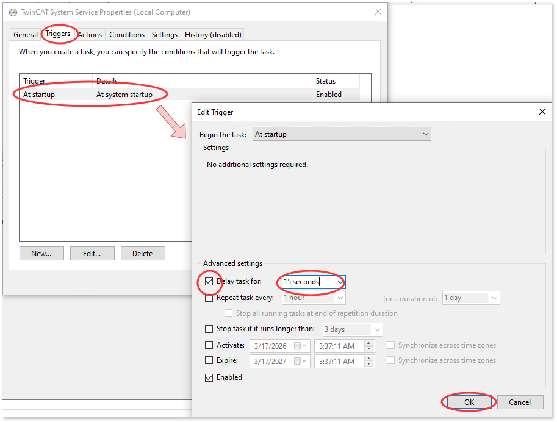{align=center}

さいごに `OK` ボタンを押して設定を反映します。 Administrator のパスワード入力画面が現れますので、パスワードを入力してください
    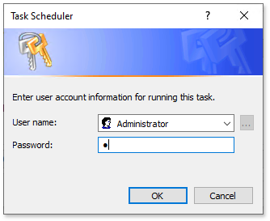{align=center}
`````

`````{grid-item-card} 最後に TwinCAT System Service がタスクスケジューラに登録されていることを確認します。
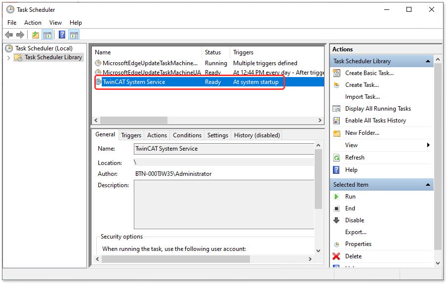{align=center}
`````

``````

以上の設定後、PCを再起動します。PC起動直後はConfigモードでTwinCATが起動し、約15秒後にTwinCATがRUNモードへ移行することを確認してください。
