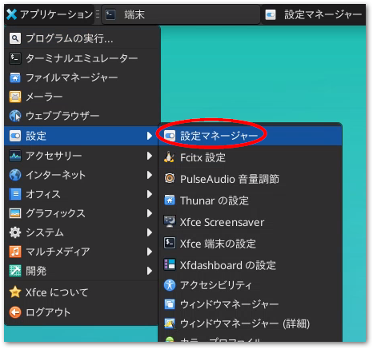
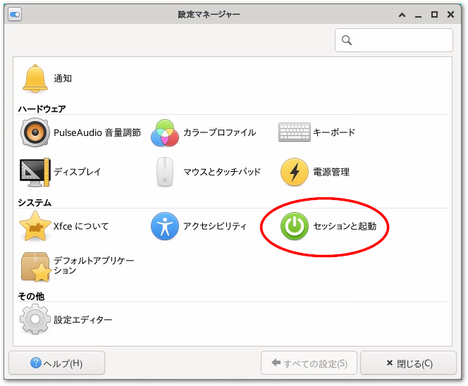
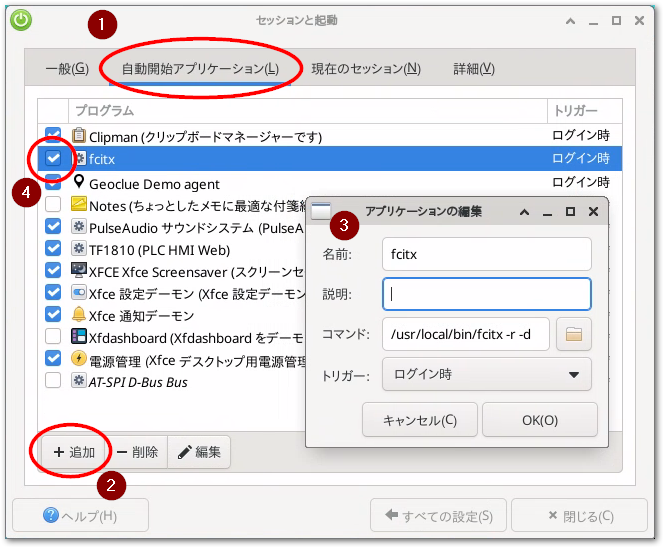
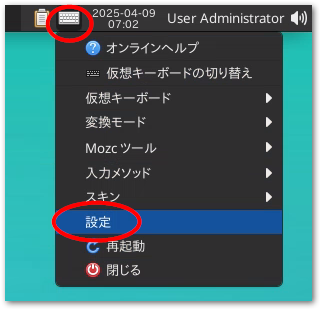
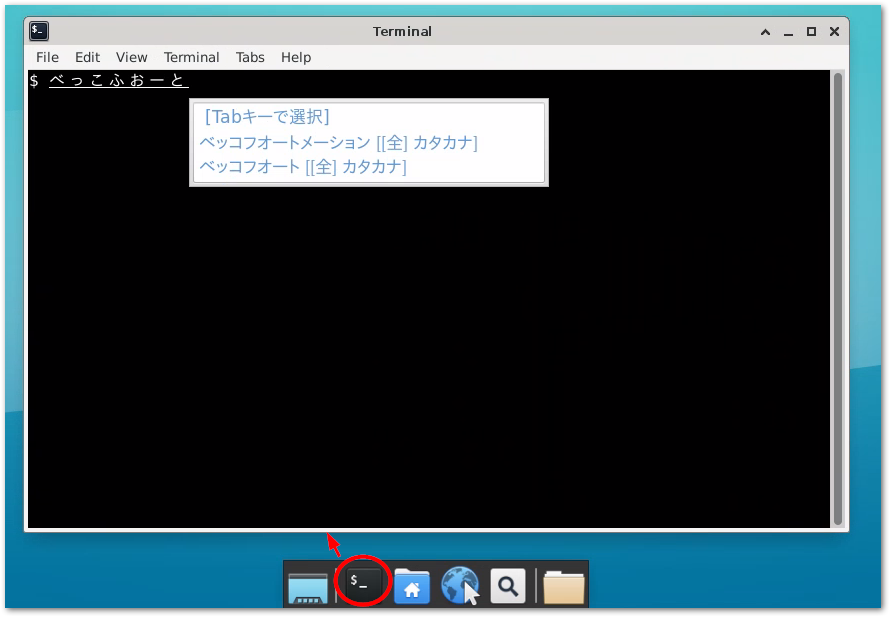

# TwinCAT BSD

## 基本設定

日本語キーボードに変更

```{code} sh
$ doas sysrc keymap="jp.106"
```

パッケージカタログを最新にする

```{code} sh
$ doas pkg update
```

最新パッケージを一斉インストールする

```{code} sh
$ doas pkg upgrade
```

## パケットフィルタの設定でTwinCATのADSルータのTCPポートを開放する

`/etc/pf.conf` を編集して、次の一行を追加します。ADSポート48898を通過させることができます。

```{code-block} sh
:caption: /etc/pf.conf

  :
# ADS port open
pass in quick proto tcp to port 48898 synproxy state  # <= 追加
```

## GPUの有効化

Intel製CPU内臓GPUを使われている場合は、次のコマンドにてGPUを用いた表示を有効にすることができます。

まず、ベッコフ製IPCに適応した、Xorgで使われるDRMに対応したカーネルモジュールをインストールします。

```{code} sh
$ doas pkg install drm-kmod-bhf
```

GPUの使用権限を与えるため、 `root` および `Administrator` ユーザを `video` グループに所属させます。

```{code} sh
$ doas pw groupmod video -m root
$ doas pw groupmod video -m Administrator
```

起動時にIntel製のGPUのカーネルモジュールを自動的にロードするため、以下の通りsysrcコマンドで `i915kms.ko` を自動ロード設定します。

```{code} sh
$ doas sysrc kld_list+=i915kms
```

再起動すると、GPUを用いた表示が可能になります。

## Window system xfce のインストール

xorg（ウィンドウシステム）, xfce（ウィンドウマネージャ）, lightdm（ディスプレーマネージャ）をインストールします。

```{code} sh
$ doas pkg install xorg xfce lightdm lightdm-gtk-greeter lightdm-gtk-greeter-settings
```
サウンドコンポーネントをインストールします。

```{code} sh
$ doas pkg install pulseaudio jackit sndio alsa-lib
```

dbusで用いられるプロセスファイルシステムを有効にする。

```{code-block}
:caption: /etc/fstab

proc            /proc   procfs  rw      0       0 # 最終行に追加
```

起動時にdbus, lightdmそれぞれのデーモンが有効になるように設定します。

```{code} sh
$ doas sysrc dbus_enable="YES"  # xfceのコンポーネント間通信機構に使われる通信フレームワーク
$ doas sysrc lightdm_enable="YES"  # 起動後GUIによるログイン画面が有効になる
```

xfceのパネル等で音量ボリュームやミキサーなどの設定を行うソフトウェアは標準では付加していませんので、追加インストールします。

```{code} sh
$ doas pkg install xfce4-pulseaudio-plugin
```

Lightdm（ログイン画面）上で扱うキーボードの種類を設定します。

```{code-block} sh
:caption: /usr/local/etc/lightdm/lightdm.conf

[Seat:*]
 :
display-setup-script=setxkbmap jp # 追加
```

ここまでの作業を行った後、次節を引き続き実施してください。再起動すると次回はログイン画面がLightDMによるGUI画面に切り替わります。

## 日本語環境の構築

ここからは、TC BSDではなく、FreeBSDのパッケージインストールが必要です。まずはFreeBSDパッケージリポジトリを有効にします。

```{code-block} sh
:caption: /usr/local/etc/pkg/repos/FreeBSD.conf

FreeBSD: { enabled: yes } # <= enabled: no からの変更
```

このあと、次のコマンドで新しいリポジトリからパッケージカタログを更新します。

```{code} sh
$ doas pkg update
```

日本語フォント、mozc（日本語IME）, fcitx（入力メソッドフレームワーク）をインストールします。

```{code} sh
$ doas pkg install ja-font-std ja-font-vlgothic ja-font-takao noto-jp
$ doas pkg install ja-fcitx-mozc ja-mozc-server ja-mozc-tool zh-fcitx zh-fcitx-configtool
```

ログイン後のXの環境設定で日本語を有効にします。

```{code-block} sh
:caption: $HOME/.xprofile

!/bin/sh
export LANG=ja_JP.UTF-8
export LC_ALL=ja_JP.UTF-8
export LC_CTYPE=ja_JP.UTF-8

export DefaultIMModule=fcitx
export GTK_IM_MODULE=fcitx
export QT_IM_MODULE=fcitx
export XMODIFIERS=@im=fcitx
export XMODIFIER=@im=fcitx
```

以上を設定したら、一度再起動してください。コンソールからのログインではなく、Lightdmのログイン画面が現われます。`User &` というユーザ名のログイン名でのログインを求められます。これは前回ログインしたユーザを示すものですが、初回は未設定なので、 `Other...` を選択してください。

上段にユーザ名 `Administrator` を、下段にはそのパスワードを入力してログインすることができます。

次回以後のログインでは、`User &` のままパスワードだけ入力してください。

### xfce ログイン後の初期設定

#### fcitx の自動起動

1. xfceの `Setting manager` を開きます。

    {align=center}

2. `Session and Startup` の設定項目を開きます。

    {align=center}

3. `Application Autostart` タブを開き、Add > 必要事項の入力 > 自動起動チェックを入れます。

    {align=center}

    ```{csv-table}
    :header: 項目, 説明, 推奨設定
    :widths: 1,3,6
    Name, 起動するプログラム名称, fcitx
    Description, プログラムの説明, 
    Command, 起動するコマンドライン(実行ファイルはフルパスで), 下記参照
    Trigger, いつ実行するか, ログイン時
    ```

    ```{code-block} sh
    :caption: Commandフィールドに記載するコマンド文字列
    /usr/local/bin/fcitx -r -d
    ```

上記設定が完了したらログインし直してください。

#### fcitx キーボード設定

1. パネル上部のキーボードアイコンをクリックして現われたポップアップメニューから設定を選択します。

    {align=center}

2. 入力メソッド下部の「現在の言語のみ表示」のチェックを外し、「不明」のツリーを展開します。

    {align=center}

3. `キーボード - 日本語 - 日本語（Dovorak）` を選択して、→ボタンを押します。

    {align=center}

4. 現在の入力メソッドに移動した `キーボード - 日本語 - 日本語（Dovorak）` を選択して、最上位に上げます。

    {align=center}

5. 次に全体の設定メニューからホットキータブを開きます。「入力メソッドのオンオフ」の2つめのボタンをクリックします。「設定したいキーの組合せをおしてください」というウィンドウが現われますので、ここで `全角/半角 漢字` キーを押します。キー名が`ZENKAKUHAN`と表示されたら「適用(A)」ボタンを押します。

    {align=center}

6. 試しに、どこでも構いませんのでテキスト入力部において`全角/半角 漢字` キーを押すと、MozcによるIMEが起動して日本語が入力できることを確認してください。

    {align=center}


## Windowsからのリモートデスクトップ接続を可能にする

次の手順でリモートデスクトップを有効にすることで、Windows PC上からリモートデスクトップでxfceのデスクトップを操作できます。

1. xrdpをパッケージでインストールします。

    ```{code} sh
    $ doas pkg install xrdp
    ```

2. リモートデスクトップのサービスを有効にして自動起動します。

    ```{code} sh
    $ doas sysrc xrdp_enable="YES"
    $ doas sysrc xrdp_sesman_enable="YES"
    ```

3. `/usr/local/etc/xrdp` 以下の設定ファイルを編集します。

    スタートスクリプト。日本語の設定などを行います。

    ```{code-block} sh
    :caption: /usr/local/etc/xrdp/startwm.sh

    #!/bin/sh
    #
    # This script is just an example. Edit this to suit your needs.
    # If ${HOME}/startwm.sh exists, xrdp-sesman will execute it instead of this.

    #### load profile if necessary
    source /etc/profile

    #### you can set environment variables here whatever you want
    export LANG=ja_JP.UTF-8
    export LC_ALL=ja_JP.UTF-8
    export LC_CTYPE=ja_JP.UTF-8
    export GTK_IM_MODULE=fcitx
    export XMODIFIERS=@im=fcitx
    export DefaultIMModule=fcitx

    #### start desktop environment
    # exec gnome-session
    # exec mate-session
    # exec start-lumina-desktop
    # exec ck-launch-session startplasma-x11
    exec startxfce4
    # exec xterm
    ```

    キーボード設定を日本語キーボードに設定します。

    ```{code-block} sh
    :caption: /usr/local/etc/xrdp/xrdp_keyboard.ini

    keyboard_type=7
    keyboard_subtype=2
    ```
    Windows間のクリップボードデータ交換を許可します。

    ```{code-block} ini
    :caption: /usr/local/etc/xrdp/sesman.ini

    ; When RestrictOutboundClipboard=all clipboard from the
    ; server is not pushed to the client.
    ; In addition, you can control text/file/image transfer restrictions
    ; respectively. It also accepts comma separated list such as text,file,image.
    ; To keep compatibility, some aliases are also available:
    ;   true: an alias of all
    ;   false: an alias of none
    ;   yes: an alias of all
    RestrictOutboundClipboard=none
    ; When RestrictInboundClipboard=all clipboard from the
    ; client is not pushed to the server.
    ; In addition, you can control text/file/image transfer restrictions
    ; respectively. It also accepts comma separated list such as text,file,image.
    ; To keep compatibility, some aliases are also available:
    ;   true: an alias of all
    ;   false: an alias of none
    ;   yes: an alias of all
    RestrictInboundClipboard=none
    ```

4. パケットフィルター設定にて、

    ```{code-block} sh
    :caption: /etc/pf.conf

    # xrdp port open
    pass in quick proto tcp to port 3389 synproxy state  # <= 追加
    ```

5. IPCを再起動したあとWindowsのリモートデスクトップからアクセス。

    コンピュータ欄にIPCのIPアドレスを入力し、接続します。次図の通りログイン画面が現われますので、ユーザー名にはログイン時のアカウントであるユーザ `Administrator` とそのパスワードを入力してください。

    {align=center}

以上で、Windowsリモートデスクトップからxfceデスクトップをリモート操作することができます。

## kioskモードでブラウザを起動してTF1810 PLC HMI Web を表示させる

最初に、TF1810サーバをインストールします。

```{code} sh
$ doas pkg install TF1810-PLC-HMI-Web
```

ブラウザをインストールします。軽量でGoogleから切り離されたChromiumブラウザをインストールします。

```{code} sh
$ doas pkg install ungoogled-chromium
```

インストールが完了したらログイン時に自動的にブラウザが起動し、 TF1810 のトップページが全画面モードで表示される設定を行います。

1. xfceの `Setting manager` を開きます。

    {align=center}

2. `Session and Startup` の設定項目を開きます。

    {align=center}

3. `Application Autostart` タブを開き、Add > 必要事項の入力 > 自動起動チェックを入れます。

    {align=center}

    ```{csv-table}
    :header: 項目, 説明, 推奨設定
    :widths: 1,3,6
    Name, 起動するプログラム名称, TF1810
    Description, プログラムの説明, PLC HMI Web
    Command, 起動するコマンドライン(実行ファイルはフルパスで), 下記参照
    Trigger, いつ実行するか, ログイン時
    ```

    ```{code-block} sh
    :caption: Commandフィールドに記載するコマンド文字列
    /usr/local/bin/ungoogled-chromium --kiosk http://localhost/Tc3PlcHmiWeb/Port_851/Visu/webvisu.htm
    ```

    ```{tip}
    TF1810だけではなくTF2000（TwinCAT HMI）を使う場合も同様の設定方法でログイン後ブラウザによる操作パネルの表示が可能です。`--kiosk` に続くURLを適切に設定してください。
    ```

  4. TwinCAT XAEからVisualization managerからWebVisualizationを有効にしたプロジェクトをTwinCAT BSDのXARへダウンロードし、再起動します。RUNモードへ移行していたら、Administratorへログイン後ブラウザが全画面モードで開き、Web Visualizationのページが表示されます。

```{tip}
全画面モードで開いているchromiumを閉じるには `ALT + F4` を押してください。
```
