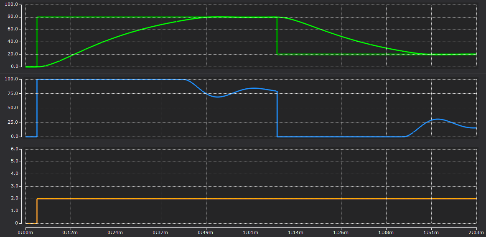

(section_tf4110_selftuning)=
# オートチューニング（Self tuning）機能

温度コントローラであるTF4110の温度コントローラ `FB_CTRL_TempController` を用いた設備の立ち上げ手順、及びプログラムの実装について記述します。

```{admonition} 公開先のGithubリポジトリ
:class: tip 

サンプルプログラム：TF4110_Sample_v3　は下記のGithubから取得できます。

[https://github.com/Beckhoff-JP/TF4110_TemperatureControlSample](https://github.com/Beckhoff-JP/TF4110_TemperatureControlSample) 
```

## チューニングの流れ

### チューニング開始

- `FB_CTRL_TempController` の入力変数 `eCtrlMode` を `E_CTRL_MODE.eCTRL_MODE_TUNE` にセットしてファンクションブロックを実行するとチューニングを開始します。

- チューニング中に不要なアラームが出ないようにアラームを抑制します。`FB_CTRL_TempController`の入出力変数`sControllerParameter`の構造体メンバーである`dwAlarmSupp`（{ref}`section_st_ctrl_tempcontrolparameter` 参照）にビットマスクを設定してください。

### チューニング中の動作

- まず、固定の待ち時間20秒（ `sControllerParameter` の `tTuneStabilisation` で設定）が経過します。この待ち時間の間、温度が$\pm1^\circ\text{C}$以内に収まり安定していることを確認します。温度がこの範囲外になった場合、待ち時間が再び開始されます。

- 待ち時間経過後、制御値fYTuneによってステップ応答を実行します。温度が設定値の80％に達していない間は、変曲点を用いたチューニング手法により、PIDコントローラのプロセスパラメータを決定します。

- また、安全上の理由により、**設定値の$80\%$に達した後は、制御は閉ループ制御に切り替わります**。

- チューニングが正常に終了すると、**eCtrlStateはeCTRL_STATE_TUNEDに設定され、スタンバイモード**に入ります。推定パラメータによる閉ループ操作は、制御モードをe_CTRL_MODE_ACTIVEに設定することで有効になります。

- 調整されたパラメータは、FB_CTRL_TempControllerの (VAR_OUTPUT) `sParaControllerInternal` で取得することが可能です。このパラメータをPERSISTENT変数で保持しておくことで、PC再起動後も保持された値が再現されます。

### チューニング完了後

* チューニングモードで調整されたパラメータを保持しておき、制御モードをe_CTRL_MODE_ACTIVEで制御実行するとチューニングされたPIDパラメータで温度制御を行うことができます。

   - PERSISTENT変数で保持しておいた `sParaControllerInternal` を `sParaControllerExternal` に代入。

   - `bSelCtrlParameterSet` をTRUEにする。

* 必要な場合は、PIDパラメータを手動で微調整します。

    ```{csv-table}
    :header: 挙動, fTuneKp, fTuneTn, fTuneTv, fTuneTd
    :caption: 設定例

    10%〜20%のオーバーシュートを伴う高速な設定, 1.2, 2.0, 0.42, 0.25
    オーバーシュートを抑えた低速な設定, 1.0, 2.5, 0.42, 0.25
    極めて小さなオーバーシュートを伴う、ほぼ漸近的な設定, 0.5, 3.0, 1.0, 0.25
    ```

## サンプルプログラムでの動作確認

サンプルプログラムでは、制御方法に示すセルフチューニングのプログラム例を紹介しています。温度シミュレータも含まれていますので、オフラインで動作を確認することができます。

MAINプログラム
    : セルフチューニングと通常モードを切り替え、チューニングで得られたパラメータをPERSISTENT変数に格納し、通常制御時のパラメータに反映するプログラムが格納されています。

FB_TemperatureController ファンクションブロック
    : `ST_CTRL_TempCtrlParameter` の設定済み構造体変数を作成し、`FB_CTRL_TempController` をラッピングするファンクションブロックです。

FB_Process
    : 温度シミュレータです

次のとおり操作してください。

1. タスクのサイクル周期を表す変数tTaskCycleTimeを、PLCのサイクル周期と同じ値に設定する。

2. チューニングモードでプログラムを実行する。

    ```{code} iecst
    MAIN.bTuningMode := TRUE;
    MAIN.bStart := TRUE;
    ```

3. グローバル変数Scope_Variablesの `fW_Scope` , `fX_Scope` , `fY_Scope` , `CtrlMode` , `CtrlState` をYT Scopeチャートで記録します。
   
   ```{figure} media/image4.png
   :align: center 

   セルフチューニング開始～出力制御開始まで
   ```

   ```{figure} media/image6.png
   :align: center

   出力制御開始～TUNEDまで
   ```

4. セルフチューニングが完了（`fbTempController.eCtrlState` が `E_CTRL_State.eCTRL_STATE_TUNED` となる）すると、MAINプログラムに以下の3行があるため、自動的にアクティブモードに切り替わり、目標温度への調整を行います。
   ```{code-block} iecst
   :caption: MAINプログラム : TUNEDになったら自動的にチューニングモードからアクティブモードに切り替えるプログラム行

   IF fbTempController.eCtrlState = E_CTRL_State.eCTRL_STATE_TUNED THEN
    bTuningMode := FALSE;
   END_IF
   ```
   チューニングされたパラメータは TPERSISTENT 変数宣言したPIDパラメータ `stParaControllerExternal` に反映され、アクティブモードにおいてもこのパラメータが使用されていることを確認してください。
   ```{note}
   オートチューニング完了後に自動的にアクティブモードへの切り替えを行わない場合は、上記3行を無効化してください。   
   ```

5. TwinCATをConfigModeにし、再度ActiveConfigurationしプログラムをRUNさせたあと、以下のメモリ状態にして最初からアクティブモードで温調を行います。このときセルフチューニングされたパラメータが反映され、正常に温調が完了することを確認してください。

    ```{code} iecst
    MAIN.bTuningMode := FALSE;
    MAIN.bStart := TRUE;
    ```

    

